# CSS and HTML Reference

## Table of Contents

1. [Void Elements](#1-void-elements)
2. [Boolean Attributes](#2-boolean-attributes)
3. [The `<head>` Element](#3-the-head-element)
4. [Adding a Title](#4-adding-a-title)
5. [Document Fragments](#5-document-fragments)
6. [Download Attribute](#6-download-attribute)
7. [Navigation Menu](#7-navigation-menu)
8. [HTML for Structuring Content](#8-html-for-structuring-content)
9. [HTML Elements Reference](#9-html-elements-reference)
10. [Non-Semantic Wrappers](#10-non-semantic-wrappers)
11. [HTML Validation](#11-html-validation)
12. [Exercise](#12-exercise)
13. [CSS Specifications](#13-css-specifications)
14. [Link and Visited States](#14-link-and-visited-states)
15. [Combinators](#15-combinators)
16. [The `href` Attribute](#16-the-href-attribute)
17. [Valid Selectors](#17-valid-selectors)
18. [CSS Declarations](#18-css-declarations)
19. [Using `calc()` Function](#19-using-calc-function)
20. [Transform Functions](#20-transform-functions)
21. [CSS Rules](#21-css-rules)
22. [Shorthand Properties](#22-shorthand-properties)
23. [Types of Selectors](#23-types-of-selectors)
24. [Attribute Selectors](#24-attribute-selectors)
25. [Presence Selector](#25-presence-selector)
25. [Substring Matching Selectors](#26-substring-matching-selectors)
27. [Pseudo-Classes and Pseudo-Elements](#27-pseudo-classes-and-pseudo-elements)
28. [The Universal Selector](#28-the-universal-selector)
29. [Selectors and Combinators](#29-selectors-and-combinators)
30. [Targeting Classes on Particular Elements](#30-targeting-classes-on-particular-elements)
31. [Targeting Elements with Multiple Classes](#31-targeting-elements-with-multiple-classes)
32. [ID Selectors](#32-id-selectors)
33. [Pseudo-Classes](#33-pseudo-classes)
34. [User-Action Pseudo-Classes](#34-user-action-pseudo-classes)
35. [Pseudo-Elements](#35-pseudo-elements)
36. [Combining Pseudo-Classes and Pseudo-Elements](#36-combining-pseudo-classes-and-pseudo-elements)
37. [Generating Content with `::before` and `::after`](#37-generating-content-with-before-and-after)
38. [Descendant Combinator](#38-descendant-combinator)
39. [Child Combinator](#39-child-combinator)
40. [Next-Sibling Combinator](#40-next-sibling-combinator)
41. [Subsequent-Sibling Combinator](#41-subsequent-sibling-combinator)
42. [Creating Complex Selectors with Nesting](#42-creating-complex-selectors-with-nesting)


---

## 1 Void Elements

Void elements, also known as self-closing elements, do not have closing tags. Examples include:

- `` (for images)
- `<br>` (for line breaks)
- `<hr>` (for horizontal rules)

## 2 Boolean Attributes

Boolean attributes can be either present or absent. If present, they are treated as true. The attribute's value is typically the same as its name. Example:

```html
<input type="checkbox" checked />
```

In this example, the `checked` attribute is a boolean attribute. It indicates that the checkbox is selected when the page loads.

## 3 The `<head>` Element

The `<head>` section of an HTML document contains metadata and links to resources like stylesheets and favicons. The content of `<head>` is not displayed on the page itself but provides information for rendering the page correctly. Examples of what you can include in the `<head>`:

- `<title>`: Defines the title of the page.
- `<link>`: Links to external CSS files or favicons.
- `<meta>`: Provides metadata such as the author and description.

```html
<head>
  <title>Page Title</title>
  <link rel="stylesheet" href="styles.css" />
  <meta charset="UTF-8" />
  <meta name="description" content="A description of the page" />
</head>
```

## 4 Adding a Title

The `<h1>` element is used to mark up the main title of your page content. It is usually used once per page to represent the primary heading. For example:

```html
<h1>Welcome to My Website</h1>
```

## 5 Document Fragments

A document fragment is a way to link to a specific part of a page. This is done using the `id` attribute and a fragment identifier in the URL. Example:

```html
<h2 id="Mailing_address">Mailing Address</h2>
<p>
  Want to write us a letter? Use our
  <a href="contacts.html#Mailing_address">mailing address</a>.
</p>
```

## 6 Download Attribute

Use the `download` attribute on `<a>` elements to suggest a filename for the file being downloaded. This attribute can be used to trigger a file download when a link is clicked. Example:

```html
<a href="https://example.com/file.zip" download="filename.zip">Download File</a>
```

## 7 Navigation Menu

A navigation menu is typically a list of links that help users navigate through different sections of a site. This can be structured with `<ul>` and `<li>` elements inside a `<nav>` element. Example:

```html
<nav>
  <ul>
    <li><a href="#home">Home</a></li>
    <li><a href="#about">About</a></li>
    <li><a href="#contact">Contact</a></li>
  </ul>
</nav>
```

## 8 HTML for Structuring Content

Use semantic HTML elements to structure your content logically:

- Header: `<header>` for introductory content or navigational links.
- Navigation Bar: `<nav>` for navigation links.
- Main Content: `<main>` for the primary content, with `<article>`, `<section>`, and `<div>` for further division.
- Sidebar: `<aside>` for related content, often placed inside `<main>`.
- Footer: `<footer>` for footer content.

```html
<header>
  <h1>Page Title</h1>
</header>
<nav>
  <!-- Navigation links -->
</nav>
<main>
  <article>
    <h2>Article Title</h2>
    <p>Article content...</p>
  </article>
  <aside>
    <p>Related content...</p>
  </aside>
</main>
<footer>
  <p>Footer content...</p>
</footer>
```

## 9 HTML Elements Reference

For a detailed list of HTML elements, visit the [MDN HTML Elements Reference](https://developer.mozilla.org/en-US/docs/Web/HTML/Element).

## 10 Non-Semantic Wrappers

When no semantic element is appropriate for grouping elements, use `<div>` and `<span>`. These elements help group content for styling or scripting purposes. Apply classes to make them easier to target with CSS or JavaScript.

```html
<div class="container">
  <p>This is some text inside a div.</p>
</div>
```

## 11 HTML Validation

To ensure your HTML is correct and follows standards, use the [W3C Markup Validation Service](https://validator.w3.org/). Validating your HTML helps catch errors and improve compatibility across browsers.

## 12 Exercise

Practice your HTML skills with these exercises:

[Marking up a Letter](https://developer.mozilla.org/en-US/docs/Learn/HTML/Introduction_to_HTML/Marking_up_a_letter)
[Structuring a Page of Content](https://developer.mozilla.org/en-US/docs/Learn/HTML/Introduction_to_HTML/Structuring_a_page_of_content)

## 13 CSS Specifications

Explore CSS specifications to understand the latest features and best practices for styling web pages.

## 14 Link and Visited States

You can style links differently based on their state:

```css
a:link {
  color: pink; /* Unvisited links */
}

a:visited {
  color: green; /* Visited links */
}

a:hover {
  text-decoration: none; /* Links when hovered */
}
```

## 15 Combinators

CSS combinators define the relationship between selectors:

- Descendant Combinator: article p span selects `<span>` inside `<p>` inside `<article>`.
- Adjacent Sibling Combinator: `h1 + ul + p` selects `<p>` that immediately follows a `<ul>`, which follows an `<h1>`.

## 16 The href Attribute

The href attribute specifies the path to a linked resource. Here are examples of different paths:

```html
<link rel="stylesheet" href="styles/style.css" />
<!-- Same directory -->
<link rel="stylesheet" href="styles/general/style.css" />
<!-- Subdirectory -->
<link rel="stylesheet" href="../styles/style.css" />
<!-- Parent directory -->
```

## 17 Valid Selectors

Examples of valid CSS selectors:

- `h1` (selects all `<h1>` elements)
- `a:link` (selects all unvisited links)
- `.manythings` (selects all elements with class "manythings")
- `#onething` (selects the element with ID "onething")
- `*` (universal selector, selects all elements)
- `.box p` (selects all `<p>` elements inside an element with class "box")
- `.box p:first-child` (selects the first `<p>` child of elements with class "box")
- `h1, h2, .intro` (selects all `<h1>`, `<h2>`, and elements with class "intro")

## 18 CSS Declarations

A CSS declaration consists of a property and its value. Declarations are enclosed in curly braces {}. Example:

```css
p {
  color: red; /* Property: color, Value: red */
  font-size: 16px; /* Property: font-size, Value: 16px */
}
```

## 19 Using calc() Function

The `calc()` function allows for mathematical calculations in CSS. Example:

```css
.box {
  width: calc(90% - 30px); /* Width is 90% of the container minus 30 pixels */
}
```

## 20 Transform Functions

Transform functions apply transformations to elements. Example:

```css
.box {
  transform: rotate(0.8turn); /* Rotate the element by 0.8 turns */
}
```

## 21 CSS Rules

CSS rules include `@`-rules for special instructions. Examples:

- `@import`: Imports another stylesheet.
- `@media`: Creates media queries for responsive design.

```css
@import "styles2.css"; /* Imports styles from another stylesheet */

@media (max-width: 600px) {
  .box {
    width: 100%; /* Styles for screens smaller than 600px */
  }
}
```

## 22 Shorthand Properties

Shorthand properties allow setting multiple values in one line. Examples include:

- `padding: 10px 15px 20px;` /_ Sets padding for top, right, bottom, and left _/
- `margin: 5px 10px;` /_ Sets margin for top/bottom and right/left _/
- `border: 1px solid black;` /_ Sets border width, style, and color _/

## 23 Types of Selectors

CSS selectors can be:

- **Type Selector**: Selects elements by their tag name.
- **Class Selector**: Selects elements by their class name.
- **ID Selector**: Selects an element by its ID.

```css
h1 {
  /* Type selector */
  color: blue;
}

.highlight {
  /* Class selector */
  background-color: yellow;
}

#unique {
  /* ID selector */
  font-size: 20px;
}
```

## 24 Attribute Selectors

Attribute selectors target elements based on attributes:

Attribute selectors target elements based on their attributes:

```css
a[title] {
  color: blue; /* Applies to all <a> elements with a title attribute */
}

a[href^="https"] {
  color: green; /* Applies to all <a> elements with href starting with "https" */
}
```


## 25 Presence Selector
- Presence Selector: Selects elements with a specific attribute.


| Selector         | Example                       | Description                                                                                     |
|------------------|-------------------------------|-------------------------------------------------------------------------------------------------|
| `[attr]`         | `a[title]`                    | Matches elements with an `attr` attribute (whose name is the value in square brackets).|
|`[attr=value]`|`a[href="https://example.com"]`| Matches elements with an `attr` attribute whose value is exactly `value` — the string inside the quotes.|
| `[attr~=value]`  | `p[class~="special"]`         | Matches elements with an `attr` attribute whose value is exactly `value`, or contains `value` in its (space-separated) list of values. | 
|`[attr\|=value]`|`div[lang\|="zh"]`| Matches elements with an `attr` attribute whose value is exactly `value` or begins with `value` immediately followed by a hyphen. |

In the example below you can see these selectors being used:

- `li[class]` matches any list item with a class attribute. This matches all of the list items except the first one.
- `li[class="a"]` matches a selector with a class of `a`, but not a selector with a class of `a` that includes another space-separated class as part of the value. It selects the second list item.
- `li[class~="a"]` will match a class of `a` but also a value that contains `a` as part of a whitespace-separated list. It selects the second and third list items.

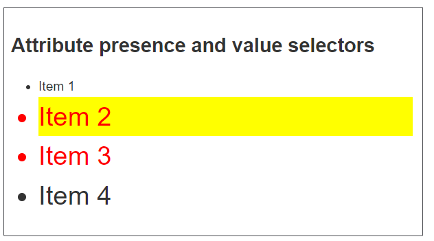

```css
li[class] {
  font-size: 200%;
}

li[class="a"] {
  background-color: yellow;
}

li[class~="a"] {
  color: red;
}
```

```html
<h1>Attribute presence and value selectors</h1>
<ul>
  <li>Item 1</li>
    <li class="a">Item 2</li>
    <li class="a b">Item 3</li>
    <li class="ab">Item 4</li>
</ul>
```


## 26 Substring Matching Selectors

These selectors allow for more advanced matching of substrings inside the value of your attribute. For example, if you had classes of `box-warning` and `box-error` and wanted to match everything that started with the string `box-`, you could use `[class^="box-"]` to select them both (or `[class|="box"]` as described in the section above).

| Selector         | Example               | Description                                                                                               |
|------------------|-----------------------|-----------------------------------------------------------------------------------------------------------|
| `[attr^=value]`  | `li[class^="box-"]`   | Matches elements with an `attr` attribute whose value begins with `value`.                               |
| `[attr$=value]`  | `li[class$="-box"]`   | Matches elements with an `attr` attribute whose value ends with `value`.                                 |
| `[attr*=value]`  | `li[class*="box"]`    | Matches elements with an `attr` attribute whose value contains `value` anywhere within the string.        |

(Aside: It may help to note that `^` and `$` have long been used as anchors in so-called regular expressions to mean "begins with" and "ends with" respectively.)

### Example Usage

- `li[class^="a"]` matches any attribute value which starts with `a`, so it matches the first two list items.
- `li[class$="a"]` matches any attribute value that ends with `a`, so it matches the first and third list items.
- `li[class*="a"]` matches any attribute value where `a` appears anywhere in the string, so it matches all of the list items.

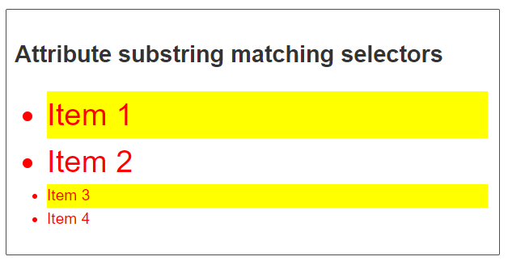

```css
li[class^="a"] {
  font-size: 200%;
}

li[class$="a"] {
  background-color: yellow;
}

li[class*="a"] {
  color: red;
}
```

```html
<h1>Attribute substring matching selectors</h1>
<ul>
  <li class="a">Item 1</li>
  <li class="ab">Item 2</li>
  <li class="bca">Item 3</li>
  <li class="bcabc">Item 4</li>
</ul>
```


```css
a[title] {
  color: blue;
}
```

- Value Selector: Selects elements with a specific attribute value.

```css
Value Selector: Selects elements with a specific attribute value.
```

## 27 Pseudo-Classes and Pseudo-Elements

- **Pseudo-Classes**: Apply styles based on element states, e.g., `:hover`.

```css
a:hover {
  color: orange; /* Styles for links when hovered */
}
```

- **Pseudo-Elements**: Style specific parts of an element, e.g., `::first-line`.

```css
p::first-line {
  font-weight: bold; /* Styles the first line of paragraphs */
}
```

## 28 The Universal Selector

The universal selector `*` targets all elements on a page. For example:

```css
* {
  box-sizing: border-box; /* Applies box-sizing to all elements */
}
```

## 29 Selectors and Combinators

Selectors combined with combinators allow more precise targeting of elements:

- **Descendant Combinator**: Selects elements nested inside other elements.

```css
article p {
  color: blue; /* Selects <p> elements inside <article> */
}
```

- **Adjacent Sibling Combinator**: Selects elements directly following other elements.

```css
h1 + p {
  margin-top: 0; /* Selects <p> that immediately follows an <h1> */
}
```

## 30 Targeting Classes on Particular Elements

Apply styles to elements with specific classes:

```css
h1.highlight {
  background-color: pink; /* Applies to <h1> elements with class "highlight" */
}

span.highlight {
  background-color: yellow; /* Applies to <span> elements with class "highlight" */
}
```

## 31 Targeting Elements with Multiple Classes

Style elements with multiple classes by combining class selectors:

```css
.notebox {
  border: 4px solid #666; /* Base style for .notebox */
}

.notebox.warning {
  border-color: orange; /* Style for .notebox with additional "warning" class */
}

.notebox.danger {
  border-color: red; /* Style for .notebox with additional "danger" class */
}
```

## 32ID Selectors

ID selectors target unique elements identified by their ID attribute:

```css
#one {
  background-color: yellow; /* Applies to element with ID "one" */
}

h1#heading {
  color: rebeccapurple; /* Applies to <h1> element with ID "heading" */
}
```


## 33 Pseudo-Classes

Pseudo-classes style elements based on their state:

```css
a:hover {
  text-decoration: underline; /* Applies when the mouse is over the link */
}

input:focus {
  border-color: blue; /* Applies when the input field is focused */
}
```

## 34 User-Action Pseudo-Classes

These pseudo-classes apply styles based on user actions:

```css
button:active {
  background-color: grey; /* Styles button when it is pressed */
}

input:checked {
  background-color: green; /* Styles checkbox when checked */
}
```

## 35 Pseudo-Elements

Pseudo-elements style specific parts of an element:

```css
p::first-line {
  font-weight: bold; /* Styles the first line of <p> elements */
}

p::first-letter {
  font-size: 2em; /* Styles the first letter of <p> elements */
}
```

## 36 Combining Pseudo-Classes and Pseudo-Elements

You can combine pseudo-classes and pseudo-elements to target more specific states and parts:

```css
a:hover::after {
  content: " (hovered)"; /* Adds text after links when hovered */
}

p:first-child::before {
  content: "Note: "; /* Adds text before the first <p> child */
}
```

## 37 Generating Content with `::before` and `::after`

Use `::before` and `::after` to insert content before or after an element's actual content:

```css
.box::before {
  content: "Start - "; /* Adds "Start - " before the content of .box */
}

.box::after {
  content: " - End"; /* Adds " - End" after the content of .box */
}
```

## Combinators [MDN](https://developer.mozilla.org/en-US/docs/Learn/CSS/Building_blocks/Selectors/Combinators)

The final selectors we will look at are called combinators, because they combine other selectors in a way that gives them a useful relationship to each other and the location of content in the document.

## 38 Descendant combinator

The descendant combinator — typically represented by a single space (" ") character — combines two selectors such that elements matched by the second selector are selected if they have an ancestor (parent, parent's parent, parent's parent's parent, etc.) element matching the first selector. Selectors that utilize a descendant combinator are called descendant selectors.

```css
body article p
```

Example:

```css
.box p {
  color: red;
}
```

```html
<div class="box"><p>Text in .box</p></div>
<p>Text not in .box</p>
```

## 39 Child combinator

The child combinator (>) is placed between two CSS selectors. It matches only those elements matched by the second selector that are the direct children of elements matched by the first. Descendant elements further down the hierarchy don't match. For example, to select only `<p>` elements that are direct children of `<article>` elements:

```css
article > p
```

In this next example, we have an ordered list `<ol>` nested inside an unordered list `<ul>`. The child combinator selects only those `<li>` elements which are direct children of a `<ul>`, and styles them with a top border.<br>

If you remove the > that designates this as a child combinator, you end up with a descendant selector and all `<li>` elements will get a red border.<br>

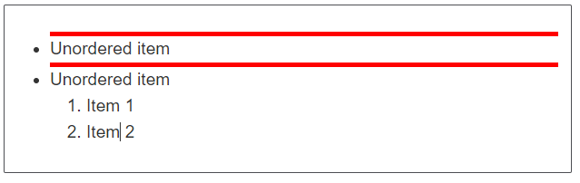

```css
ul > li {
  border-top: 5px solid red;
}
```

```html
<ul>
  <li>Unordered item</li>
  <li>
    Unordered item
    <ol>
      <li>Item 1</li>
      <li>Item 2</li>
    </ol>
  </li>
</ul>
```

## 40 Next-sibling combinator

The next-sibling combinator (+) is placed between two CSS selectors. It matches only those elements matched by the second selector that are the next sibling element of the first selector. For example, to select all `` elements that are immediately preceded by a `<p>` element:

```css
p + img
```

A common use case is to do something with a paragraph that follows a heading, as in the example below. In that example, we are looking for any paragraph which shares a parent element with an `<h1>`, and immediately follows that `<h1>`.<br><br>

If you insert some other element such as a `<h2>` in between the `<h1>` and the `<p>`, you will find that the paragraph is no longer matched by the selector and so does not get the background and foreground color applied when the element is adjacent.

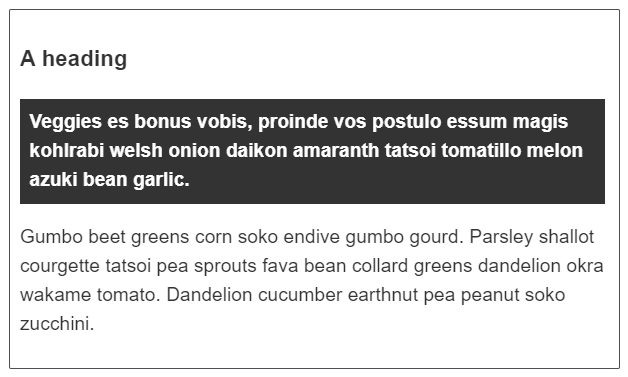

```css
h1 + p {
  font-weight: bold;
  background-color: #333;
  color: #fff;
  padding: 0.5em;
}
```

```html
<article>
  <h1>A heading</h1>
  <p>
    Veggies es bonus vobis, proinde vos postulo essum magis kohlrabi welsh onion
    daikon amaranth tatsoi tomatillo melon azuki bean garlic.
  </p>

  <p>
    Gumbo beet greens corn soko endive gumbo gourd. Parsley shallot courgette
    tatsoi pea sprouts fava bean collard greens dandelion okra wakame tomato.
    Dandelion cucumber earthnut pea peanut soko zucchini.
  </p>
</article>
```

## 41 Subsequent-sibling combinator

If you want to select siblings of an element even if they are not directly adjacent, then you can use the subsequent-sibling combinator (~). To select all `` elements that come anywhere after `<p>` elements, we'd do this:

```css
p ~ img
```

In the example below we are selecting all `<p>` elements that come after the `<h1>`, and even though there is a `<div>` in the document as well, the `<p>` that comes after it is selected.

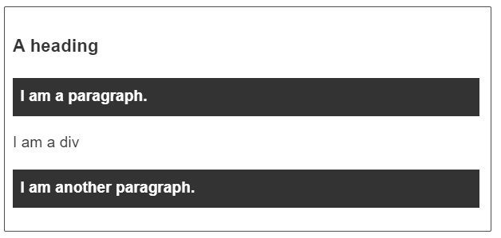

```css
h1 ~ p {
  font-weight: bold;
  background-color: #333;
  color: #fff;
  padding: 0.5em;
}
```

```html
<article>
  <h1>A heading</h1>
  <p>I am a paragraph.</p>
  <div>I am a div</div>
  <p>I am another paragraph.</p>
</article>
```

## 42 Creating complex selectors with nesting

[MDN](https://developer.mozilla.org/en-US/docs/Learn/CSS/Building_blocks/Selectors/Combinators#creating_complex_selectors_with_nesting)


<hr>

# Cascade, specificity, and inheritance


## 43 Conflicting rules
CSS stands for Cascading Style Sheets, and that first word cascading is incredibly important to understand — the way that the cascade behaves is key to understanding CSS.<br><br>

At some point, you will be working on a project and you will find that the CSS you thought should be applied to an element is not working. Often, the problem is that you create two rules that apply different values of the same property to the same element. Cascade and the closely-related concept of specificity are mechanisms that control which rule applies when there is such a conflict. The rule that's styling your element may not be the one you expect, so you need to understand how these mechanisms work.<br><br>

Also significant here is the concept of inheritance, which means that some CSS properties by default inherit values set on the current element's parent element and some don't. This can also cause some behavior that you might not expect.<br><br>


### Cascade
Stylesheets cascade — at a very simple level, this means that the origin, the cascade layer, and the order of CSS rules matter. When two rules from the same cascade layer apply and both have equal specificity, the one that is defined last in the stylesheet is the one that will be used.

In the below example, we have two rules that could apply to the <h1> element. The <h1> content ends up being colored blue. This is because both the rules are from the same source, have an identical element selector, and therefore, carry the same specificity, but the last one in the source order wins.

```css
h1 {
  color: red;
}
h1 {
  color: blue;
}
```

```html
<h1>This is my heading.</h1>
```

### Specificity
Specificity is the algorithm that the browser uses to decide which property value is applied to an element. If multiple style blocks have different selectors that configure the same property with different values and target the same element, specificity decides the property value that gets applied to the element. Specificity is basically a measure of how specific a selector's selection will be:

- An element selector is less specific; it will select all elements of that type that appear on a page, so it has less weight. Pseudo-element selectors have the same specificity as regular element selectors.

- A class selector is more specific; it will select only the elements on a page that have a specific class attribute value, so it has more weight. Attribute selectors and pseudo-classes have the same weight as a class.

[More about Specifity](/Apna-College/Day6_CSS2/Selectors/CSS-Specifity/)

### Inheritance
Inheritance also needs to be understood in this context — some CSS property values set on parent elements are inherited by their child elements, and some aren't.<br><br>

For example, if you set a color and font-family on an element, every element inside it will also be styled with that color and font, unless you've applied different color and font values directly to them.<br><br>

```css
body {
  color: blue;
}

span {
  color: black;
}
```

```html
<p>As the body has been set to have a color of blue this is inherited through the descendants.</p>
<p>We can change the color by targeting the element with a selector, such as this <span>span</span>.</p>
```
<br>
Some properties do not inherit — for example, if you set a width of 50% on an element, all of its descendants do not get a width of 50% of their parent's width. If this was the case, CSS would be very frustrating to use!<br><br>

`Note`: On MDN CSS property reference pages, you can find a technical information box called "Formal definition", which lists a number of data points about that property, including whether it is inherited or not. See the color property Formal definition section as an example.<br><br>


## Understanding inheritance

We'll start with inheritance. In the example below, we have a `<ul>` element with two levels of unordered lists nested inside it. We have given the outer `<ul>` a border, padding, and font color.<br><br>

The color property is an inherited property. So, the color property value is applied to the direct children and also to the indirect children — the immediate child `<li>`s and those inside the first nested list. We have then added the class special to the second nested list and applied a different color to it. This then inherits down through its children.<br><br>


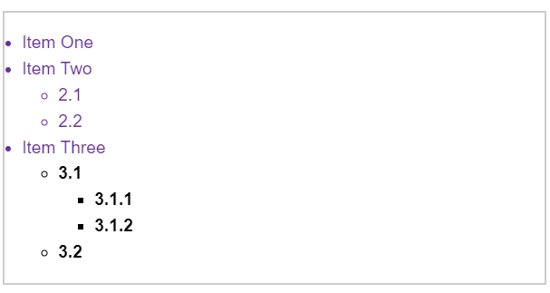


```css
.main {
  color: rebeccapurple;
  border: 2px solid #ccc;
  padding: 1em;
}

.special {
  color: black;
  font-weight: bold;
}
```


```html
<ul class="main">
  <li>Item One</li>
  <li>Item Two
    <ul>
      <li>2.1</li>
      <li>2.2</li>
    </ul>
  </li>
  <li>Item Three
    <ul class="special">
      <li>3.1
        <ul>
          <li>3.1.1</li>
          <li>3.1.2</li>
        </ul>
      </li>
      <li>3.2</li>
    </ul>
  </li>
</ul>
```

<br><br>
Properties like width (as mentioned earlier), margin, padding, and border are not inherited properties. If a border were to be inherited by the children in this list example, every single list and list item would gain a border — probably not an effect we would ever want!<br><br>

Though every CSS property page lists whether or not the property is inherited, you can often guess the same intuitively if you know what aspect the property value will style.<br><br>


## Controlling inheritance
CSS provides five special universal property values for controlling inheritance. Every CSS property accepts these values. `inherit` `initial` `revert` `revert-layer`  `unset`

1. inherit
Sets the property value applied to a selected element to be the same as that of its parent element. Effectively, this "turns on inheritance".<br>
 ```css
  .parent {
    color: blue;
  }

  .child {
    color: inherit; /* This will make the text color of .child blue, inherited from .parent */
  }
```

2. initial
Sets the property value applied to a selected element to the initial value of that property.<br><br>

```css
.example {
  color: red; /* Red color */
}

.reset {
  color: initial; /* This will reset the color to the default value defined by the CSS specification */
}

```

3. revert
Resets the property value applied to a selected element to the browser's default styling rather than the defaults applied to that property. This value acts like unset in many cases.<br><br>

```css
.example {
  color: green; /* Green color */
}

.revert {
  color: revert; /* This will revert the color to the browser's default value */
}
```

4. revert-layer
Resets the property value applied to a selected element to the value established in a previous cascade layer.<br><br>

```css
/* Assume multiple layers are used */
.layer1 {
  color: purple; /* Color defined in the first layer */
}

.layer2 {
  color: revert-layer; /* This will use the color from the previous layer (layer1) */
}
```


5. unset
Resets the property to its natural value, which means that if the property is naturally inherited it acts like inherit, otherwise it acts like initial.<br><br>

```css
.example {
  color: black; /* Black color */
}

.unset {
  color: unset; /* This will either inherit the color from the parent if the property is inherited, or use the initial value */
}
```

### Example
1. The second list item has the class `my-class-1` applied. This sets the color of the `<a>` element nested inside to `inherit`. If you remove the rule, how does it change the color of the link?

2. Do you understand why the third and fourth links are the color that they are? The third link is set to `initial`, which means it uses the initial value of the property (in this case black) and not the browser default for links, which is blue. The fourth link is set to `unset`, which means that the link text uses the color of the parent element, green.

3. Which of the links will change color if you define a new color for the `<a>` element — for example `a { color: red; }`?

4. After reading the next section on resetting all properties, come back and change the color property to `all`. Notice how the second link is on a new line and has a bullet. What properties do you think were inherited?

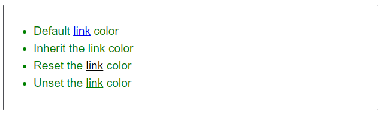

```css
body {
  color: green;
}

.my-class-1 a {
  color: inherit;
}

.my-class-2 a {
  color: initial;
}

.my-class-3 a {
  color: unset;
}
```


```html
<ul>
  <li>Default <a href="#">link</a> color</li>
  <li class="my-class-1">Inherit the <a href="#">link</a> color</li>
  <li class="my-class-2">Reset the <a href="#">link</a> color</li>
  <li class="my-class-3">Unset the <a href="#">link</a> color</li>
</ul>
```

## Resetting all property values

The CSS shorthand property `all` can be used to apply one of these inheritance values to (almost) all properties at once. Its value can be any one of the inheritance values (`inherit`, `initial`, `revert`, `revert-layer`, or `unset`). It's a convenient way to undo changes made to styles so that you can get back to a known starting point before beginning new changes.<br><br>

In the example below, we have two blockquotes. The first has styling applied to the `blockquote` element itself. The second has a class applied to the `blockquote`, which sets the value of `all` to `unset`.<br><br>

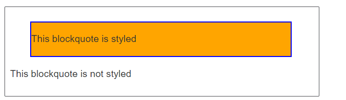

```css
blockquote {
  background-color: orange;
  border: 2px solid blue;
}

.fix-this {
  all: unset;
}
```

```html
<blockquote>
  <p>This blockquote is styled</p>
</blockquote>

<blockquote class="fix-this">
  <p>This blockquote is not styled</p>
</blockquote>
```


## Understanding the cascade
There are three factors to consider, listed here in increasing order of importance. Later ones overrule earlier ones:

1. Source order
2. Specificity
3. Importance

We have already seen how source order matters to the cascade. If you have more than one rule, all of which have exactly the same weight, then the one that comes last in the CSS will win. You can think of this as: the rule that is nearer the element itself overwrites the earlier ones until the last one wins and gets to style the element.<br><br>

Source order only matters when the specificity weight of the rules is the same, so let's look at specificity:<br><br>

### Specificity
You will often run into a situation where you know that a rule comes later in the stylesheet, but an earlier, conflicting rule is applied. This happens because the earlier rule has a higher specificity — it is more specific, and therefore, is being chosen by the browser as the one that should style the element.<br><br>

`Note`: The universal selector (*), combinators (+, >, ~, ' '), and specificity adjustment selector (:where()) along with its parameters, have no effect on specificity.<br><br>

The negation (:not()), relational selector (:has()), the matches-any (:is()) pseudo-classes, and CSS nesting themselves don't add to specificity, but their parameters or nested rules do. The specificity weight that each contributes to the specificity algorithm is the specificity weight of the selector in the parameter or nested rule with the greatest weight.<br><br>

The following table shows a few isolated examples to get you in the mood. Try going through these, and make sure you understand why they have the specificity that we have given them. We've not covered selectors in detail yet, but you can find details of each selector on the MDN selectors reference.<br><br>

| Selector | Identifiers | Classes | Elements | Total specifity|
|----------|-------------|---------|----------|----------------|
|h1	| 0	| 0 |	1 |	0-0-1|
|h1 + p::first-letter	| 0 |	0 |	3	| 0-0-3|
|li > a[href*="en-US"] > .inline-warning|	0 |	2 |	2	| 0-2-2|
| #identifier	| 1 |	0 |	0 |	1-0-0|
|button:not(#mainBtn, .cta)|	1	| 0	| 1 |	1-0-1|

### Example
```css

/* 1. specificity: 1-0-1 */
#outer a {
  background-color: red;
}

/* 2. specificity: 2-0-1 */
#outer #inner a {
  background-color: blue;
}

/* 3. specificity: 1-0-4 */
#outer div ul li a {
  color: yellow;
}

/* 4. specificity: 1-1-3 */
#outer div ul .nav a {
  color: white;
}

/* 5. specificity: 0-2-4 */
div div li:nth-child(2) a:hover {
  border: 10px solid black;
}

/* 6. specificity: 0-2-3 */
div li:nth-child(2) a:hover {
  border: 10px dashed black;
}

/* 7. specificity: 0-3-3 */
div div .nav:nth-child(2) a:hover {
  border: 10px double black;
}

a {
  display: inline-block;
  line-height: 40px;
  font-size: 20px;
  text-decoration: none;
  text-align: center;
  width: 200px;
  margin-bottom: 10px;
}

ul {
  padding: 0;
}

li {
  list-style-type: none;
}
```


```html
<div id="outer" class="container">
  <div id="inner" class="container">
    <ul>
      <li class="nav"><a href="#">One</a></li>
      <li class="nav"><a href="#">Two</a></li>
    </ul>
  </div>
</div>
```

- The first two selectors are competing over the styling of the link's background color. The second one wins and makes the background color blue because it has an extra ID selector in the chain: its specificity is 2-0-1 vs. 1-0-1.

- Selectors 3 and 4 are competing over the styling of the link's text color. The second one wins and makes the text white because although it has one less element selector, the missing selector is swapped out for a class selector, which has more weight than infinity element selectors. The winning specificity is 1-1-3 vs. 1-0-4.

- Selectors 5–7 are competing over the styling of the link's border when hovered. Selector 6 clearly loses to selector 5 with a specificity of 0-2-3 vs. 0-2-4; it has one fewer element selectors in the chain. Selector 7, however, beats both selectors 5 and 6 because it has the same number of sub-selectors in the chain as selector 5, but an element has been swapped out for a class selector. So the winning specificity is 0-3-3 vs. 0-2-3 and 0-2-4.

## Inline styles
Inline styles, that is, the style declaration inside a style attribute, take precedence over all normal styles, no matter the specificity. Such declarations don't have selectors, but their specificity can be construed as 1-0-0-0; always more than any other specificity weight no matter how many IDs are in the selectors.<br><br>

## !important
There is a special piece of CSS that you can use to overrule all of the above calculations, even inline styles - the !important flag. However, you should be very careful while using it. This flag is used to make an individual property and value pair the most specific rule, thereby overriding the normal rules of the cascade, including normal inline styles.<br><br>

# The box model
Everything in CSS has a box around it, and understanding these boxes is key to being able to create more complex layouts with CSS, or to align items with other items. In this lesson, we will take a look at the CSS Box Model. You'll get an understanding of how it works and the terminology that relates to it.<br><br>

<hr>

# Flexbox
Flexbox is a one-dimensional layout method for arranging items in rows or columns. Items flex (expand) to fill additional space or shrink to fit into smaller spaces. 

- Vertically center a block of content inside its parent.
- Make all the children of a container take up an equal amount of the available width/height, regardless of how much width/height is available.
- Make all columns in a multiple-column layout adopt the same height even if they contain a different amount of content.

Flexbox features may be the perfect solution for your one dimensional layout needs. Let's dig in and find out!<br>

### Introducing a simple example

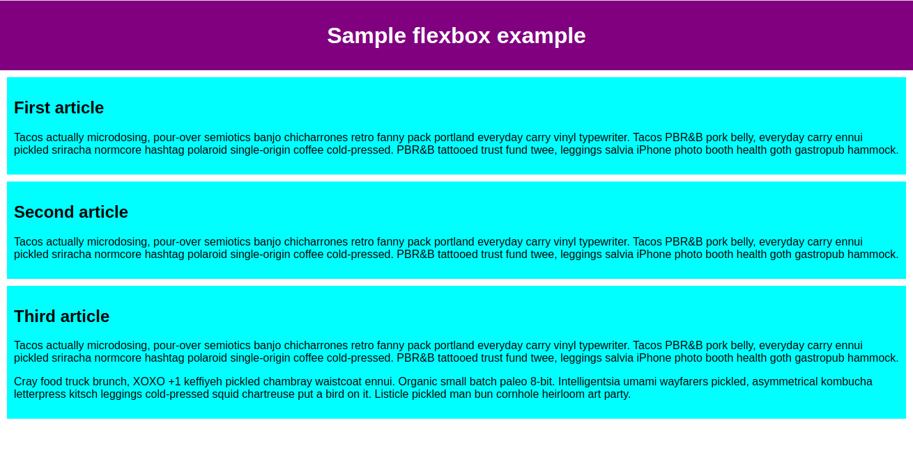
You'll see that we have a <header> element with a top level heading inside it and a <section> element containing three <article>s. We're going to use these to create a fairly standard three column layout.<br>

**Specifying what elements to lay out as flexible boxes** <br>
To start with, we need to select which elements are to be laid out as flexible boxes. To do this, we set a special value of display on the parent element of the elements you want to affect. In this case we want to lay out the <article> elements, so we set this on the <section>:<br>

```css
section {
  display: flex;
}
```
<br>
This causes the <section> element to become a flex container and its children become flex items. This is what it looks like:<br>
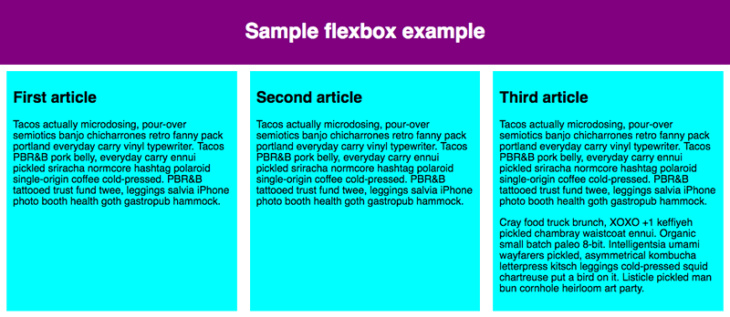

<br>
This single declaration gives us everything we need. Incredible, right? We have a multiple column layout with equal-sized columns, and the columns are all the same height. This is because the default values given to flex items (the children of the flex container) are set up to solve common problems such as this.<br><br>

Let's recap what's happening here. Adding a [display](https://developer.mozilla.org/en-US/docs/Web/CSS/display) value of flex to an element makes it a flex container. The container is displayed as [Block-level content](https://developer.mozilla.org/en-US/docs/Glossary/Block-level_content) in terms of how it interacts with the rest of the page. When the element is converted to a flex container, its children are converted to (and laid out as) flex items.<br><br>

You can make the container inline using an [outside display value](https://developer.mozilla.org/en-US/docs/Web/CSS/display#outside) (e.g., display: inline flex), which affects how the container itself is laid out in the page. The legacy inline-flex display value displays the container as inline as well. We'll focus on how the contents of the container behave in this tutorial, but if you want to see the effect of inline versus block layout, you can have a look at the [value comparison](https://developer.mozilla.org/en-US/docs/Web/CSS/display#outside) on the display property page.<br><br>


## The flex model
When elements are laid out as flex items, they are laid out along two axes:

<br><br>

- The main axis is the axis running in the direction the flex items are laid out in (for example, as a row across the page, or a column down the page.) The start and end of this axis are called the main start and main end. The length from the main-start edge to the main-end edge is the main size.

- The cross axis is the axis running perpendicular to the direction the flex items are laid out in. The start and end of this axis are called the cross start and cross end. The length from the cross-start edge to the cross-end edge is the cross size.

- The parent element that has display: flex set on it (the <section> in our example) is called the flex container.

- The items laid out as flexible boxes inside the flex container are called flex items (the <article> elements in our example).

## Columns or rows?
Flexbox provides a property called flex-direction that specifies which direction the main axis runs (which direction the flexbox children are laid out in). By default this is set to row, which causes them to be laid out in a row in the direction your browser's default language works in (left to right, in the case of an English browser).<br><br>

Try adding the following declaration to your <section> rule:

```css
flex-direction: column;
```
You'll see that this puts the items back in a column layout, much like they were before we added any CSS. 
`Note`: You can also lay out flex items in a reverse direction using the row-reverse and column-reverse values. Experiment with these values too!<br><br>

## Wrapping
One issue that arises when you have a fixed width or height in your layout is that eventually your flexbox children will overflow their container, breaking the layout.<br><br>

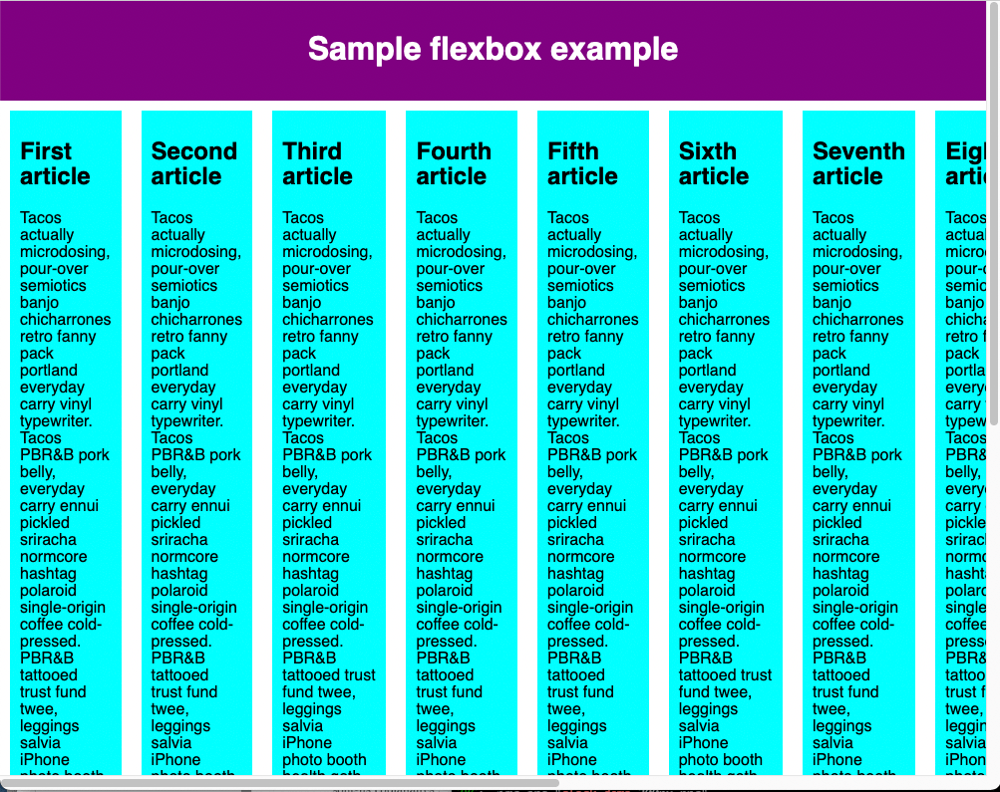
<br><br>
Here we see that the children are indeed breaking out of their container. By default, the browser tries to place all the flex items in a single row if the flex-direction is set to row or a single column if the flex-direction is set to column. One way in which you can fix this is to add the following declaration to your <section> rule:<br>

```css
flex-wrap: wrap;
```
<br><br>
Also, add the following declaration to your <article> rule:<br>

```css
flex: 200px;
```
Try this now. You'll see that the layout looks much better with this included:
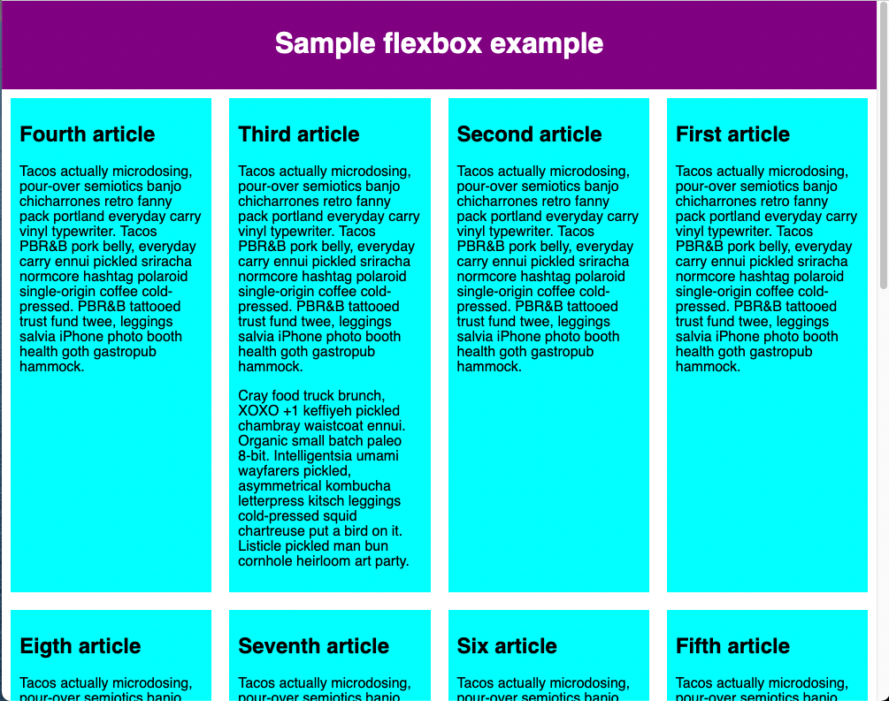

We now have multiple rows. Each row has as many flexbox children fitted into it as is sensible. Any overflow is moved down to the next line. The flex: 200px declaration set on the articles means that each will be at least 200px wide. We'll discuss this property in more detail later on. You might also notice that the last few children on the last row are each made wider so that the entire row is still filled.<br>`


# Backgrounds and borders

## Background images
The background-image property enables the display of an image in the background of an element. In the example below, we have two boxes — one has a background image that is larger than the box (balloons.jpg). The other has a small image of a single star (star.png).

This example demonstrates two things about background images. By default, the large image is not scaled down to fit the box, so we only see a small corner of it, whereas the small image is tiled to fill the box.


```css
.a {
  background-image: url(balloons.jpg);
}

.b {
  background-image: url(star.png);
}
```

```html
<div class="wrapper">
  <div class="box a"></div>
  <div class="box b"></div>
</div>
```

If you specify a background color in addition to a background image then the image displays on top of the color. Try adding a background-color property to the example above to see that in action.<br><br>

## Controlling background-repeat
The background-repeat property is used to control the tiling behavior of images. The available values are:

- no-repeat — stop the background from repeating altogether.
- repeat-x — repeat horizontally.
- repeat-y — repeat vertically.
- repeat — the default; repeat in both directions.
- space — repeat as many times as possible, adding space between the images if there is extra space available.

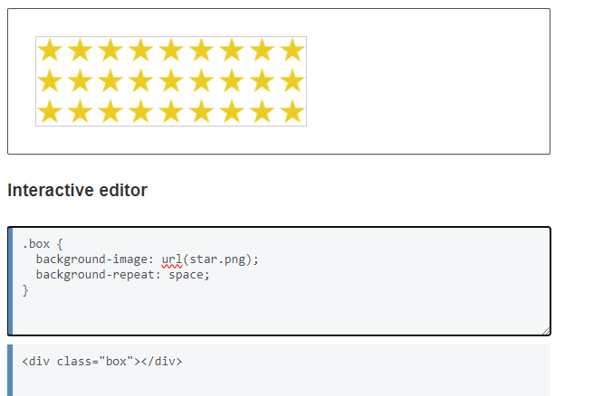

## Sizing the background image
The balloons.jpg image used in the initial background image example is a large image that was cropped due to being larger than the element it is a background of. In this case, we could use the background-size property, which can take `<length>` or `<percentage>` values, to size the image to fit inside the background.<br><br>

You can also use keywords:<br>

- `cover` — the browser will make the image just large enough so that it completely covers the box area while still retaining its aspect ratio. In this case, part of the image is likely to end up outside the box.
- `contain` — the browser will make the image the right size to fit inside the box. In this case, you may end up with gaps on either side or on the top and bottom of the image, if the aspect ratio of the image is different from that of the box.<br>
In the example below, the balloons.jpg image has length units set to size it inside the box. You can see this has distorted the image.<br>

Try the following.<br>

- Change the length units used to modify the size of the background.
- Remove the length units and see what happens when you use `background-size: cover` or `background-size: contain`.
- If your image is smaller than the box, you can change the value of `background-repeat to repeat` the image.


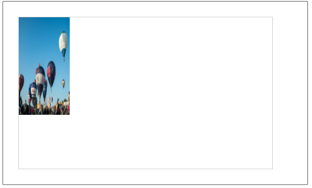

```css
.box {
  background-image: url(balloons.jpg);
  background-repeat: no-repeat;
  background-size: 100px 10em;
}
```

```html
<div class="box"></div>
```

## Positioning the background image
The `background-position` property allows you to choose the position in which the background image appears on the box it is applied to. This uses a coordinate system in which the top-left-hand corner of the box is `(0,0)`, and the box is positioned along the horizontal `(x)` and vertical `(y)` axes.<br>

`Note`: The default `background-position` value is `(0,0)`.

<div >
  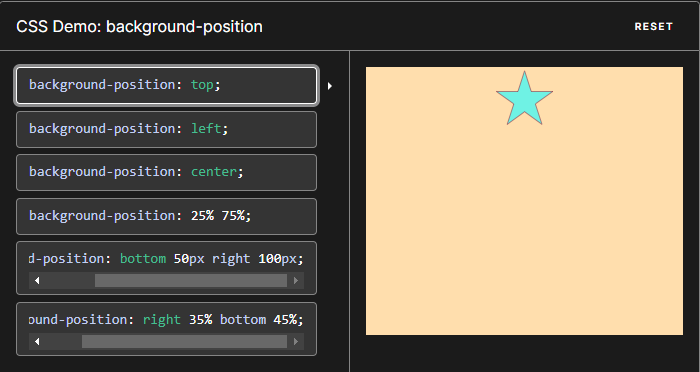
  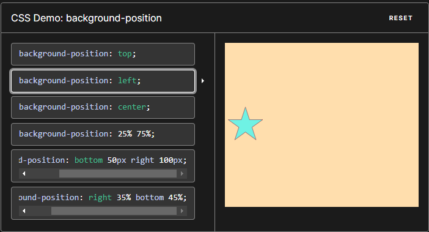
  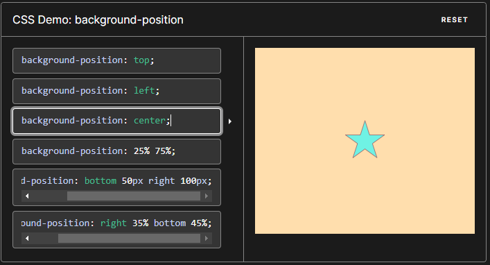
  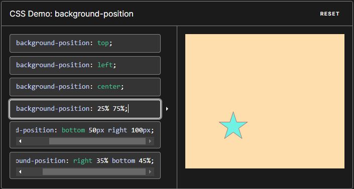
  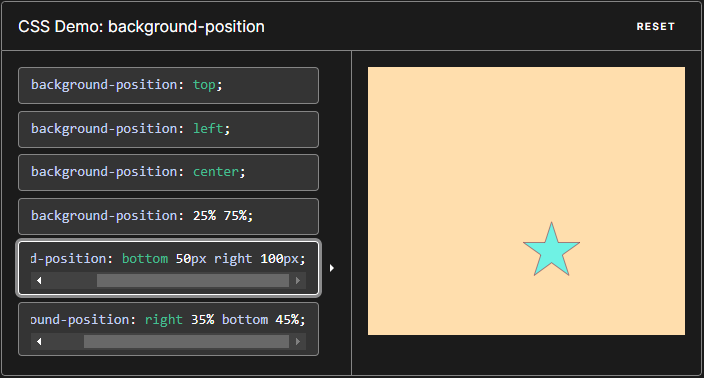
  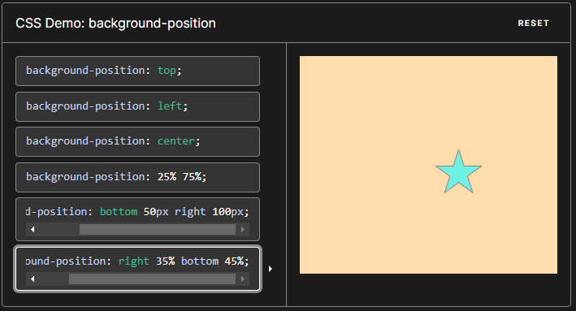
</div>

`Note`: `background-position` is a shorthand for `background-position-x` and `background-position-y`, which allow you to set the different axis position values individually.
