# Practical Networking
[Youtube](https://www.youtube.com/watch?v=bj-Yfakjllc&list=PLIFyRwBY_4bRLmKfP1KnZA6rZbRHtxmXi&index=1)

## Networking Topics

### Network Core
1. Networking Devices, Transmission Media(Guided, Unguided)
2. IP Version(IPV4, IPV6) + Classes(A,B,C,D,E)
3. Domains, Addresses(Physical, Logical)
4. Network Engineer, Network Definition

### Data Communication
1. Transmission Mode: Simplex, Half/Full Duplex, Half Duplex: HUB
2. Sync vs Async
3. Collision Port in Hub
4. Electromagnetic Waves (Analog, Digital)
5. Signal Spectrum: Radio Waves, Micro Waves, Infrared, Gamma, Beta, X-Rays

### Network Protocols
1. Definition
2. OSI Model, TCP/IP Model
3. Examples: TCP/IP, HTTP, FTP, ICMP, POP3
4. Layer 1 (Physical, HUB, Wires, Ports)
5. Layer 2 (Switch), ARP, RARP
6. Layer 3 (Router)
7. Network Connectivity Device

### Packet Tracer
1. Two Ways to Assign IP: Static (Customized) + Dynamic (DHCP)

### Network Classifications and Topologies
1. Functionality, Area
2. CSMA/CD, CSMA/CA
3. IP Addresses (Works on Layer 3)
4. Classes, Broadband vs Baseband, Subnet Mask

### Router Configuration and Transmission Media
1. Router Configuration Commands
2. DCE vs DTE
3. Router RIP
4. Transmission Media: Guided, Unguided
5. Cables, Connectors (BNC, RJ45)

### Transmission Media
1. Guided VS Unguided | Ground Line vs Satelite Link
2. Cables: Coaxial, Twisted Pair (cat5, cat6, cat7), Untwisted, Fiber optic, 

### MISC
1. Broadband: Many signals at a time
2. Baseband: only one signal at a time 
3. Router on Stick Methodology
4. Error checking algorithms, (Transport Layer, checksum, end-to-end), and point-to-point
5. Impairment causes in network(Issue while transmitting packets: Low signal, droping packets): Attenuation, distortion, Noise
6. Types of Noise: Thermal, Induce, Cross Talk, Impulse
7. Switch Port Mode: Access, Trunk; It is router on stick methodology.
8. Routing: Dynamic, Distance Vector, Link State(Short Distance, less traffic, open shortest path first(OSPF), dijsktra algorithm)
9. Border Gateway Protocol()
10. STP: Spanning Tree Protocol: Root, Bridge, Block
11. VTP: VLAN Trunking Protocol

- End-To-End Checking Algorithm --> Checksum
- Point-to-point --> CRC: Cyclic Redundancy
- Switch Port Mode: 

---

# Networ Core
## 1) Network Devices (HINR-HBSR)
1. Host 
2. IP Addresses
3. Network
4. Repeater
5. Hub
6. Bridge
7. Switch
8. Router

### 1. Host
    - Any device which sends or receive traffic over network. Host fall in two categories.  
    - Client: Initiate requests
    - Server: Responds to specific requests

### 2. IP Address
- Identity of each host. IP addresses are 32 bits, represented as 4 octets of 0-255. Hierarchically assigned

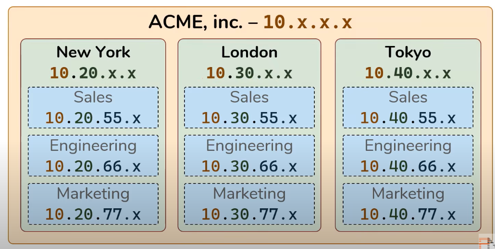

### 3. Network
Interconnecting more than one nodes.

### 4. Repeater
- It regenrates signals.
- Allow communications across greater distances.

### 5. Hub
- Hubs are simply multi-port repeaters.
- Facilitates scaling communication between additional hosts
- Everyone recieves everyone else's data. There comes the concept of bridges.
- *Evaluation of a hub (star topology diagram)*

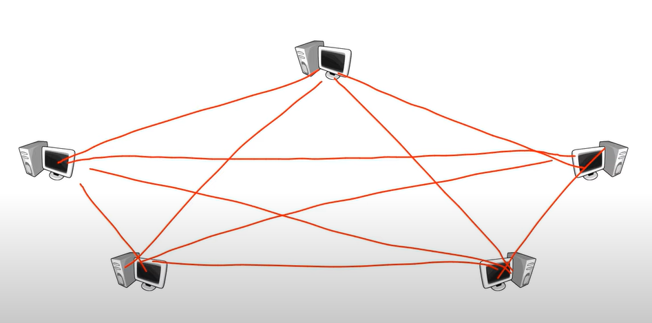

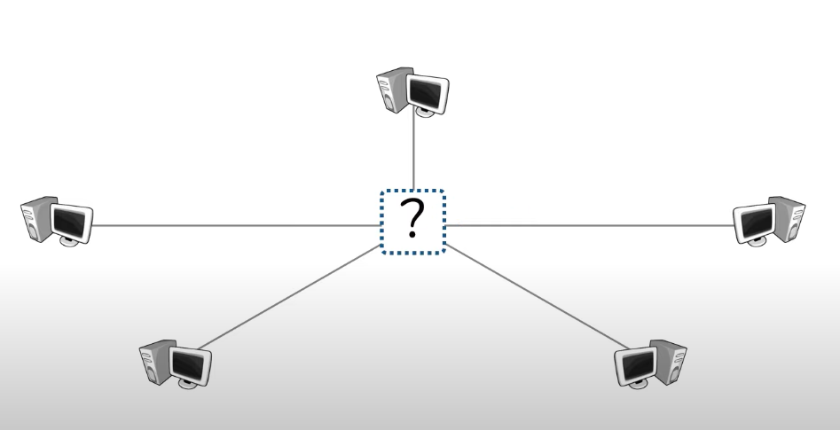

 

### 6. Bridge: 2 Port
- Bridges sit between Hub-connected hosts.
- Has only 2 ports
- Bridges learn which hosts are on each **side**.

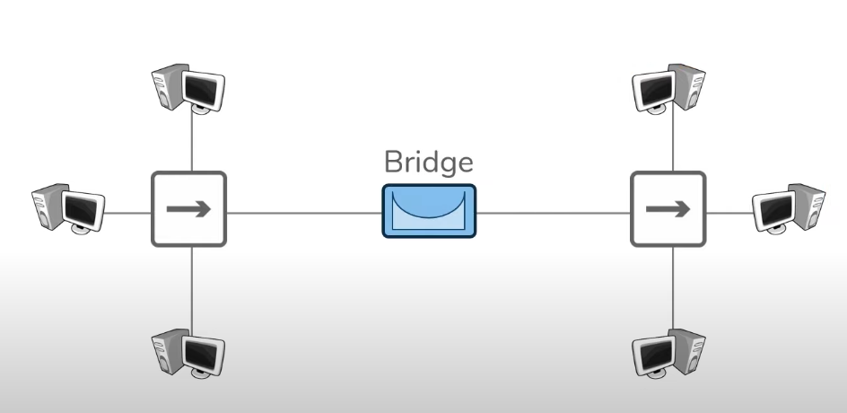

### 7. Switch
- Facilitates communication within a network.
- Switches are a combination of Hubs and Bridges.
- Multiple ports
- Learns which hosts are on each **port**.

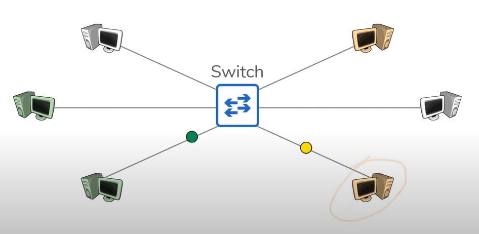

### 8. Router
- Routers Learn which network they are attached to 
  - Known as **Routes**-- Stored in a **Routing Table**
- Have IP Addresses in the Networks they are attached to
- **Gateway** --each host's way out of their local Network.

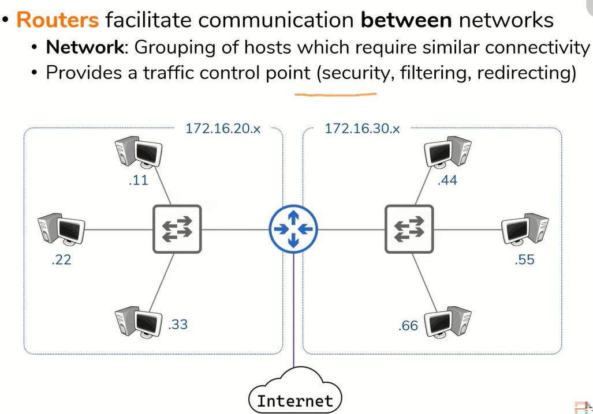

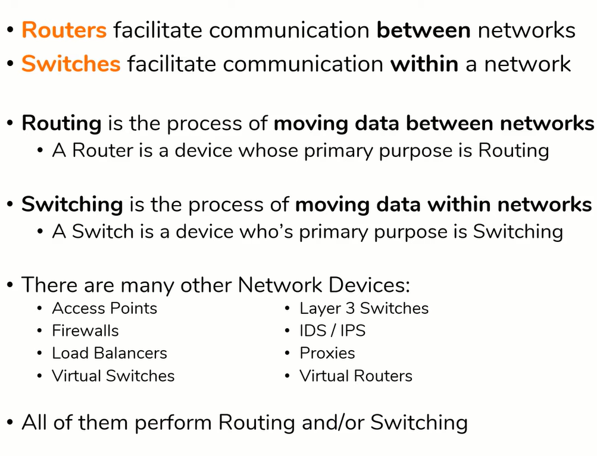

## Quick Review of 1) Network Devices

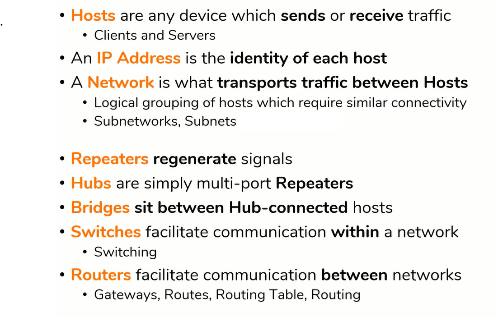

<!--  -->

## 2) IP Version(IPV4, IPV6) + Classes(A,B,C,D,E)    

|| IPv4 | IPv6|
|------|------|-----|
|Size| 32 bits|128 bits|
|Addresses|4.3B|4 Trillion|

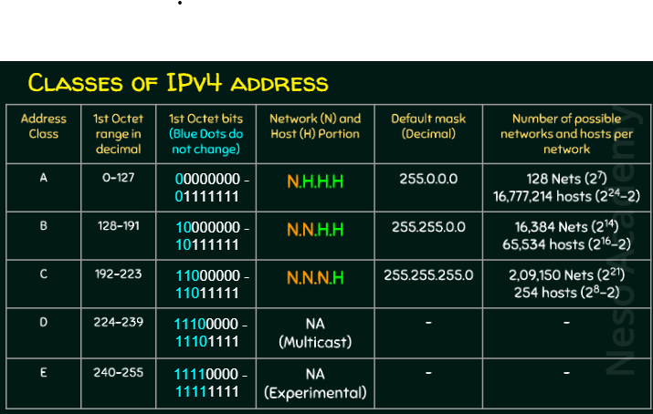

## 3) Domains, Addresses(Physical, Logical)

  
  <pre>       `http:` `//www.`   `nps.gov` `/history` `/places.htm`
      Protocol Hostname   domain name  path    webpage name
   </pre>

- TLDs: Top Level Domains
  - `.com` Commercial organizations and companies
  - `.edu` Educational institutions
  - `.gov` Governement organizations
  - `.mil` Military
  - `.net` Network Providers
  - `.org` Non-profit organizations
  
  The organization that approves and controls TLDs is ICANN(Pronounced Eye-can)
  - ICANN: Internet Corporation for assigned names and numbers.
  - The suffix of the domain name may include a contry code(ccTLD), two letter conury code such as auTLD for australia.

- Addresses
  - Logical Address: IP
    - Private IP: 
      - Used with LAN Network Not recognized over network. 
      - Assigned by LAN Adminstrator. 
      - Unique only in LAN and free of charge.
    - Public IP: Used on public network(WAN). 
      - Recognized over interent. 
      - Assigned by service provider.
      - Unique globally, cost is associated with using public IP.
  - Physical Address: MAC (Media Access Control)
    - MAC address is a unique identifier assigned to a NIC for use as a network address in communications within a network segment.

---
## Networking Shorthand

1. Introduction to Networking
  - FQDN(Fully Qualified Domain Name), URL(Uniform Resource Locator)
  - Basic Characteristics of Networking
    - Need for Fault Tolerant
    - Need for Scalable Networks
    - Quality of Service(QoS)
      - 1. Set Priorites: VoIP call no delay, 1 second delay in mail.
      - 2. Manage data traffic to reduce data loss, delay, etc.
    - Importance of Security
      - The ability to prevent: Unauthorized access, Misuse, Forgery
      - The ability to provide: Cofidentiality, Integrity, Availbility

2. Network Protocols & Communication
  - Data Communication: Exchange of data b/w 2 nodes.
  - Data Flow: Simplex (Traditional Monitors), Half Duplex(Walkie-Talkie), Full Duplex(Telephone Line)
  - Protocols: Communication Schemas, rules that govern all methods of communication
    - Source or Sender
    - Destination or receiver
    - Channel or Media
  - **_Protocol Determines: What & How & When it is communication?_**
  - Protocols used in network communication also define: DEFTS
    - Message Delievry options: Unicast, Multicast, Broadcast
    - Message Encoding
    - Message Formating & Encapsulation
    - Message Timing: Flow Control, Response Timeout
    - Message Size

3. Components of a Computer Network
  - Nodes: End Nodes(End Devices), Intermediary Nodes.
  - Media: Wired(Guided Media), Wireless(Unguided Media)
  - Service: E-mail, online-game, storage-services, VoIP, File Sharing, video telephony, instant Messaging, **World Wide Web**
  - Signals are the electromagnetic waves.
    - Some common waves: Radio, Micro, X-Rays, Bets, Gama
  - **Wired Media**
    - Ethernet Straight through cable: Connecting 2 differnet nodes.
    - Ethernet crossover cable: connecting 2 same type of nodes.
    - Fibre Optic: Light Signals
    - Coaxial Cable: Audio and Video transmitting
    - USB Cable: Smartphone & Computer communicating

  - **Wireless Media**
    - Infrared: Short range communication, e.g, TV remote.
    - Radio: Bluetooth, wifi
    - Microwaves: Cellular system
    - Satelite: Long range communication, e.g, GPS.

  - 1. How the data flows?
There comes the concept of transmission modes/data flow modes: Simplex(Traditional Monitors), Half Duplex(Walkie-Talkies), Full Duplex(Telephone Lines)

4. Classification of Computer Networks
  - LAN(Local Area Network): _Interconnects_ computers withing a limited area. 
    - Ex: Wired LAN(ex: Ethernet, Hub, Switch), Wireless LAN(ex: wifi)
  - MAN(Metropolitan Area Network): Interconnects users with computer resources in a geographic region of the size of a metropolitan area(city).
    - Switch & Hub: To connect
    - Router & Bridges: connect the end nodes to network
  - Wide Area Network(WAN): Telecommunications network that extends over a large geo area.
    -Ex: WAN-Devices: End devices, and intermediary devices.

5. Network Topology
  - Arrangements of nodes of a computer network.
    - Physical Topolgy and Logical topology
      - Physical Topology: Physical Location of nodes.
      - Logical Topology: How the data will flow.
    - **Network Topologies**: Bus, Ring, Star, Mesh, Hybrid
    - 1. Bus Topology: 
      - Only one wire, less expensive, suited for temporary network, node failures doesn't affect others.
      - Not fault tolerant (no redundancy), limited cable length, no security

---

# OSI Model

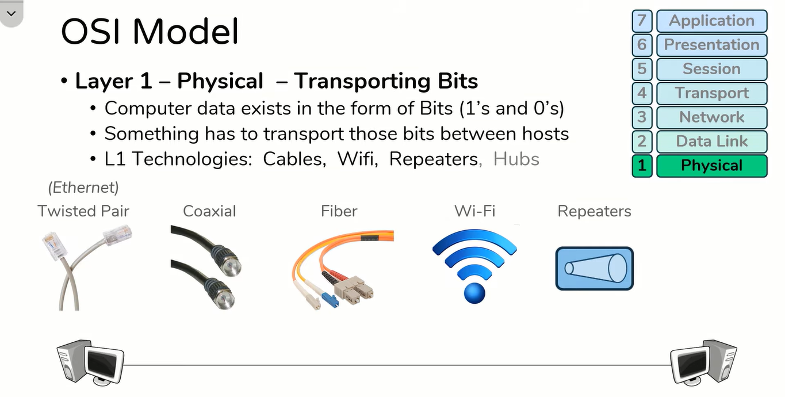
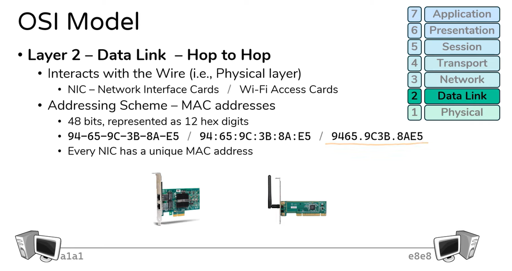
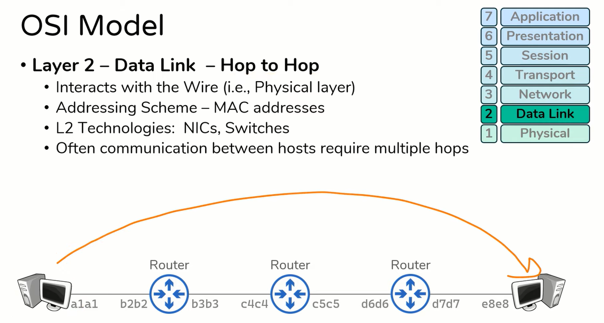
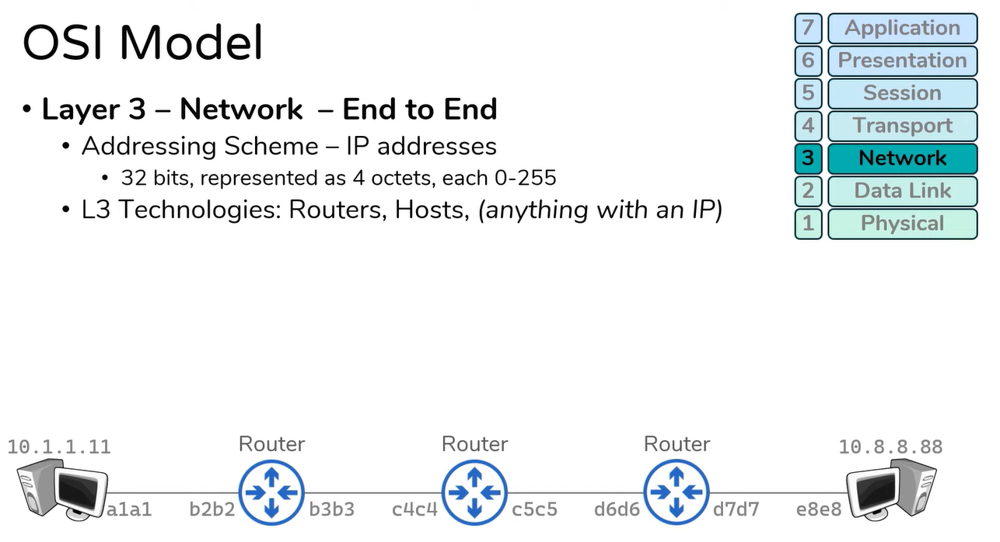
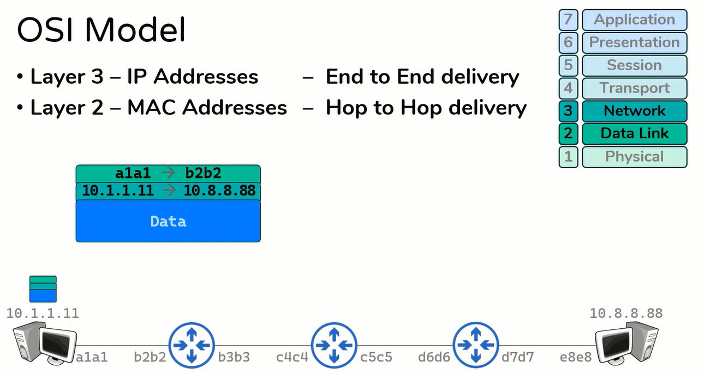
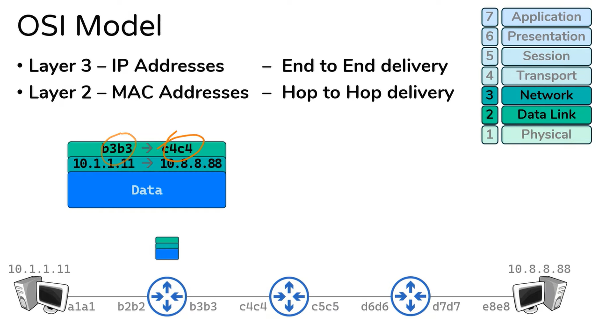
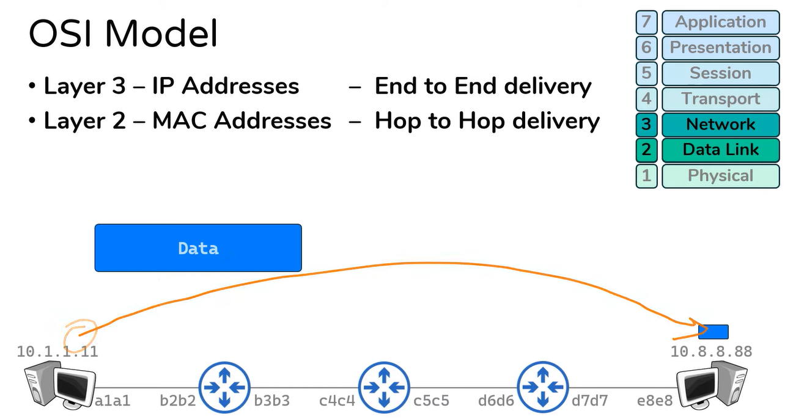
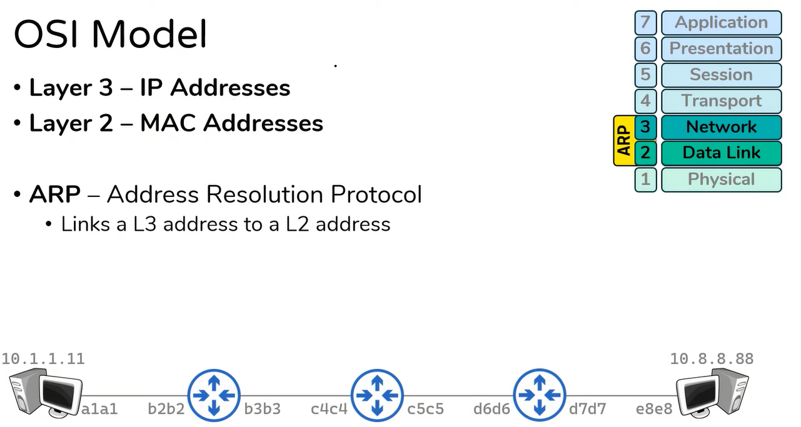
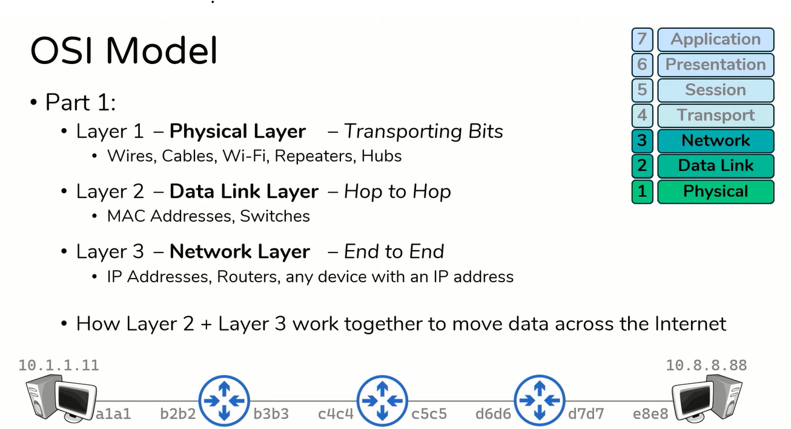
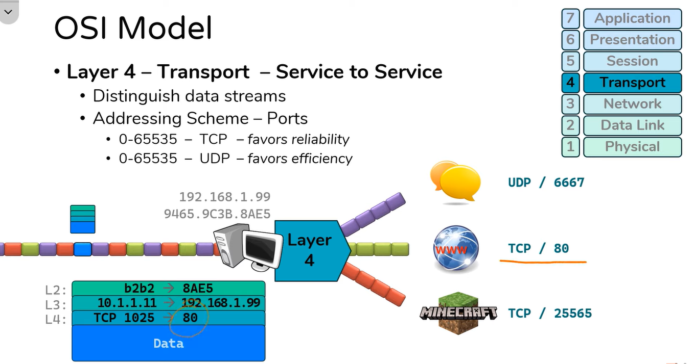

##  1. Router on Stick stick methodology   2. Switch Config   3. Dynamic Routing Types

- Access Mode: For single VLAN connections (end devices).
- Trunk Mode: For multiple VLANs (inter-switch connections).
- Dynamic Auto: Automatically negotiates trunking if possible.
- Dynamic Desirable: Actively attempts to form a trunk connection.
- Hybrid Mode

## Dynamic Router
1. Distance Vector Routing: Bellford
2. Link State Routing: Hop to Hop, OSPF Protocol, Dijstktra Algorithm

# Spanning Tree Protocol
  - Understand the need for redundancy and how failure is handled.
  - Know about broadcast storm.
  - Understand Spanning Tree Protocol.

- Redundant Link or backup link

### Key Facts
- Original STP (802.1D) was created to prevent loops
- Switches send probes into the network to discover loops.
- These probes are called BPDU(Bridge Protocol Data Unit).
- BPDU will have specific information about the switch.
- Switch multicasts BPDU probes (every 2 seconds) and if it receives its own BPDU back, it means there is  a loop.
- Also the BPDU probes help to elect the root bridge.
- All switches will find the best way to reach the root bridge and the redundant links will be blocked. (Port cost)

## VLAN
- Know the need for VLAN
- Working of VLAN
- Benefits of VLAN
- Types of VLAN
- VLAN Frame Tagging

- A VLAN is a logical partition of a layer 2 network.
- Multiple partitions can be created, allowing for multiple VLANs to Co-Exist
- Each VLAN is a broadcast domain, usually with its own IP Network.
- VLANs are mutually isolated and packets can only pass between them via a router.
- The partitioning of the layer 2 network takes place inside a layer 2 device, usually via a switch. 
- The hosts grouped within a VLAN are unaware of the VLAN's existence.

### Advantages of VLAN
  - Security
  - Cost reduction
  - Better performance

### Types of VLAN
  - Data VLAN
  - Default VLAN
  - Native VLAN
  - Managment VLAN
  - Voice VLAN

## VLAN Trunking Protocol

### Switch 1: Server
- Switch> VTP Domain iba
- Switch> VTP mode server
- Switch> VTP password 123

### Switch 2: Client
- Switch> VTP Domain iba
- Switch> VTP mode client
- Switch> VTP password 123

- IP Conversion: Network Address, Broadcast, Subnet Exercises
- Bayonet Neill–Concelman (BNC)

1. OSI and TCP/IP Model
2. IP Exercises and Router Configuration(1-Router, 2-Router, 3-Router, )
3. Sync VS Async, IPv4 VS IPv6, Hub VS Router, Impairment Causes in Network , Bus and Star, Ethernet Port VS Serial Port
4. Network According Area, Data Communication(Transmission Media), and Topologies.
5. VTP and STP, Network Protocols: IP, TCP/IP, HTTP, FTTP, ICMP, POP; 

ICMP: Inernet Connect Message Protocol
Static and Dynamic IP: 

MISC: 
1. IPv4 vs IPv6
2. Pulic IP(Dynamic, Static) and Private IP
3. RIP (Routing Information Protocol): Distance Vector Routing Protocol: Path with lowest hop count(Usually 15), 16 means unreachable
4. Router on Stick methodology: When Inter VLAN is done using router but not using layer3 switch.
5. Access Port: One VLAN, Trunk Port: More than one VLAN

## Attenuation: 
The loss of signal strength over distance, requiring amplifiers to restore the original signal.

## Distortion: 
Changes in a signal's shape due to different propagation speeds of its frequency components, causing them to arrive at different times.

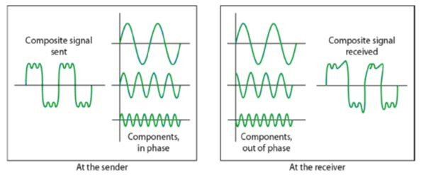

## Noise: 
Random interference that disrupts the original signal, caused by various sources like motors, thermal activity, and external disturbances.

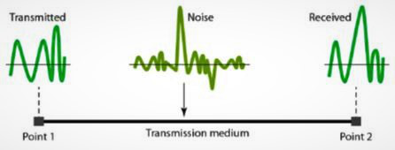

## Thermal Noise: 
Random signals created by moving electrons in wires.

## Induced Noise: 
Interference from nearby devices like motors and appliances.

## Impulse Noise: 
Sudden spikes in the signal caused by events like lightning or power surges.

## Crosstalk: 
Interference that occurs when signals from one wire or channel affect another, causing unwanted noise in the received signal.

---

# Presentation

1. Cryptography
  - IAM, Authentication, CIA[Sagar]
  - Digital Signature, VoIP [Both]
  - Packet Encryption: [Both]
  - Practical: Subnetting, http(s), (Wire Shark), [Both]

2. Subnetting [Sagar]

---

# Final Cisco Practice

Video 1: 
VLAN: A logical grouping of devices connected to a single Ethernet Cable
  - Solved broadcast issues
  - Instead of buying multiple switches

1. Assign IPs to PC
1. Enable Config
1. Create Vlans with diff IPs
1. Set Ports Mode and Access

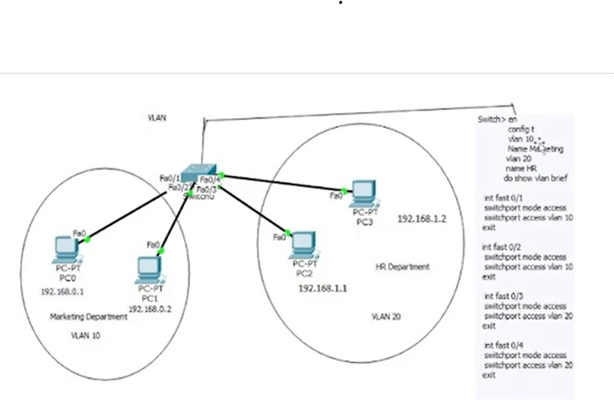

Video 2: 
InterVLAN: Router On Stick

1. Assign IPs
2. Enable Config
3. Create VLANS on each switch
4. Set Ports Mode and Access
5. Router: interface, encapsulation, ip add

Video 3: 
VLAN

Video 4:
VTP: Instead of creating vlans on each switch

- VTP Mode: Server(main), Transparent(outside the control of main/server), Client(under control of main/server)

---

### 1. **Modulation**

**Definition:**  
Modulation is the process of modifying a carrier signal (usually a wave) with information (like voice, data, or video). This helps transmit the information over long distances without losing quality.

**Why do we need it?**  
Without modulation, signals like aud  io or video could not be transmitted over long distances, as they would lose quality or be affected by noise. By modulating the signal, we can send it over a variety of mediums like radio waves, fiber optics, or cables.

#### **Key Terms Related to Modulation:**
- **Carrier Signal:** A steady wave that is used to carry the information. The carrier signal itself typically doesn't contain any useful information but is altered (modulated) to carry data.
- **Carrier Wave:** A continuous wave signal that is modified by the information signal. It has a certain frequency, amplitude, and phase, which are adjusted during modulation to carry the information.
- **Modulated Signal:** The signal that results after the carrier wave has been altered (modulated) by the information signal. The carrier wave is modified in terms of amplitude, frequency, or phase to encode the information.

#### **Types of Modulation:**

- **Amplitude Modulation (AM):**  
  In AM, the **amplitude** (height) of the carrier wave changes according to the information signal. Think of it like how loud or soft a sound is. AM is often used in radio broadcasting.  
  **Example:** AM radio stations.
  
- **Frequency Modulation (FM):**  
  In FM, the **frequency** (the number of times the wave oscillates per second) of the carrier wave changes according to the information. FM is known for its better sound quality and resistance to interference.  
  **Example:** FM radio stations.

- **Phase Modulation (PM):**  
  In PM, the **phase** of the carrier wave shifts in accordance with the information. This type is less common but used in certain communications systems.

#### **Example in Real Life:**  
When you listen to the radio, the signal is modulated so that the sound (information) can travel across the airwaves. Your radio demodulates the signal to play the sound.

---

### 2. **Demodulation**

**Definition:**  
Demodulation is the reverse process of modulation. It's when the receiver extracts the original information (like audio, data, or video) from the modulated carrier signal.

**Why do we need it?**  
After a signal is transmitted over long distances using modulation, the receiver needs to convert the signal back to its original form (such as sound or video) that we can understand.

**Example:**  
In radio, when you tune into a station, your radio **demodulates** the signal to produce sound or music.

#### **Types of Demodulation:**  
The demodulation technique depends on the type of modulation used:
- **AM Demodulation**
- **FM Demodulation**
- **PM Demodulation**

Each of these techniques recovers the original information based on the type of modulation used during transmission.

---

### 3. **Multiplexing**

**Definition:**  
Multiplexing is the process of combining multiple signals (data, voice, video) into one signal so that they can be transmitted over a single communication channel. This increases the efficiency of the channel by allowing multiple pieces of information to travel at the same time.

**Why do we need it?**  
Without multiplexing, separate channels would be needed for each signal, wasting resources. Multiplexing allows the use of a single medium (like a cable or radio wave) to carry many different types of information simultaneously.

#### **Key Terms Related to Multiplexing:**

- **Frequency Division Multiplexing (FDM):**  
  In FDM, the frequency spectrum (the range of frequencies) of the communication channel is divided into smaller parts. Each signal uses a different frequency band to transmit its information.  
  **Example:** Radio and TV broadcasting, where each station uses a different frequency.

- **Time Division Multiplexing (TDM):**  
  In TDM, the time available on the channel is divided into small time slots. Each signal gets a turn to use the channel, one after the other. This happens very quickly, so it looks like all signals are being transmitted at the same time.  
  **Example:** Telephone systems where many people can use the same line.

- **Code Division Multiplexing (CDM):**  
  In CDM, each signal is assigned a unique code, and all signals are transmitted at the same time using the same frequency band. The signals are distinguished by their unique codes, and at the receiver end, the code is used to separate the signals.
  **Example:** Used in mobile communication networks like CDMA (Code Division Multiple Access).

- **Wavelength Division Multiplexing (WDM):**  
  This is used in fiber-optic communication, where different signals are sent using different light wavelengths. It’s a more advanced form of multiplexing, allowing even more signals to be transmitted.

#### **Real-Life Example:**  
When you make a phone call and listen to music on the radio at the same time, you are using different signals over the same network. The system uses multiplexing to manage these multiple signals.

---

### 4. **Demultiplexing**

**Definition:**  
Demultiplexing is the reverse of multiplexing. It’s the process of separating a combined signal back into its original individual components.

**Why do we need it?**  
At the receiving end, the combined signal needs to be separated into the original signals so they can be understood or processed.

#### **Types of Demultiplexing:**  
Demultiplexing depends on the type of multiplexing used:
- **TDM Demultiplexing:** Separates the time-division multiplexed signals based on their time slots.
- **FDM Demultiplexing:** Separates signals based on their frequency ranges.
- **WDM Demultiplexing:** Separates optical signals based on different wavelengths of light.
- **CDM Demultiplexing:** Uses the assigned unique codes to extract the individual signals from the combined transmission.

#### **Example:**  
In a telephone network, the signal that contains multiple phone calls must be demultiplexed at the receiving end so each call can be sent to the correct person.

---

### **Important Topics for Your Exam**

1. **Basic Concepts:**
   - What is Modulation and why is it needed?
   - Difference between Modulation and Demodulation.
   - Types of Modulation (AM, FM, PM) and examples.
   - Difference between Multiplexing and Demultiplexing.
   - Types of Multiplexing (TDM, FDM, WDM, CDM).

2. **Modulation and Demodulation Techniques:**
   - Detailed explanation of AM, FM, and PM with examples.
   - The mathematical concepts behind modulation (like frequency, amplitude, and phase).
   - How demodulation works for different types of modulation.

3. **Multiplexing Techniques:**
   - Time Division Multiplexing (TDM) and its working.
   - Frequency Division Multiplexing (FDM) and its working.
   - Code Division Multiplexing (CDM) and its applications.
   - Wavelength Division Multiplexing (WDM) and its applications in fiber optics.

4. **Applications and Examples:**
   - Real-life applications of modulation and demodulation (radio, TV, telephone, etc.).
   - How multiplexing helps in efficient communication (telephone systems, internet).
   - Examples from everyday life (using a mobile phone, watching TV, internet usage).

---

### Recap

- **Modulation** helps us send signals over long distances by changing a carrier wave.
- **Demodulation** extracts the original information from the modulated signal.
- **Multiplexing** allows multiple signals to share a single communication medium, increasing efficiency.
- **Demultiplexing** separates combined signals back into their original form at the receiver's end.

---

### 1. **Spanning Tree Protocol (STP)**

**Definition:**  
Spanning Tree Protocol (STP) is a network protocol used to prevent loops in Ethernet networks. In a network, if data keeps circulating in a loop, it can cause network congestion and failure. STP is responsible for ensuring there is only one active path between any two network devices, preventing these harmful loops.

**Why do we need STP?**  
Ethernet networks are made up of interconnected switches. If a loop forms (when there are multiple paths between switches), it can lead to **broadcast storms**, data loss, and network outages. STP prevents this by automatically detecting and disabling redundant paths.

**How STP Works:**
- **Root Bridge:** The first step in STP is selecting a "root bridge" (the central point in the network). All decisions regarding which paths to block or keep active depend on this root.
- **Blocked Paths:** Once the root bridge is chosen, STP identifies the best path to each switch and blocks the redundant paths (those that form loops).
- **Dynamic Adjustment:** If the primary path fails, STP will reconfigure the network to use an alternative path without forming a loop.

#### **Types of STP:**
- **IEEE 802.1D (Standard STP):** The original and most widely used version of STP.
- **Rapid Spanning Tree Protocol (RSTP – IEEE 802.1w):** A faster version of STP that can detect network changes and respond more quickly.
- **Multiple Spanning Tree Protocol (MSTP – IEEE 802.1s):** Allows multiple spanning trees for different VLANs (Virtual LANs), improving network performance.

#### **Real-Life Example:**
Imagine you have multiple highways between two cities. If there is an accident on one highway, traffic will get stuck and circulate in a loop. STP is like a traffic control system that ensures only one road is used at a time, while others are blocked to prevent traffic jams. If one road is blocked, it finds the next available one.

---

### 2. **Network Protocols**

**Definition:**  
A **network protocol** is a set of rules that govern how data is transmitted and received across a network. These protocols ensure that devices like computers, routers, and servers communicate efficiently, securely, and reliably.

Network protocols define the **format**, **order**, and **timing** of messages, and how devices respond to errors, data collisions, and other network issues. Every time you use the internet, your devices communicate using these protocols.

#### **Types of Network Protocols:**

1. **Transmission Control Protocol (TCP):**
   - **Purpose:** Ensures reliable, ordered, and error-checked delivery of data between devices.
   - **How It Works:** It breaks data into small packets, sends them over the network, and then reassembles them on the receiving end. If any packet is lost or corrupted, TCP requests it to be resent.
   - **Real-Life Example:** When you send an email, TCP ensures that the email is received completely and in the correct order.

2. **Internet Protocol (IP):**
   - **Purpose:** IP is responsible for addressing and routing data packets across networks.
   - **How It Works:** Every device on a network has a unique IP address, and IP helps to direct the data packets to their correct destination by checking the destination IP address.
   - **Real-Life Example:** When you visit a website, your browser sends a request to a server's IP address to fetch the webpage.

3. **Hypertext Transfer Protocol (HTTP):**
   - **Purpose:** HTTP is used for transferring data over the web (like loading webpages).
   - **How It Works:** HTTP defines the rules for how a web browser and web server communicate. It tells the browser to request specific information (like a webpage), and the server sends back the requested content.
   - **Real-Life Example:** When you type a website URL (like "www.example.com") in your browser, HTTP sends the request to the website’s server to retrieve the webpage.

4. **File Transfer Protocol (FTP):**
   - **Purpose:** FTP is used to transfer files between computers over a network.
   - **How It Works:** It allows users to upload and download files from remote computers (like servers) using a client program.
   - **Real-Life Example:** FTP is often used by web developers to upload files (such as images or HTML files) to their websites.

5. **Simple Mail Transfer Protocol (SMTP):**
   - **Purpose:** SMTP is used for sending and receiving email.
   - **How It Works:** SMTP helps email clients (like Gmail or Outlook) send emails to a mail server and then route them to the recipient’s email server.
   - **Real-Life Example:** When you send an email, SMTP is responsible for routing that email to the recipient's email provider.

6. **Dynamic Host Configuration Protocol (DHCP):**
   - **Purpose:** DHCP automatically assigns IP addresses to devices on a network, making it easier to connect devices without manually setting up IP addresses.
   - **How It Works:** When a device (like a laptop or smartphone) joins a network, DHCP assigns it a temporary IP address to communicate on that network.
   - **Real-Life Example:** When you connect to Wi-Fi at a café, DHCP gives your device an IP address to access the internet.

7. **Simple Network Management Protocol (SNMP):**
   - **Purpose:** SNMP is used to manage and monitor network devices, such as routers, switches, and servers.
   - **How It Works:** It allows network administrators to gather data from devices, check their status, and perform network diagnostics.
   - **Real-Life Example:** When an IT team checks the performance of a company’s network devices, SNMP helps them retrieve data and identify issues.

8. **Secure Sockets Layer (SSL) / Transport Layer Security (TLS):**
   - **Purpose:** SSL and TLS are protocols used to secure communication between devices on a network, especially for web browsing.
   - **How It Works:** SSL/TLS encrypts the data transmitted between a client (like a web browser) and a server, ensuring privacy and security.
   - **Real-Life Example:** When you enter credit card details on a website, SSL/TLS encrypts that information to protect it from hackers.

---

### **Real-Life Example of Network Protocols in Action:**
Imagine you're sending an email to a friend. Here's how protocols are involved:

1. **SMTP** sends the email to the mail server.
2. **IP** routes that email to the server’s address.
3. The email is then transferred to your friend’s mail server via **SMTP** again.
4. Your friend’s email client retrieves the email using **POP3** or **IMAP**, which are other protocols for email retrieval.

All of these protocols work together to ensure that your email reaches your friend correctly and securely.

---

### **Why Are Network Protocols Important?**

- **Standardization:** Protocols ensure that devices from different manufacturers can work together. Without common protocols, devices like computers, phones, and printers wouldn't be able to communicate.
- **Security:** Protocols like SSL/TLS and HTTPS ensure secure communication over the internet.
- **Efficiency:** Protocols like TCP/IP, DHCP, and SNMP help networks run efficiently by managing how data is transmitted, assigned, and monitored.

---

### **Important Topics for Your Exam:**

1. **Spanning Tree Protocol (STP):**
   - Definition and purpose of STP.
   - How STP prevents loops in a network.
   - Different versions of STP (IEEE 802.1D, RSTP, MSTP).
   - The role of the Root Bridge and blocked paths.
   
2. **Network Protocols:**
   - Definition and role of network protocols in communication.
   - Major protocols (TCP, IP, HTTP, FTP, SMTP, etc.) and their functions.
   - How protocols work together to support various internet and network services.
   - Key differences between different protocols like TCP vs. UDP, FTP vs. HTTP, etc.

3. **Protocol Layers:**
   - The OSI model and how protocols work at each layer (Physical, Data Link, Network, Transport, Application).
   - Understanding how protocols interact at different layers for communication.

---

### 1. **VTP (VLAN Trunking Protocol)**

**Definition:**  
VTP is a network protocol used in **Cisco** switches to manage **VLANs** (Virtual Local Area Networks) across a **trunk link**. A trunk link is a connection between two network switches that can carry traffic from multiple VLANs simultaneously.

**Purpose:**  
VTP simplifies the management of VLANs by allowing switches to automatically exchange information about VLANs with each other. This reduces the need for manual configuration on each switch, which can be time-consuming and error-prone.

**How it Works:**
- **VTP Domains:** All switches within the same VTP domain share VLAN information. A domain is essentially a group of switches that exchange VTP information.
- **VTP Modes:** There are three main modes in VTP:
  - **Server Mode:** Switches in this mode can create, delete, and modify VLANs, and they propagate this information to other switches in the VTP domain.
  - **Client Mode:** Switches in this mode receive VLAN information from servers but cannot create, delete, or modify VLANs.
  - **Transparent Mode:** Switches in this mode do not participate in VLAN information exchange but will forward VLAN information they receive to other switches.
  
**Benefits of VTP:**
- **Simplified VLAN Management:** VLAN configurations can be made on a single switch (in server mode), and the information will be automatically shared with other switches in the domain.
- **Consistency:** Ensures that all switches in the network have consistent VLAN configurations.

**Real-Life Example:**  
Imagine a large office building with multiple floors. Each floor is its own VLAN for better network management. VTP allows the network administrator to create a new VLAN (like for a new department) on one switch, and that VLAN will be automatically available on all switches across the building.

---

### 2. **VLAN (Virtual Local Area Network)**

**Definition:**  
A **VLAN** is a logical (virtual) grouping of devices within a network, independent of their physical location. It allows network administrators to segment networks into smaller, isolated broadcast domains, even if devices are physically located on different switches.

**Why do we need VLANs?**
- **Improved Security:** By separating different types of traffic (e.g., separating employee traffic from guest traffic), VLANs can enhance security. Sensitive data can be kept isolated from other types of traffic.
- **Better Network Management:** VLANs help manage traffic more efficiently by limiting the scope of broadcast traffic (which is sent to all devices in a network). Each VLAN has its own broadcast domain.
- **Optimized Performance:** VLANs can help reduce congestion by limiting broadcast traffic within each VLAN, leading to improved performance.

**Types of VLANs:**
1. **Data VLAN:** Used for general user data traffic.
2. **Voice VLAN:** Used to prioritize and carry voice traffic, like VoIP (Voice over IP) calls.
3. **Management VLAN:** Dedicated to network management traffic, such as network monitoring and device management.
4. **Native VLAN:** The default VLAN for untagged traffic on trunk links.
5. **Guest VLAN:** Used for guest or temporary users to ensure they are isolated from the rest of the network.

**How it Works:**
- Devices within the same VLAN can communicate with each other without the need for routers, as they are in the same broadcast domain.
- Devices in different VLANs require a router or a Layer 3 switch to communicate with each other.
  
**Real-Life Example:**  
In an office, employees in the HR department can be in one VLAN, employees in IT can be in another VLAN, and the guests can have their own VLAN. Even though they are on the same physical network (same switches), the traffic from each group remains separate, making the network more organized and secure.

---

### 3. **Impairment Causes in Networking**

**Definition:**  
Impairments are disruptions or conditions that affect the quality of data transmission in a network. These impairments can lead to network issues like slow performance, packet loss, and unreliable communication.

**Common Causes of Impairments:**

1. **Signal Attenuation (Loss of Signal Strength):**
   - **What it is:** Signal attenuation is the reduction in the strength of the signal as it travels over a distance. The longer the distance, the more the signal weakens.
   - **Cause:** This typically happens in copper cables (like Ethernet cables) and fiber optics over long distances.
   - **Example:** A Wi-Fi signal might become weaker the farther you are from the router.

2. **Noise and Interference:**
   - **What it is:** Electrical noise and interference from other electronic devices can corrupt the signal being transmitted.
   - **Cause:** Devices like microwaves, fluorescent lights, or even other network cables can emit electromagnetic interference that affects the quality of the signal.
   - **Example:** Poor voice quality in VoIP calls due to electromagnetic interference from nearby devices.

3. **Jitter:**
   - **What it is:** Jitter refers to the variation in the arrival time of data packets.
   - **Cause:** Jitter often occurs when there are delays in the transmission path, causing the data packets to arrive out of order.
   - **Example:** Video calls with uneven audio or stuttering video due to delayed data packets.

4. **Latency (Delay in Transmission):**
   - **What it is:** Latency is the time it takes for data to travel from the source to the destination. High latency leads to delays in communication.
   - **Cause:** Latency can be caused by long physical distances between devices, network congestion, or poor routing.
   - **Example:** A noticeable delay when you send a message in an online game.

5. **Packet Loss:**
   - **What it is:** Packet loss occurs when data packets do not reach their destination. This can result in incomplete or corrupt data being received.
   - **Cause:** Packet loss can happen due to network congestion, poor-quality hardware, or faulty cables.
   - **Example:** Streaming a video and it pauses or buffers repeatedly because some packets of the video stream are lost.

6. **Crosstalk (Electromagnetic Interference Between Cables):**
   - **What it is:** Crosstalk is the interference caused by one cable affecting another, leading to signal degradation.
   - **Cause:** This typically happens in twisted-pair cables when the signal in one pair of wires leaks into another pair.
   - **Example:** Poor-quality phone calls due to crosstalk from nearby phone lines or cables.

7. **Congestion:**
   - **What it is:** Network congestion occurs when there is too much data traffic on a network, leading to delays, packet loss, and slow performance.
   - **Cause:** This happens when too many devices or data-heavy applications try to use the same network resources.
   - **Example:** Slow internet speeds during peak hours when everyone in the neighborhood is online.

---

### **Real-Life Examples of Impairment Causes:**

1. **Signal Attenuation:**  
   If you're far from your Wi-Fi router, you might experience slow internet speeds or dropped connections due to signal attenuation. The farther you are, the weaker the signal becomes.

2. **Noise and Interference:**  
   If you're using Bluetooth devices near your Wi-Fi router, the Bluetooth signals might interfere with Wi-Fi signals, causing slower internet speeds or dropped connections.

3. **Packet Loss:**  
   Imagine you're on a video call with someone, but you notice that their video freezes or the audio cuts out. This could be due to packet loss, where some data packets didn't reach their destination.

4. **Jitter:**  
   During an online video game, if your character moves in jumps or the action seems out of sync, it could be because of jitter, causing delays in how the game data is transmitted.

---

### **Summary of Key Points:**

- **VTP (VLAN Trunking Protocol):** A Cisco protocol used to manage VLANs across switches, making it easier to propagate VLAN configurations in a network.
- **VLAN (Virtual Local Area Network):** A logical grouping of devices that isolates network traffic, improving security and performance.
- **Impairment Causes in Networking:** Factors like signal attenuation, noise, jitter, latency, packet loss, crosstalk, and congestion can negatively affect network performance.

---
The **OSI Model** (Open Systems Interconnection Model) is a conceptual framework that standardizes the functions of a network into seven distinct layers. These layers help different systems and devices communicate over a network, ensuring that data is transmitted and received correctly.

Here’s a breakdown of the **7 layers** of the OSI Model, from the physical transmission of data to its final presentation to the user:

---

### **7 Layers of the OSI Model:**

1. **Physical Layer (Layer 1)**  
   - **Function:** Deals with the physical connection between devices, including cables, switches, and electrical signals.
   - **Example:** Cables (Ethernet cables, fiber optics), Network Interface Cards (NICs), hubs.
   
2. **Data Link Layer (Layer 2)**  
   - **Function:** Responsible for the transfer of data frames between devices on the same network. It also handles error detection and correction.
   - **Example:** Ethernet, MAC (Media Access Control) addresses, switches, bridges.

3. **Network Layer (Layer 3)**  
   - **Function:** Responsible for routing packets between devices across different networks. This layer handles logical addressing and routing.
   - **Example:** IP (Internet Protocol), routers.

4. **Transport Layer (Layer 4)**  
   - **Function:** Ensures end-to-end communication, reliability, and data flow control. It divides large messages into smaller segments and ensures they are received in the correct order.
   - **Example:** TCP (Transmission Control Protocol), UDP (User Datagram Protocol).

5. **Session Layer (Layer 5)**  
   - **Function:** Manages sessions (connections) between two devices, establishing, maintaining, and terminating them. It also synchronizes data exchange.
   - **Example:** NetBIOS, RPC (Remote Procedure Call), SMB (Server Message Block).

6. **Presentation Layer (Layer 6)**  
   - **Function:** Translates, encrypts, or compresses data to be sent to the application layer. It ensures that the data is in a readable format.
   - **Example:** SSL/TLS (for encryption), JPEG, GIF, ASCII, EBCDIC.

7. **Application Layer (Layer 7)**  
   - **Function:** The layer closest to the user. It provides network services directly to the user, such as email, file transfer, and web browsing.
   - **Example:** HTTP, FTP, SMTP, DNS, POP3.

---

### **Shortcut to Remember the OSI Model:**

To remember the **7 layers** of the OSI model, you can use this mnemonic:

**"Please Do Not Throw Sausage Pizza Away"**

- **P** = Physical
- **D** = Data Link
- **N** = Network
- **T** = Transport
- **S** = Session
- **P** = Presentation
- **A** = Application

### **Alternatively:**

"**All People Seem To Need Data Processing**"

- **A** = Application
- **P** = Presentation
- **S** = Session
- **T** = Transport
- **N** = Network
- **D** = Data Link
- **P** = Physical

---

### **Key Concepts to Remember:**

- **Top to Bottom Approach (Application Layer to Physical Layer):** The OSI model is usually explained from top to bottom, starting from the **Application Layer** (Layer 7) down to the **Physical Layer** (Layer 1).
- **Bottom to Top Approach (Physical Layer to Application Layer):** Data is transmitted from the bottom up, starting from the **Physical Layer** (Layer 1) and moving up to the **Application Layer** (Layer 7).

---

### **Real-Life Example:**

Let’s use the **example of sending an email** to understand how the OSI model works:

1. **Application Layer (Layer 7)** – You open your email client (like Gmail) and compose a message.
2. **Presentation Layer (Layer 6)** – The email content is converted into a format (like HTML or plain text).
3. **Session Layer (Layer 5)** – A session is created between your email client and the server to exchange the message.
4. **Transport Layer (Layer 4)** – The email is broken into smaller segments and sent across the network reliably using TCP.
5. **Network Layer (Layer 3)** – The email segments are addressed with an IP address to find the destination server.
6. **Data Link Layer (Layer 2)** – The email segments are packaged into frames, and data is transferred over your local network or internet.
7. **Physical Layer (Layer 1)** – The frames are sent as electrical signals through a physical medium (cables or wireless signals).

At the receiving end, the process reverses as the data travels from the **Physical Layer** (Layer 1) to the **Application Layer** (Layer 7) of the receiver's email client.

---

### **Summary:**

- The **OSI Model** divides network communication into seven layers, each with specific functions.
- A helpful mnemonic to remember the layers is "**Please Do Not Throw Sausage Pizza Away**."
- The **Application Layer** is at the top, closest to the user, and the **Physical Layer** is at the bottom, dealing with the actual transmission of data.

---

## Networking

### Network Core
1. Networking Devices, Transmission Media(Guided, Unguided)
2. IP Version(IPV4, IPV6) + Classes(A,B,C,D,E)
3. Domains, Addresses(Physical, Logical)
4. Network Engineer, Network Definition

### Data Communication
1. Transmission Mode: Simplex, Half/Full Duplex, Half Duplex: HUB
2. Sync vs Async
3. Collision Port in Hub
4. Electromagnetic Waves (Analog, Digital)
5. Signal Spectrum: Radio Waves, Micro Waves, Infrared, Gamma, Beta, X-Rays

### Network Protocols
1. Definition
2. OSI Model
3. Examples: TCP/IP, HTTP, FTP, ICMP, POP3
4. Layer 1 (Physical, HUB, Wires, Ports)
5. Layer 2 (Switch), ARP, RARP
6. Layer 3 (Router)
7. Network Connectivity Device

### Network Classifications and Topologies
1. Functionality, Area
2. CSMA/CD, CSMA/CA
3. IP Addresses (Works on Layer 3)
4. Classes, Broadband vs Baseband, Subnet Mask

### Router Configuration and Transmission Media
1. Router Configuration Commands
2. DCE vs DTE
3. Router RIP
4. Transmission Media: Guided, Unguided
5. Cables, Connectors (BNC, RJ45)

### Transmission Media
1. Guided VS Unguided | Ground Line vs Satelite Link
2. Cables: Coaxial, Twisted Pair (cat5, cat6, cat7), Untwisted, Fiber optic, 

### Packet Tracer || Final Exam Tasks
1. Two Ways to Assign IP: Static (Customized) + Dynamic (DHCP)
2. Switches(1,2,3), InterNetwork Connectivity: Router(1,2,3), 
3. VLAN (Single Switch)
4. InterVLAN (Multiple Switches + Router)
5. InterVLAN VTP

Modulation + DeModulation 
Multiplexer
ip exercises

### MISC
1. Broadband: Many signals at a time
2. Baseband: only one signal at a time 
3. Router on Stick Methodology
4. Error checking algorithms, (Transport Layer, checksum, end-to-end), and point-to-point
5. Impairment causes in network: Attention, distortion, Noise
6. Types of Noise: Thermal, Induce, Cross Talk, Impulse
7. Switch Port Mode: Access, Trunk; It is router on stick methodology.
8. Routing: Dynamic, Distance Vector, Link State(Short Distance, less traffic, open shortest path first(OSPF), dijsktra algorithm)
9. Border Gateway Protocol()
10. STP: Spanning Tree Protocol: Root, Bridge, Block
11. VTP: VLAN Trunking Protocol
