## Session 1 Descriptive Statisitics
## Session 2 Descriptive Statistics Part 2

## Session 1 Descriptive Statisitics

#### Table of Contents

1. [Session 1 Descriptive Statistics](#session-1-descriptive-statistics)
   1. [Statistics: Descriptive vs Inferential](#statistics-descriptive-vs-inferential)
   2. [Population vs Sample](#population-vs-sample)
   3. [Inferential Statistics](#inferential-statistics)
      - [Hypothesis Testing](#hypothesis-testing)
      - [Confidence Intervals](#confidence-intervals)
      - [ANOVA (Analysis of Variance)](#anova-analysis-of-variance)
      - [Regression Analysis](#regression-analysis)
      - [Chi-Square Tests](#chi-square-tests)
      - [Sampling Techniques](#sampling-techniques)
      - [Bayesian Statistics](#bayesian-statistics)
   4. [Parameter vs Population](#parameter-vs-population)
   5. [Types of Data](#types-of-data)
      - [Categorical](#categorical)
         - [Nominal Data](#nominal-data)
         - [Ordinal Data](#ordinal-data)
      - [Numerical or Quantitative Data](#numerical-or-quantitative-data)
         - [Discrete Data](#discrete-data)
         - [Continuous Data](#continuous-data)
   6. [Measure of Central Tendency & Measure of Dispersion](#measure-of-central-tendency--measure-of-dispersion)
      - [Central Tendency](#central-tendency)
         - [Mean](#mean)
         - [Median](#median)
         - [Mode](#mode)
         - [Weighted Mean](#weighted-mean)
         - [Trimmed Mean](#trimmed-mean)
      - [Dispersion](#dispersion)
         - [Range](#range)
         - [Variance](#variance)
         - [Standard Deviation](#standard-deviation)
         - [Coefficient of Variation](#coefficient-of-variation)
   7. [Graphs for Univariate Analysis](#graphs-for-univariate-analysis)
      - [Categorical](#categorical)
      - [Numerical](#numerical)
   8. [Graphs for Bivariate Analysis](#graphs-for-bivariate-analysis)
      - [Categorical - Categorical Columns](#categorical--categorical-columns)
      - [Numerical - Numerical Columns](#numerical--numerical-columns)
      - [Numerical - Categorical Columns](#numerical--categorical-columns)
   9. [Cross Tab vs. Pivot Table](#cross-tab-vs-pivot-table)
      - [Cross Tab](#cross-tab)
      - [Pivot Table](#pivot-table)
   10. [Types of Correlation](#types-of-correlation)
      - [Positive Linear Correlation](#positive-linear-correlation)
      - [Negative Linear Correlation](#negative-linear-correlation)
      - [Non-linear Correlation](#non-linear-correlation)
      - [No Correlation](#no-correlation)
   11. [Bar Chart](#bar-chart)

1. Statisics: Descriptivive VS Inferential
2. Polulation VS Sample
3. Inferential Statisics: Hypothesis Testing, Confidence Intervals, ANOVA (Anyalysis of Variance), Regression Analysis, Chi-Square tests, sampling techniques, Bayesian Statisitcs.

- Examples: Sample VS Population
    - All cricket fans vs fans who were present in the stadium.
    - All students vs who visit college for lectures.

- Sample Plays a major role, so there are certain things that need to considered while creating sample(s):
    - Sample Size
    - Random
    - Representative

4. Parameter vs Population
5. Types of Data
    - Categorical: Nominal Data, Ordinal Data
    - Numerical or Quantitative Data: Discrete Data, Continuous Data

6. Measure of Central Tendency & Measure Of Dispersion (While dealing with Descriptive Statistics)
    - Central Tendency: Mean, Median, Mode, Weighted Mean, Trimmed Mean
    - Range, Variance, Standard Deviation, Coefficient of Variation, 

### Measure Of Central Tendency

#### 1. Mean
The mean is the the sum of all values in the dataset divided by the number of values. Mean is not robust to outliers.
- Population Mean vs Sample Mean 

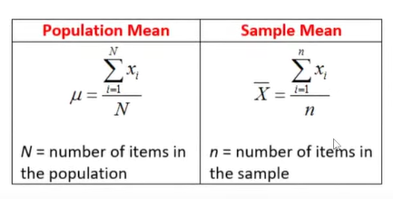

#### 2. Median
The median is the middle value in the dataset when the data is arranged in order. It is robust to outliers.

  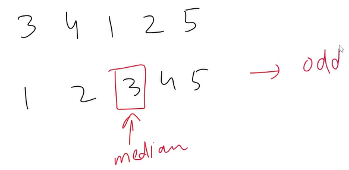
  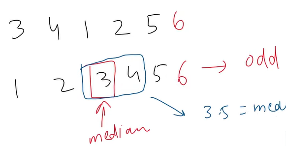
  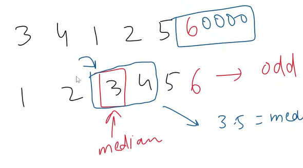

#### 3. Mode
The value that appears most frequently  in the dataset. Most useful in categorical and discrete data but less in continuous data.

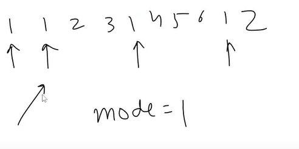

#### 4. Weighted Mean
The weighted mean is the sum of the products of each value and its weight, divided by the sum of the weights. It is used to calculate a mean when the values in the dataset have different importance or frequency.
Ex: Semester GPA

#### 5. Trimmed Mean
A trimmed mean is calculated by removing a certain percentage of the samllest and largest values from the dataset and then taking the mean of the remaining values. The percentage of values removed is called the trimming percentage.

### Measure of Dispersion
A measure of dispersion is a statisitical measure that desribes the spread or variability of a dataset. It provides information about how the data is distributed around the central tendency (mean, median, or mode) of the dataset.

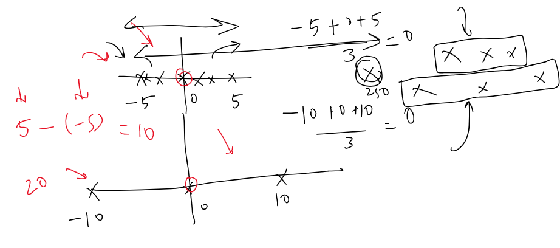

#### 1. Range
The range is the difference between the maximum and minimum values in the dataset. It is a simple measure of dispersion that is easy to calculate **but can be affected by outliers**.

#### 2. Variance 
The variance is the average of the squared differences between each data point and the mean. It measures the average distance of each data point from the mean and is useful in comparing the dispersion of datasets with different means.

  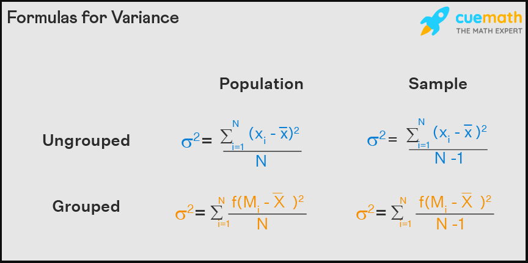
  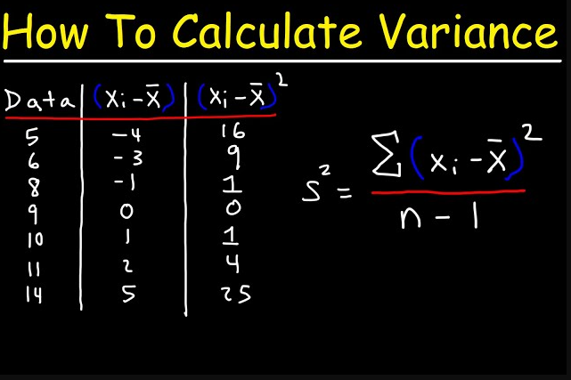

    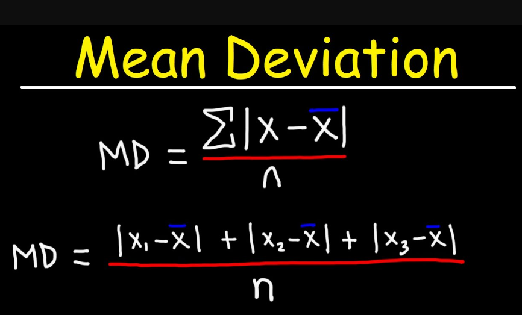
    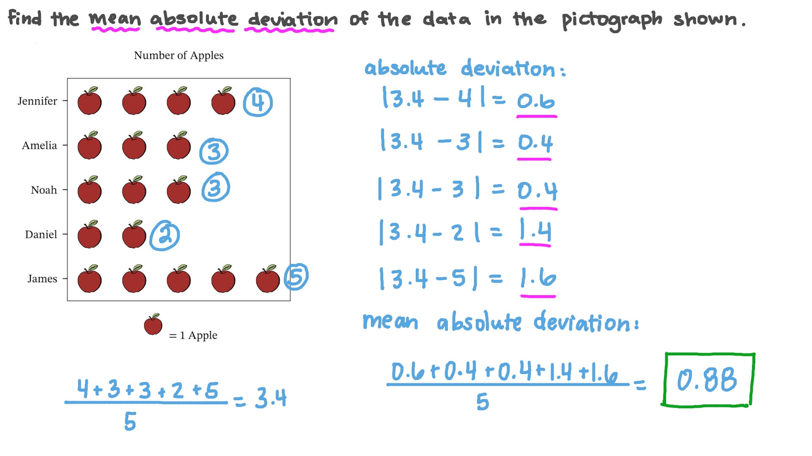

   
1. MAD: Robustness to Outliers: Less sensitive to extreme values, making it robust in the presence of outliers.(Absolute function, point of non-differntiability) 
2. Variance: Penalty for Outliers: Emphasizes larger deviations by squaring them. 

#### 3. Standard Deviation
The standard deviation is the square root of the variance. It is a widely used measure of dispersion that is useful in describing the shape of a distribution.

  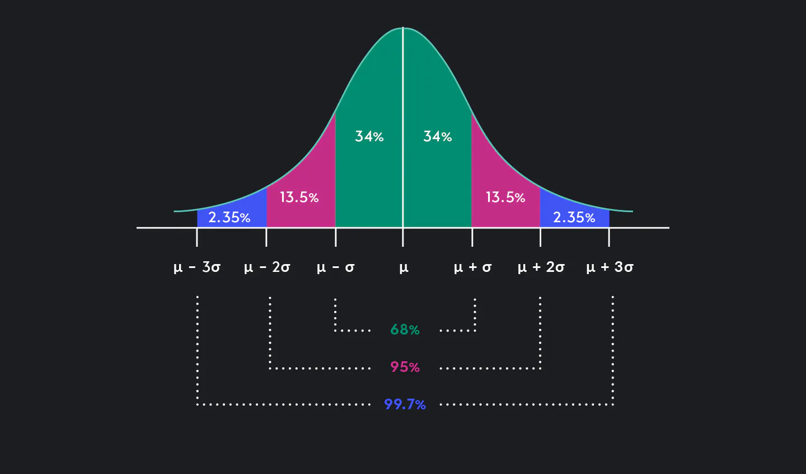
  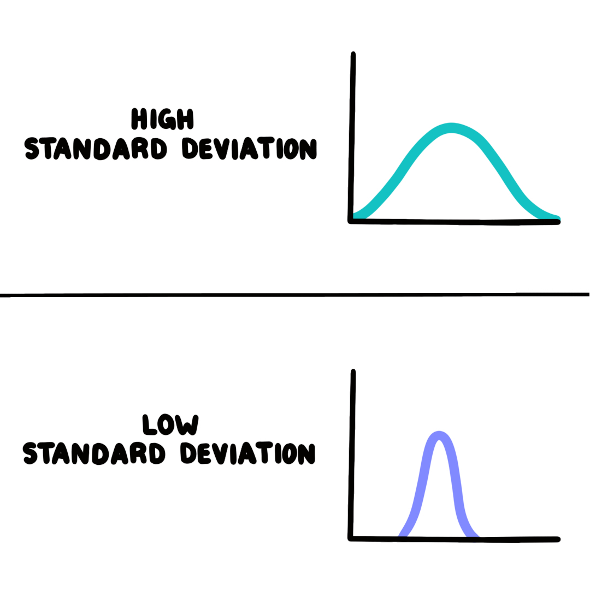

  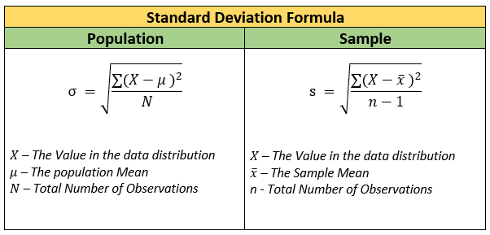

#### 4. Coefficient of Variation
Coefficient of Variation (CV): The CV is the **ratio of the standard deviation to the mean expressed as percentage**. It is used to compare the variability of datasets with different means and is commonly used in fields such as biology, chemistry, and engineering.  

The coefficient of varation (CV) is a statistical measure that expresses the amount of variability in dataset relative to the mean. It is a dimensionless quantity that is expressed as a percentage.  

The formula for calculating the CV is: 
**CV = (stdev/mean) x 100%**   
CV indicates how much the data points deviate from the mean, scaled to the size of the mean, making it easy to see how spread out the data is compared to the average.  
In Summary:Mean gives a central value for a dataset. CV shows how consistent or variable that dataset is relative to its mean, allowing for comparison across different datasets or columns. 

### Graphs for Univariate Analysis

1. Categorical - Frequency Distribution Table & Cummulative Frequency 
A frequency distribution table is a table that summarizes the number of times (or frequency) that each value occurs in a dataset. 
Ex: **Categorical**: Frequency (Bar Chart), Frequency + Relative Frequency (Pie Chart), Cummulative (line chart)

2. Numerical - Frequency Distribution Table & Histogram
- Categories ---> Bins/Buckets. 
- Shapes of Historgram: Symmetric, Bimodal, Left Skew, Right Skew, Uniform, No-Pattern

### Graphs for Bivariate Analysis
1. Categorical - Categorical Columns
2. Numerical - Numerical Columns
3. Numerical - Categorical Columns

#### Categorical - Categorical Columns
A contingency table, also known as a cross-tabulation or crosstab, is a type of table used in statistics to summarize relationship between two categorical variables. A contingency table displays the frequencies or relative frequencies of the observed values of the two variables, organized into rows and columns. (Cross Tab: 2 Categorical Columns; Pivot Table: 2 Cat + 3rd Column)  

|        | **Male** | **Female** | **Grand Total** |
|--------|----------|------------|-----------------|
| **Dog**| 42       | 9          | 51              |
| **Cat**| 10       | 39         | 49              |
| **Grand Total** | 52    | 48         | 100             |

`For such kind of data we can draw a Stack/Extended Bar Chart.`

# `Bonus` 

### Cross Tab vs. Pivot Table

#### **Cross Tab**

**Definition:**
- A cross tab (or cross-tabulation) is a table that displays the frequency distribution of two categorical variables.

**Differences:**
- **Columns**: Shows the relationship between two categorical variables.
- **Aggregation**: Typically displays counts or frequencies.

**Example:**
- **Table** showing the number of males and females who own dogs or cats:

  |              | **Dog** | **Cat** | **Total** |
  |--------------|---------|---------|-----------|
  | **Male**     | 42      | 10      | 52        |
  | **Female**   | 9       | 39      | 48        |
  | **Total**    | 51      | 49      | 100       |

#### **Pivot Table**

**Definition:**
- A pivot table is a data processing tool used to summarize and analyze data from a spreadsheet. It can handle more than two categorical variables and include numeric values for aggregation.

**Differences:**
- **Columns**: Can include multiple categorical variables and numeric values for aggregation.
- **Aggregation**: Displays aggregates like sums, averages, or other metrics.

**Example:**
- **Table** summarizing sales data by region, product type, and average sales:

  | **Region** | **Product Type** | **Average Sales** |
  |------------|-------------------|-------------------|
  | North      | Electronics       | 2000              |
  | North      | Furniture         | 1500              |
  | South      | Electronics       | 1800              |
  | South      | Furniture         | 1300              |

In this example, the pivot table shows average sales for different product types in various regions, illustrating the ability to handle multiple dimensions and aggregations.  
Pivot in titanic dataset: pclass and average age.

#### Numerical - Numerical Columns (Scatter Plot)
- Types of Correlation
    1. Definition
    2. Positive Linear Correlation
    3. Negative Linear Correlation
    4. Non-linear Correlation (known as curvilinear correlation)
    5. No Correlation

#### 1. Definition
Correlation describes the relationship between variables. It can be described as either strong or weak, and as either positive or negative.
Note: 1= Correlation does not imply causation.

#### 2. Positive Linear Correlation
There is a positive linear correlation when the variable on the x-axis increases as the variable on the y-axis increases. This is shown by an upwards sloping straight regression line.

#### 3. Negative Linear Correlation

There is a negative linear correlation when one variable increases as the other variable decreases. This is shown by a downwards sloping straight regression line.

#### 4. Non-linear Correlation (Curvilinear Correlation)

There is a non-linear correlation when there is a relationship between variables, but the relationship is not linear (straight).

#### 5. No Correlation

There is no correlation when there is no detectable pattern between the variables.

  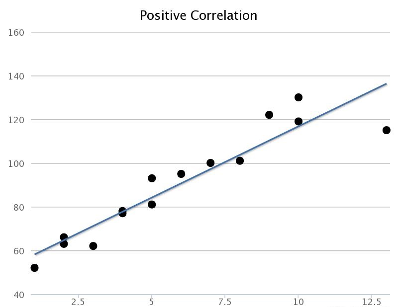
  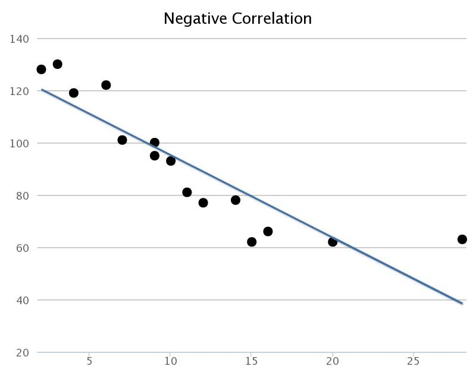

 

  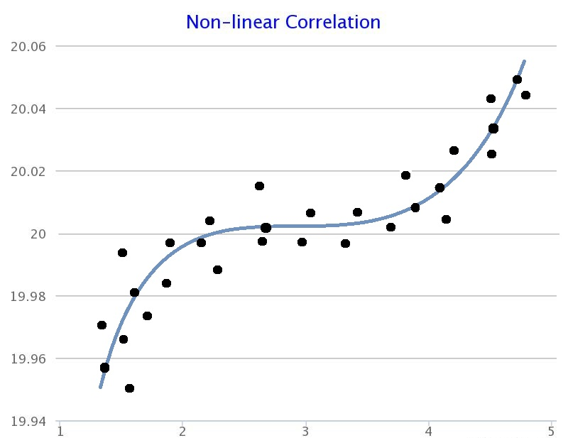
  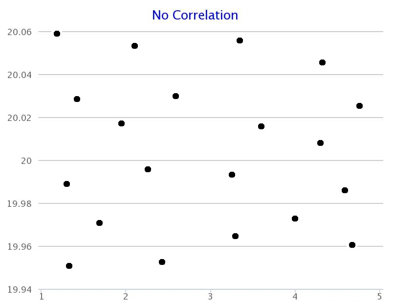

  

#### Numerical - Categorical Columns
1. Bar Chart: In case of cat-num columns in a bar chart, the y-axis typically shows an aggregate measure, like an average, rather than counts or frequencies.
2. Contingency Table.

Ex: Age and Sex Columns.

## Session 2 Descriptive Statistics Part 2
- Outline
  1. Quantiles and Percentiles
  2. Five number summary
  3. Boxplots
  4. Scatter Plots
  5. Covariance
  6. Correlation
  7. Correlation and Causation
  8. Multivaraite Analysis (Visualizing Multiple Variables.)

### 1. Quantiles and Percentiles
**Quantiles** are statistical measures used to divide a set of **numerical data** into equal sized groups, with each group containing an equal number of observations.  
Quantiles are important **measures of variability** and can be used to: **understand distribution of data**, **summarize** and **compare different datasets**. They can also be used to **identify outliers.**  

- There are several types of quantiles used in statistical analysis, including: 

  1. Quartiles: Divide the data into four equal parts, Q1 (25th percentile), Q2 (50th percentile or median), and Q3 (75th percentile).
  2. Deciles: Divide the data into ten equal parts, D1 (10th percentile), D2  (20th percentile), ..., D9 (90th percentile).
  3. Percentiles: Divide the data into 100 equal parts, P1 (1st percentile), P2  (2nd percentile), ..., P99 (99th percentile).
  4. Quintiles: Divides the data into 5 equal parts

`Note: Quan**tiles vs. Quar**tiles vs. Quin**tiles`

- Things to remember while calculating these measures:
  1. Data should be sorted from low to high1.
  2. You are basically finding the location of an observation2.
  3. They are not actual values in the data3.
  4. All other tiles can be easily derived from Percentiles4.
 

Formula to calculate the percentile value
Percentile of a value
Box plot: univariate
why 1.5 while finding the min in box plot

correlation refers to the relationship between two variables, while causation refers to a cause-and-effect relationship between two variables.

Probability Distribution Functions:
  1. Probability Mass Function (PMF): Discrete Variable
  2. Probability Density Function (PDF): Continuous Variable
  3. Cummulative Distribution Function (CDF): PMF + PDF

  - Discrete Prob Dist: Bernoulli 

---
Permutation and Combination
1. Fundamental Counting Principle
  - Multiplication
  - Addition

---
# Moments, Skewness, and Kurtosis
Moment is used with reference to frequency distribution. It describe two very impoartant characteristics of frequency distribution i.e., Skewness and Kurtosis.

### Skewness 
It measuers the degree of symmetry.

## Kurtosis
It measures the degree of peakness of a distribution.

# Introduction to Moments
## 1. Central Moments (Moments about mean)

## Skewness
Skewness means lack of symmetry or departure from symmetry of a distribution. In other words, if the frequency curve of a distribution is not symmetrical, the distribution is said to be skewed or to have skewness.

---

# Probability
1. A bag contains 5 green and 7 red balls. Two balls are drawn what is the probability that one is green and other is red?
2. From a pack of 52 cards, two cards are drawn at random. Find the probability that one is king and other is queen?
3. A bag contains 9 red balls, 7 white balls and 4 green. Three balls are drawn randomly without replacement. Find probability of getting one ball of each color.
4. A card is drawn from a pack of 52 cards what is the probability getting either a king or queen.
5. A perfect die is tossed what is the probability of throwing 3 or 5?
6. A bag contains balls numbered from 1 to 30. One ball is drawn at random, find the probability that the number of ball is a multiple of 5 or 6.
7. A card is drawn out of pack of 52 cards. Find the probability that the card is an ACE, a KING, a QUEEN, or a card of CLUBs.
8. A bag contains 30 balls numbered from 1 to 30. One ball is drawn at random. Find the probability that the number of ball is multiple of 5 or 8.
9.A card is drawn from a pack of 52 cards. What is the probability:
  - It is either a king or queen
  - It is either king or black
10. What is the probability of drawning a heart or a king card from a pack of cards?
11. A number was drawn at random from the number 1-50. What is the probability that it will be a multiple of 2 or 3 or 10.
12. From a pack of 52 cards, two cards are drawn at random one after the other with replacement what is the probability that both cards are kings?
13. A bag contains 5 white and 3 black balls. Two balls are drawn at random one after the other with replacement. Find the probability that both balls are black?
14. Probability of getting 3 tails in three tosses of a coin?
15. 2 Vacancies: 
  - Probability of selection of husband: 4/5
  - Probability of selection of wife: 3/4
    - Both of them will be selected?
    - None of them will be selected?
    - Only wife will be selected?
16. A problem in statistics is given to three students A,B, and C. Whose chances of solving it are 1/2, 1/3, and 1/4. What is the probability that the problem will be solved?
17. A candidate Mr. X is interviewed for 3 posts. For the first post, there are 3 candidates, for the second post, there are 4 and for third there are 2. What are the chances of Mr. X being getting selected?
18. A bag contains 10 white and 5 black balls. Two balls are drawn at random one after the other without replacement. Find the probability that both balls drawn are black?
19. Find the probability of drawing a king, a queen, and a knave(Jack) in that order from a pack of careds in 3 consecutive drawing the cards not being replaced.
20. Foud cards are drawn witout replacement. What is the probability they all are aces?
21. Two cards are drawn from a well shuffled pack of 52 cards. Find the probability that they are both aces if the first card is (i) replaced (ii) not replaced
22. A bag contains 5 white and 8 red balls. Two successive drawings of 3 balls are made such that
  - (i) Balls are replaced before second trial
  - (ii) Balls are not replaced before second trial
23. Find the probability that the first drawing will give 3 white and the second 3 red balls in each case?
24. A factory has two machines, machine I produces 30% of the items of output and macine II produces 70% of the items. Further 5% of items produced by the machine I were defective and only 1% produced by machine II were defective. If the defective item is drawn at random, what is the probability that it was produced by machine I?
25. In a bolt factory machine A, B, and C manufacture respectively 25%, 35%, and 40% of the total. Of their output 5,4,2 precent are defective bolts. A bolt is drawn at random from the product and is found to be defective. What is the probability that it was produced by machine C?
26. There are three identical boxes containing respectively 1 white and/& 3 red balls, 2 white and 1 red balls, 4 white and 3 red balls. One box is chosen at random and two balls are drawn.
  - Find the probability that balls drawn are white and red
  - If the balls are white and red, white is the probability that they are from bag II.

---
# Test
# Probability Questions

1. A card is drawn from a pack of 52 cards. What is the probability of getting either a king or queen?

2. A bag contains 10 white and 5 black balls. Two balls are drawn at random one after the other without replacement. Find the probability that both balls drawn are black?

3. A perfect die is tossed. What is the probability of throwing a 3 or 5?

4. From a pack of 52 cards, two cards are drawn at random. Find the probability that one is a king and the other is a queen?

5. A bag contains 9 red balls, 7 white balls, and 4 green. Three balls are drawn randomly without replacement. Find the probability of getting one ball of each color.

6. A number is drawn at random from the numbers 1-50. What is the probability that it will be a multiple of 2, 3, or 10?

7. Two cards are drawn from a well-shuffled pack of 52 cards. Find the probability that they are both aces if the first card is:
   - (i) replaced
   - (ii) not replaced

8. A candidate Mr. X is interviewed for 3 posts. For the first post, there are 3 candidates; for the second post, there are 4; and for the third, there are 2. What are the chances of Mr. X getting selected?

9. A bag contains 5 green and 7 red balls. Two balls are drawn. What is the probability that one is green and the other is red?

10. A factory has two machines, Machine I produces 30% of the items, and Machine II produces 70%. Further, 5% of items produced by Machine I are defective, and only 1% produced by Machine II are defective. If a defective item is drawn at random, what is the probability that it was produced by Machine I?

11. A bag contains balls numbered from 1 to 30. One ball is drawn at random. Find the probability that the number on the ball is a multiple of 5 or 6.

12. A card is drawn out of a pack of 52 cards. Find the probability that the card is an ACE, a KING, a QUEEN, or a card of CLUBs.

13. Probability of getting 3 tails in three tosses of a coin?

14. A problem in statistics is given to three students A, B, and C. Whose chances of solving it are 1/2, 1/3, and 1/4. What is the probability that the problem will be solved?

15. A bag contains 30 balls numbered from 1 to 30. One ball is drawn at random. Find the probability that the number on the ball is a multiple of 5 or 8.

16. Four cards are drawn without replacement. What is the probability that they are all aces?

17. Find the probability of drawing a king, a queen, and a jack (knave) in that order from a pack of cards in 3 consecutive draws without replacement.

18. A bag contains 5 white and 8 red balls. Two successive drawings of 3 balls are made such that:
   - (i) Balls are replaced before the second trial
   - (ii) Balls are not replaced before the second trial

19. Find the probability that the first drawing will give 3 white and the second 3 red balls in each case.

20. A number was drawn at random from the number 1-50. What is the probability that it will be a multiple of 2, 3, or 10?

21. The probability of selection of husband: 4/5; the probability of selection of wife: 3/4. What is the probability that:
   - Both will be selected?
   - None will be selected?
   - Only the wife will be selected?

22. There are three identical boxes containing respectively 1 white and 3 red balls, 2 white and 1 red balls, and 4 white and 3 red balls. One box is chosen at random, and two balls are drawn. Find the probability that the balls drawn are white and red.

23. If the balls are white and red, what is the probability that they are from bag II?

24. From a pack of 52 cards, two cards are drawn at random one after the other with replacement. What is the probability that both cards are kings?

25. In a bolt factory, machines A, B, and C manufacture respectively 25%, 35%, and 40% of the total. Of their output, 5%, 4%, and 2% are defective bolts. A bolt is drawn at random from the product and is found to be defective. What is the probability that it was produced by machine C?

26. What is the probability of drawing a heart or a king card from a pack of cards?

---

## F-test

# F-Test: Overview, Application, and Examples

The **F-test** is a statistical test used to compare variances between two or more groups or assess the overall significance of a regression model. Below, we will walk through examples of three main types of F-tests:

## 1. **F-Test for Equality of Variances**

This F-test compares the variances of two independent samples to determine if they are significantly different from each other.

### Example:
Consider two independent samples:
- **Sample 1**: Variance $s_1^2 = 16$, $n_1 = 20$
- **Sample 2**: Variance $s_2^2 = 25$, $n_2 = 25$

#### Step-by-step solution:
- **Step 1**: State the hypotheses:
  - Null hypothesis ($H_0$): The variances are equal, i.e., $\sigma_1^2 = \sigma_2^2$
  - Alternative hypothesis ($H_1$): The variances are not equal, i.e., $\sigma_1^2 \neq \sigma_2^2$

- **Step 2**: Calculate the F-statistic using the formula:
  $$
  F = \frac{s_1^2}{s_2^2} = \frac{16}{25} = 0.64
  $$

- **Step 3**: Find the degrees of freedom:
  - $df_1 = n_1 - 1 = 20 - 1 = 19$
  - $df_2 = n_2 - 1 = 25 - 1 = 24$

- **Step 4**: Use an F-distribution table to find the critical F-value at $\alpha = 0.05$, with degrees of freedom $df_1 = 19$ and $df_2 = 24$. Assume the critical F-value is 2.48 (for example).

- **Step 5**: Compare the F-statistic to the critical value:
  - $F = 0.64$ (calculated) and critical value = 2.48.
  - Since $F < 2.48$, we fail to reject $H_0$, meaning there is no significant difference in variances.

---

## 2. **F-Test in ANOVA (Analysis of Variance)**

ANOVA is used to compare the means of more than two groups to determine if at least one of the means is significantly different.

### Example:
We have three groups with the following sample data:

- Group 1: $[15, 16, 14, 13, 16]$
- Group 2: $[22, 21, 23, 24, 22]$
- Group 3: $[30, 32, 31, 29, 30]$

We want to test if the mean scores for these three groups are significantly different.

#### Step-by-step solution:
- **Step 1**: State the hypotheses:
  - Null hypothesis ($H_0$): All group means are equal, i.e., $\mu_1 = \mu_2 = \mu_3$
  - Alternative hypothesis ($H_1$): At least one group mean is different.

- **Step 2**: Calculate the **Mean Square Between (MSB)** and **Mean Square Within (MSW)**.
  - MSB measures the variance due to differences between the groups.
  - MSW measures the variance within the groups.

  After calculating the values, assume:
  - MSB = 22.5
  - MSW = 2.5

- **Step 3**: Calculate the F-statistic:
  $$
  F = \frac{MSB}{MSW} = \frac{22.5}{2.5} = 9
  $$

- **Step 4**: Use an F-distribution table to find the critical F-value at $\alpha = 0.05$, with degrees of freedom $df_{\text{between}} = 2$ and $df_{\text{within}} = 12$. Assume the critical F-value is 3.89.

- **Step 5**: Compare the F-statistic to the critical value:
  - $F = 9$ (calculated) and critical value = 3.89.
  - Since $F > 3.89$, we reject $H_0$. This indicates that there is a significant difference between the group means.

---

## 3. **F-Test for Overall Significance of a Regression Model**

The F-test in regression analysis is used to test if at least one independent variable significantly contributes to explaining the variance in the dependent variable.

### Example:
Consider a regression model where the dependent variable is sales ($Y$) and the independent variables are advertising budget ($X_1$) and product quality score ($X_2$). We want to test if these variables explain a significant amount of variation in sales.

- **Step 1**: State the hypotheses:
  - Null hypothesis ($H_0$): The regression model does not explain the variability in sales, i.e., $\beta_1 = \beta_2 = 0$
  - Alternative hypothesis ($H_1$): At least one $\beta$ is not equal to zero.

- **Step 2**: Calculate the Mean Square Regression (MSR) and Mean Square Error (MSE):
  - MSR = 200
  - MSE = 50

- **Step 3**
