2. **Variance and Standard Deviation** 

    **Shortcut Formula for Calulating Variance**
    $$
   \text{Variance} = \frac{\left(\sum x^2\right) - \frac{(\sum x)^2}{n}}{n - 1}
   $$
   First, we will calculate the mean of the data set.

   **Mean**:
   $$
   \text{Mean} = \frac{7 + 37 + 3 + 8 + 48 + 11 + 6 + 0 + 10 + 3}{10} = \frac{123}{10} = 12.3
   $$

   **Variance** (using the shortcut formula):

   The shortcut formula for variance is:

   $$
   \text{Variance} = \frac{\left(\sum x^2\right) - \frac{(\sum x)^2}{n}}{n - 1}
   $$

   Where $ \sum x $ is the sum of the data values, $ \sum x^2 $ is the sum of the squares of the data values, and $ n $ is the number of data points.

   1. Calculate $ \sum x $:
      $$
      \sum x = 7 + 37 + 3 + 8 + 48 + 11 + 6 + 0 + 10 + 3 = 123
      $$

   2. Calculate $ \sum x^2 $:
      $$
      \sum x^2 = 7^2 + 37^2 + 3^2 + 8^2 + 48^2 + 11^2 + 6^2 + 0^2 + 10^2 + 3^2
      $$
      $$
      = 49 + 1369 + 9 + 64 + 2304 + 121 + 36 + 0 + 100 + 9
      $$
      $$
      = 3052
      $$

   3. Plug into the formula:
      $$
      \text{Variance} = \frac{3052 - \frac{123^2}{10}}{10 - 1}
      $$
      $$
      = \frac{3052 - \frac{15129}{10}}{9}
      $$
      $$
      = \frac{3052 - 1512.9}{9}
      $$
      $$
      = \frac{1539.1}{9} \approx 171.01
      $$

   **Standard Deviation**:

   $$
   \text{Standard Deviation} = \sqrt{\text{Variance}} = \sqrt{171.01} \approx 13.11
   $$

# Variance of Grouped Data
| NL Interval   | NL Frequency | AL Interval   | AL Frequency |
|---------------|--------------|---------------|--------------|
| 0.252–0.256   | 4            | 0.256–0.261   | 2            |
| 0.257–0.261   | 6            | 0.262–0.267   | 5            |
| 0.262–0.266   | 1            | 0.268–0.273   | 4            |
| 0.267–0.271   | 4            | 0.274–0.279   | 2            |
| 0.272–0.276   | 1            | 0.280–0.285   | 1            |

### National League (NL) Batting Averages

| Interval     | Frequency/w | x = C.M (CLassMark/Midpoint)  |
|---------------|-----------|-----------|
| 0.252 - 0.256 | 4         | 0.254     |
| 0.257 - 0.261 | 6         | 0.259     |
| 0.262 - 0.266 | 1         | 0.264     |
| 0.267 - 0.271 | 4         | 0.269     |
| 0.272 - 0.276 | 1         | 0.274     |

**Mean Calculation**:

$$
\text{Mean}_{\text{NL}} = \bar{x}= \frac{\sum (\text{w} \cdot \text{x})}{\sum \text f}
$$

**Variance Calculation**:

$$
\text{Variance}_{\text{NL}} = \frac{\sum (\text{w} \cdot (\text{x} - \bar{x} )^2)}{\text{n} - 1}
$$

**Standard Deviation Calculation**:

$$
\text{Standard Deviation}_{\text{NL}} = \sqrt{\text{Variance}_{\text{NL}}}
$$

---

### American League (AL) Batting Averages

| Interval     | Frequency | Midpoint  |
|---------------|-----------|-----------|
| 0.256 - 0.261 | 2         | 0.2585    |
| 0.262 - 0.267 | 5         | 0.2645    |
| 0.268 - 0.273 | 4         | 0.2705    |
| 0.274 - 0.279 | 2         | 0.2765    |
| 0.280 - 0.285 | 1         | 0.2825    |

**Mean Calculation**:

$$
\text{Mean}_{\text{AL}} = \bar{x}= \frac{\sum (\text{x} \cdot \text{w})}{\text{n}}
$$

**Variance Calculation**:

$$
\text{Variance}_{\text{AL}} = \frac{\sum (\text{w} \cdot (\text{x} - \bar{x})^2)}{\text{n} - 1}
$$

**Standard Deviation Calculation**:

$$
\text{Standard Deviation}_{\text{AL}} = \sqrt{\text{Variance}_{\text{AL}}}
$$

# Median of a Discrete Series

## Median of a Simple Data Set

| **Step**               | **Action**                                      | **Result**    |
|------------------------|-------------------------------------------------|---------------|
| **1. Data Set**        | Given data values                              | 3, 7, 8, 5, 12|
| **2. Arrange Data**    | Sort the data in ascending order                | 3, 5, 7, 8, 12|
| **3. Total Observations ($N$)** | Count the number of values                | $N = 5$     |
| **4. Find Median Position** | Since $N$ is odd, position is $\frac{N + 1}{2}$ | $\frac{5 + 1}{2} = 3$|
| **5. Identify Median** | Value at the 3rd position                        | 7             |

**Median**: 7

---

## Median of a Frequency Distribution

| **Step**                    | **Action**                                      | **Result**    |
|-----------------------------|-------------------------------------------------|---------------|
| **1. Frequency Distribution**| List of values and their frequencies            | Value: 2, 4, 6, 8, 10 Frequency: 3, 5, 7, 4, 1|
| **2. Calculate Total Observations ($N$)** | Sum the frequencies                       | $N = 20$    |
| **3. Find Median Position** | Since $N$ is even, median is the average of $\frac{N}{2}$ and $\frac{N}{2} + 1$ | Positions 10th and 11th|
| **4. Determine Cumulative Frequencies** | Compute cumulative frequencies          | 2: 3, 4: 8, 6: 15, 8: 19, 10: 20 |
| **5. Locate Median Value**  | Positions 10th and 11th fall into the value with cumulative frequency 15 | 6             |

**Median**: 6

## Sorting Technique of Data
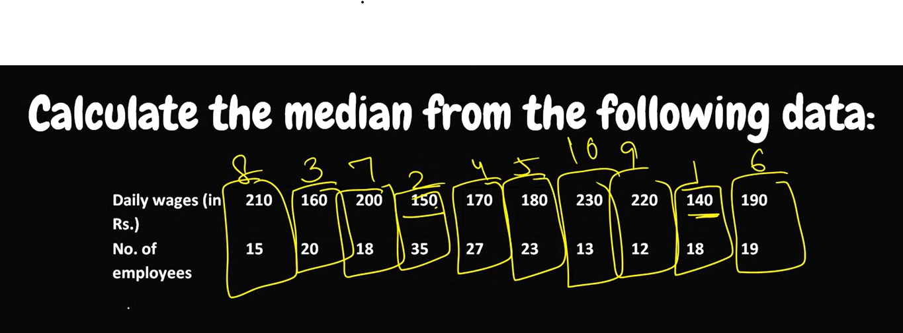

## Median lies in two frequencies
- Avg(100th + 101th term) because N = 200 is even; 100th term lie in 170 and 101th in 180; so (170+180)/2 is answer.
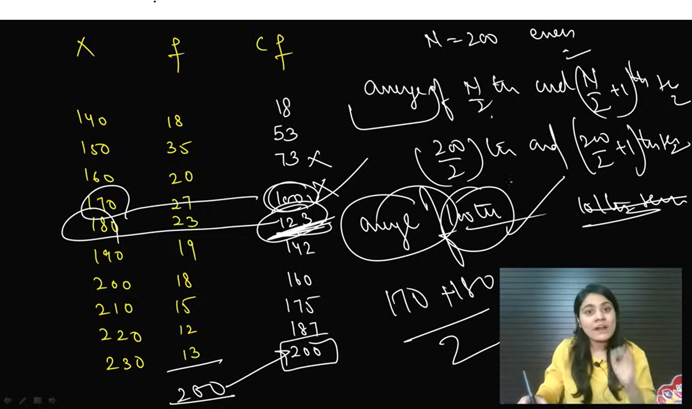

## The less than case: Here CF is given and we need to find the frequency.
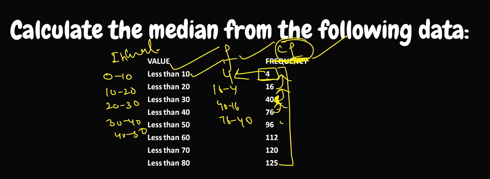

## Relationship between mean, median, and mode

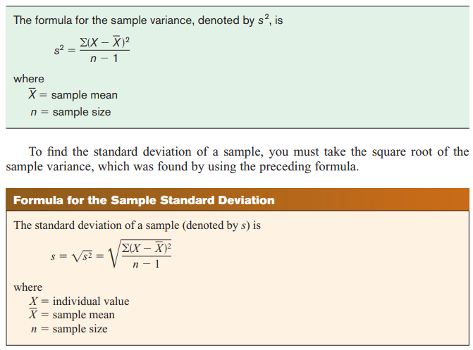
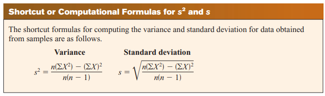
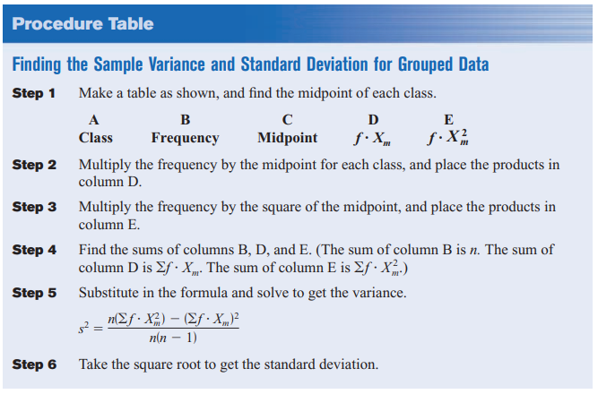
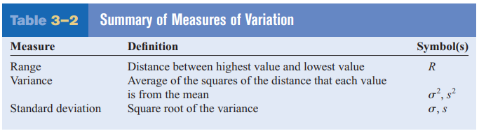
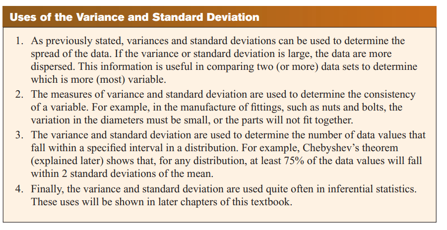
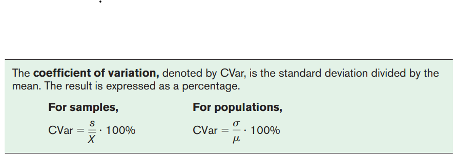

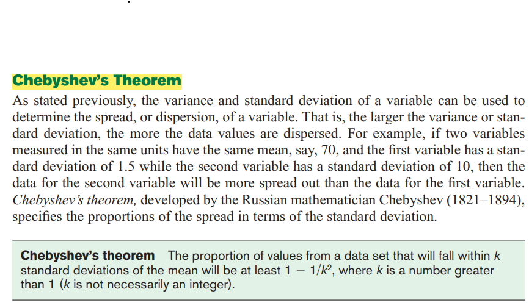
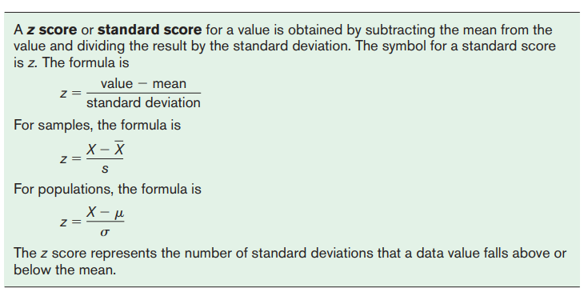

# 3-3 Measures of Position 

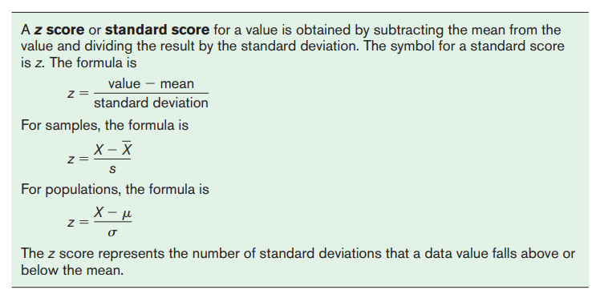
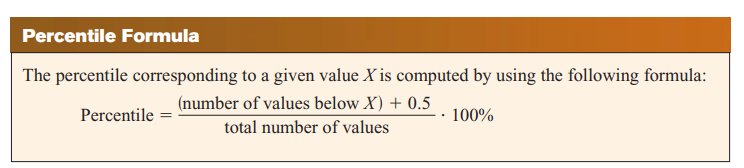
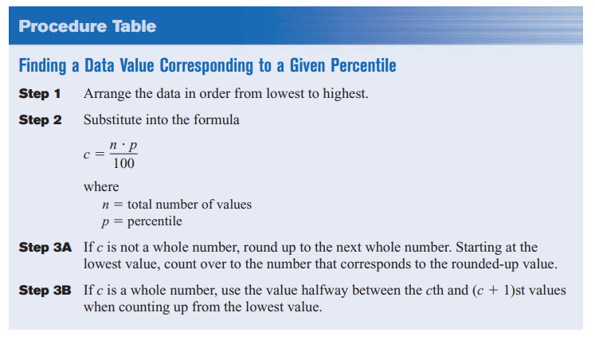
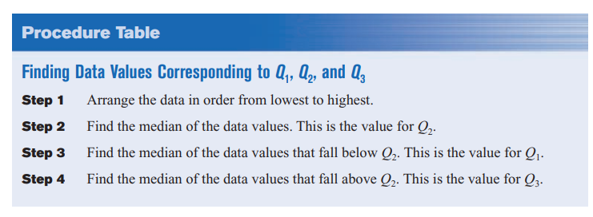
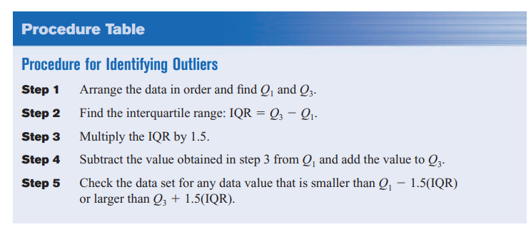

# Chapter 3 Descriptive Stats Formulas Summary
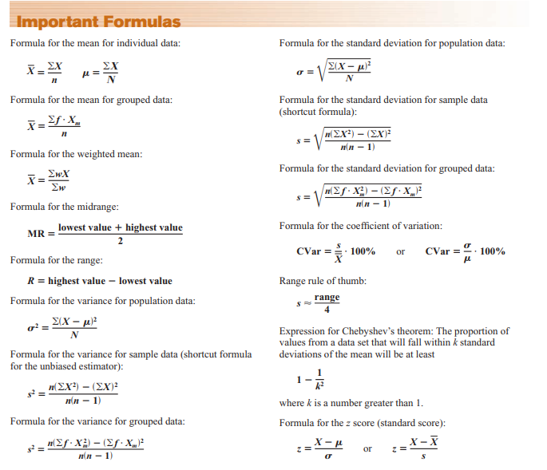
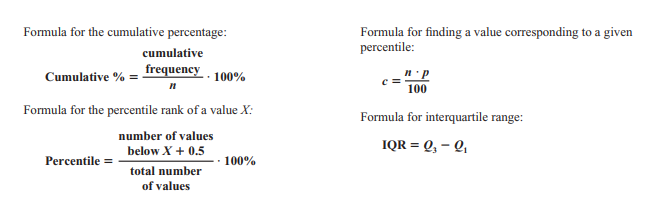
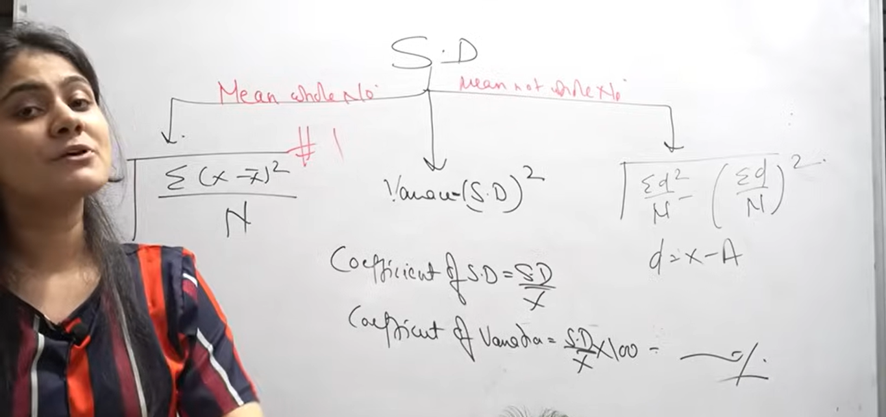