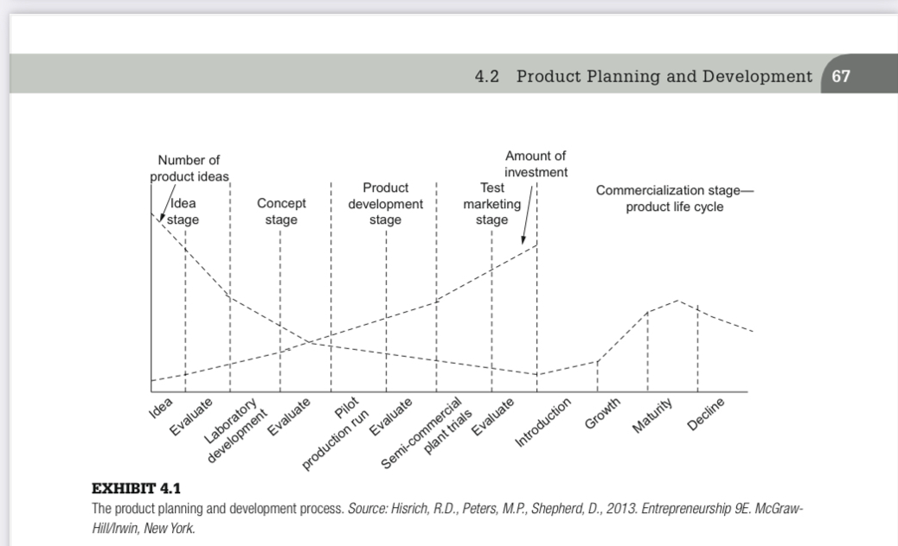
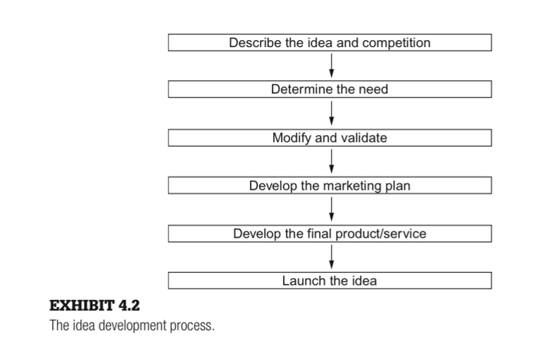
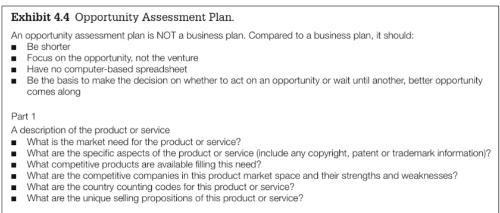
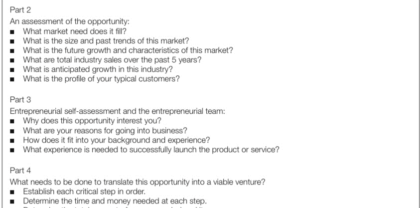

It's not about just earning but also maintaining and investing wisely.

- 6.3 Choice of Legal Structure[Sagar Chhabriya]
  - 6.3.1 Sole Proprietorship
  - 6.3.2 General Partnership
  - 6.3.3 Limited Partnership
  - 6.3.4 Corporation
    - 6.3.4.1 Structure of a Corporation
    - 6.3.4.2 U.S. Tax Laws and Corporation Types
    - 6.3.4.3 Maintaining Corporate Status
  - 6.3.5 Limited Liability Company (LLC)
    - 6.3.5.1 LLC Characteristics
  - 6.3.6 Limited Liability Entities—A Comparison
    - 6.3.6.1 Expense
    - 6.3.6.2 Shareholder Options
    - 6.3.6.3 Taxation
    - 6.3.6.4 Distribution of Profits and Losses
    - 6.3.6.5 Formalities

1. Sole Proprietorship
2.Partnership (General and Limited)
3.Corporation (C-Corporation or S-Corporation)
Limited Liability Company (LLC)

## CHOICE OF LEGAL STRUCTURE  

- 1. Sole Proprietorship: A single individual owns and operates the business.
- 2.General Partnership: Owned by two or more people who share profits, losses, and responsibilities.
- 3. Limited Partnership (LP): Has general partners (who manage the business and have unlimited liability) and limited partners (investors with liability only up to their investment).
- 4.Limited Liability Company (LLC): Combines aspects of corporations and partnerships, offering liability protection without corporate-level taxation.
- 5.Corporation (C-Corporation or S-Corporation): A corporation is a separate legal entity from its owners, providing the strongest liability protection. 
- 6.Cooperative: Owned and operated by members who use its services, sharing profits and decision-making.

[CH-6 Legal Structures and equity distribution](#legal-structures-and-equity-distribution)
   - [Top 5 Case Studies](#top-5-case-studies-famous-businesses-and-their-legal-structures)
   - [Bullets](#bullets)
   - [Book Notes](#book-notes)
# The Nature of Entrepreneurship

**Entrepreneur**: A person who takes the initiative to combine resources in new ways and is willing to take risks to make things happen.

## Entrepreneurial Opportunities
These are situations where new products, services, materials, or methods can be created and sold for more than they cost to make.  
**Examples**: E-Learning, Online Gaming, Management Consulting, etc.

## Entrepreneurial Action
This is about creating new products or processes and entering new markets. This can happen through starting a new company or working within an existing one.

---

# How Entrepreneurs Think
Entrepreneurs often think differently depending on the situation they are in. Because of this, they may need to:

1. **Think Structurally**: 
   - **Superficial similarities**: Basic elements of a technology are similar to basic elements of a market.
     - **Example**: A mobile app for budgeting (technology) and traditional financial planning services (market). Both provide a way to manage personal finances, addressing similar customer needs, such as budgeting and expense tracking.
     
   - **Structural similarities**: The underlying mechanisms of the technology resemble those of the market.
     - **Example**: E-commerce platforms (technology) and traditional retail stores (market). Both rely on inventory management, customer interactions, and sales processes, although the methods of delivery and interaction differ.

2. **Bricolage**: 
   - This means using available resources in creative ways to solve new problems or explore new opportunities. It involves taking existing resources and adapting or changing them for new uses.

3. **Causal Process**: 
   - Starts with a specific goal and focuses on the means to achieve that goal.

4. **Effectuation Process**: 
   - Starts with what one already has (skills, knowledge, connections) and then chooses among possible outcomes.

5. **Cognitive Adaptability**: 
   - This is the ability to quickly sense changes, act on them, and adapt, even when things are uncertain. It reflects an entrepreneur's awareness of their own thinking processes.

## Achieving Cognitive Adaptability
Entrepreneurs can improve their cognitive adaptability through:

- **Comprehension Questions**: Understanding the environment before tackling a challenge.
- **Connection Tasks**: Thinking about current situations in relation to past experiences.
- **Strategic Tasks**: Considering which strategies will work best for solving a problem or taking advantage of an opportunity.
- **Reflection Tasks**: Reflecting on their understanding and feelings during the entrepreneurial process.

By enhancing cognitive adaptability, entrepreneurs can:

- Adjust to new situations.
- Be more creative.
- Clearly explain their reasoning for decisions.

---

# The Intention to Act Entrepreneurially
**Entrepreneurial Intentions**: These are the motivations that drive people to pursue entrepreneurial outcomes.

**Entrepreneurial Self-Efficacy**: This is the belief that one can successfully carry out the entrepreneurial process.

---

# Entrepreneur Background and Characteristics
1. **Education**: The level and type of education an entrepreneur has.
2. **Age**: The age of the entrepreneur can influence their perspective and experience.
3. **Work History**: Previous job experiences that shape their skills and knowledge.
4. **Role Model**: People who inspire and guide the entrepreneur.
5. **Moral Support**: Emotional encouragement from family and friends.
6. **Professional Support**: Guidance and resources from mentors or professional networks.

# Chapter 2: Five Pillars of Technology Entrepreneurship

**Five Pillars of Technology Entrepreneurship**

Technology entrepreneurs have learned specific skills and ways to think about their products and businesses. These skills are called the “five pillars of entrepreneurial expertise.” They are:

1. Value Creation
2. The Lean Startup
3. Customer Discovery and Validation
4. The Business Model Canvas
5. The Entrepreneurial Method

---

## 1. Value Creation

Value creation means offering products, services, or solutions that meet customer needs or wants. It’s about giving customers something useful that makes them happy or solves their problems. Successful businesses focus on creating value to build strong customer relationships and stay ahead of the competition.

### Key Aspects of Value Creation:
- **Customer-Focused:** Value is based on how well a product meets customer needs.
- **Innovation and Differentiation:** Creating unique solutions that offer better results.
- **Sustainable:** The value should last over time, allowing the business to keep growing.

**Example:** The iPhone by Apple changed the mobile phone market. It combined a stylish design, easy-to-use interface, and many apps, meeting various needs like communication and entertainment. The value came not just from the phone itself but also from the ecosystem of apps it offered, building lasting customer loyalty.

---

## 2. The Lean Startup

In lean startups, value creation is key. These startups aim to provide maximum customer value while wasting little time or resources. Instead of launching a complete product right away, they:

1. **Start Small**
2. **Test and Learn**
3. **Iterate Rapidly**

**Example:** Dropbox began with a simple version of their service to see if people wanted cloud storage. By getting early feedback, they improved the product, adding features that solved users’ problems, like easy access to files. This focus on customer value helped Dropbox grow.

---

## 3. Customer Discovery and Validation

Customer discovery and validation are important steps in the Lean Startup approach. They help ensure a product meets real customer needs before spending too much time or money on it.

### Customer Discovery:
This involves finding potential customers and understanding their problems or needs. The goal is to learn if there’s a real problem worth solving.

**Actions:** Entrepreneurs talk to potential customers through interviews or surveys to gather insights.

**Example:** Before starting Airbnb, the founders spoke to potential users to learn about their travel frustrations and interest in short-term rentals.

### Customer Validation:
Once a problem is identified, customer validation checks if the proposed solution is appealing. This phase involves creating a Minimum Viable Product (MVP) and getting feedback.

**Actions:** Entrepreneurs offer the MVP to early users and analyze their feedback to refine the product.

### Key Takeaway:
Customer validation reduces risk by testing ideas early, ensuring that the startup builds something people really want.

---

## 4. The Business Model Canvas

The Business Model Canvas is a tool that helps entrepreneurs outline the main parts of their business. It focuses on nine key areas:

1. **Customer Segments:** Who are your customers?
2. **Value Propositions:** What value do you offer?
3. **Channels:** How do you deliver this value?
4. **Customer Relationships:** How do you interact with customers?
5. **Revenue Streams:** How does your business make money?
6. **Key Resources:** What resources do you need?
7. **Key Activities:** What do you need to do to run your business?
8. **Key Partnerships:** Who are your partners or suppliers?
9. **Cost Structure:** What are the main costs involved?

**Example:** For Uber:
- **Customer Segments:** Riders and drivers
- **Value Proposition:** Quick rides and flexible income for drivers
- **Channels:** Mobile app
- **Revenue Streams:** Ride fares

---

## 5. The Entrepreneurial Method

The Entrepreneurial Method focuses on trying out ideas, learning from mistakes, and improving continuously. Instead of creating a full product from the start, it emphasizes:

### Key Steps:
1. **Identify an Opportunity:** Find a problem in the market.
2. **Develop a Hypothesis:** Create a solution that addresses the problem.
3. **Build an MVP:** Make a simple version of the product to test.
4. **Test and Learn:** Get feedback from real customers.
5. **Iterate:** Improve the product based on feedback and repeat the process.

**Example:** Dropbox used this method by launching a demo video to see if people wanted a cloud storage service. This helped them gather interest before fully developing the product.

# Chapter 3: Entrepreneurial Intentions and Corporate Entrepreneurship

## Corporate Entrepreneurship

Corporate entrepreneurship refers to entrepreneurial actions taken within established organizations.

### Examples
- **Hewlett-Packard (HP) in the mid-1990s:** 
- Jeff was given $8M and asked by the VP of marketing and sales to “figure out e-commerce for the company.” There were no strict rules, allowing them to choose the right focus. They decided to concentrate on the web—this turned out to be the right decision.

### Great Innovations by People
- **Google**
- **Facebook:** Known for its strong entrepreneurial culture.

### Causes for Interest in Corporate Entrepreneurship
- **Social:**
  - Desire to “do your own thing”
  - Self-actualization
- **Cultural:**
  - Self-recognition
  - Praise
- **Business Levels:**
  - Hyper-competition
  - New product development
  - Diversification
  - Increased productivity
  - Decreased costs

---

## Managerial Versus Entrepreneurial Decision Making

Entrepreneurial management is different from traditional management in several ways:

- **Strategic Orientation**
- **Commitment to Opportunity**
- **Commitment of Resources**
- **Control of Resources**
- **Management Structure**
- **Reward Philosophy**
- **Growth Orientation**
- **Entrepreneurial Culture**

### Table 2.1 – Distinguishing Entrepreneurially from Traditionally Managed Firms

---

## Key Endeavors of Corporate Entrepreneurship

Corporate entrepreneurship is prominently reflected in:

1. **New Business Venturing:** Creation of new businesses within an existing organization.
2. **Innovativeness:** Product and service innovation, focusing on development and technology.
3. **Self-Renewal:** Transformation through renewal of key ideas.
4. **Proactiveness:** Includes initiative, risk-taking, competitive aggressiveness, and boldness.

### Table 2.3 - Characteristics of an Entrepreneurial Environment

### Table 2.4 - Leadership Characteristics of a Corporate Entrepreneur

---

## Establishing Corporate Entrepreneurship in the Organization

1. **Step One:** Secure commitment to corporate entrepreneurship from top, upper, and middle management.
   - Establish an initial framework and embrace the concept.
   - Identify, select, and train corporate entrepreneurs.

2. **Step Two:**
   - Identify ideas and areas of interest for top management support.
   - Determine available risk funds to develop concepts.
   - Set overall program expectations and target results for each venture.
   - Establish a mentor/sponsor system.

3. **Step Three:** Use technology to ensure organizational flexibility.

4. **Step Four:** Identify interested managers to train employees and share experiences.

5. **Step Five:** Develop methods for the organization to connect more closely with customers.

6. **Step Six:** Learn to be more productive with fewer resources.

7. **Step Seven:** Establish a strong support structure for corporate entrepreneurship.

8. **Step Eight:** Tie rewards to the performance of the entrepreneurial unit.

### Finally:
- Implement an evaluation system to allow successful entrepreneurial units to expand and eliminate unsuccessful ones.

---

## Problems and Successful Efforts

A study found that new ventures started within corporations often perform worse than those initiated independently by entrepreneurs. Reasons include:

- Corporations' difficulty in maintaining long-term commitment.
- Lack of freedom for autonomous decision-making.
- Constrained environments.

**On average, independent start-ups:**
- Become profitable twice as fast.
- End up being twice as profitable.

### Successful Companies
Companies that have successfully adopted their own version of the implementation process for launching new ventures include:
- Minnesota Mining and Manufacturing (3M)
- Hewlett-Packard (HP)
- IBM

## Technology Venture Idea Generation
- "Innovativeness" refers to the ability to come up with new ideas, methods, or products. It means being creative and willing to try new things to improve or solve problems.

- A company that designs a unique smartphone app to help people manage their time better is showing innovativeness.

- To generate ideas for a new technology product, start by considering the type of venture you want to pursue. The possibilities are vast, from private space ventures to innovative retail models, reflecting endless entrepreneurial creativity. Most technology ventures fall into four fundamental types, which we will explore in this chapter.

- Chegg 
- Netflix Hulu 
- Pinterest 
- Instagram  
- ZipCar 
- LinkedIn  
- AirBNB

# The Six fundamental venture types

## THE IDEA GENERATION PROCESS
1. Identify a point of pain in a target market 
2. Innovate a product or service 
3. Test business models 
4. Explore how to acquire customer

- Identify a pain point in your target market by recognizing a significant problem or unmet need that customers are willing to pay to resolve.
   - Ex: Many small and medium-sized businesses find it hard to handle customer questions from different places like email, social media, and chat. This causes delays in responses, resulting in bad customer service and missed sales opportunities.

- Innovate a product or service 
- Create a product or service that solves the identified pain point in a unique or more efficient way than existing solutions. The innovation could be technological, process-based, or even a combination of both.

   - Ex: Develop an **AI-powered customer support platform** that integrates all communication channels into a single dashboard. The platform uses AI to automate common responses and route more complex queries to the right person, helping businesses respond faster and more efficiently.

- Test Business Models
- Experiment with different ways to generate revenue and scale the product. This could include subscription models, pay-per-use, freemium offerings, or one-time purchase models. It’s important to validate which model fits both the product and the target market.
   - Ex: Offer a *free tier* that allows businesses to manage customer support for up to 100 queries per month, with basic AI capabilities. A **premium tier** would offer unlimited queries, advanced AI features, and analytics for a monthly subscription fee.     - **Testing**: The company could test pricing strategies and monitor user behavior to see which features drive upgrades to the paid version.

- How to Acquire Customers
- Develop a strategy to attract and convert potential customers. This can involve digital marketing, partnerships, inbound marketing, or outbound sales. The acquisition strategy should be cost-effective and scalable.
   - Acquisition Strategy
      - Digital Marketing: Run ads on LinkedIn and Facebook for small business owners and customer service managers.
      - Content Marketing: Create helpful blog posts and webinars about using AI to improve customer service.
      - Partnerships: Team up with other business software companies to offer combined solutions.
      - Referral Programs: Give discounts or free features to users who refer new customers.

# CH4: Technology Venture Idea Generation

## 1. Product Planning and Development Process
Product planning and development is the structured way of turning an idea into a marketable product. It involves several steps to ensure the product meets customer needs, is viable, and stands out in the market.

## 2. Idea Generation
**Idea Generation**: This is the first step, where entrepreneurs brainstorm potential product ideas based on market trends, customer needs, or technological innovations.  
*Example: An entrepreneur sees a growing demand for eco-friendly products and thinks of creating reusable, eco-friendly water bottles.*

## 3. Idea Screening and Feasibility
**Idea Screening and Feasibility**: The entrepreneur assesses whether the idea is viable by analyzing market demand, production costs, and profitability.  
*Example: The entrepreneur conducts market research to check if there’s enough interest in reusable water bottles and whether production costs will allow for profit.*

## 4. Concept Development and Testing
**Concept Development and Testing**: The product concept is refined, and prototypes are created. Feedback from potential customers is gathered to improve the design.  
*Example: A prototype of the eco-friendly water bottle is tested among environmentally conscious consumers for feedback on design, durability, and usability.*

## 5. Product Development
**Product Development**: After refining the concept, the product is fully developed, and the final design is ready for production. The production process is organized, and suppliers are identified.  
*Example: The entrepreneur finalizes the water bottle design and partners with a manufacturer to produce it sustainably at scale.*

## 6. Test Marketing
**Test Marketing**: The product is launched in a limited market to gather insights on customer reactions, sales performance, and potential improvements.  
*Example: The entrepreneur releases the water bottles in select stores or online to test customer interest and sales volume, gathering feedback for adjustments.*

## 7. Commercialization
**Commercialization**: The product is launched to a broader market, and marketing strategies are implemented to promote it.  
*Example: After successful test marketing, the eco-friendly water bottles are distributed nationally, with a digital marketing campaign aimed at eco-conscious consumers.*

## 8. Post-Launch Evaluation
**Post-Launch Evaluation**: After the product launch, the entrepreneur monitors performance, collects feedback, and makes necessary improvements for future versions.  
*Example: The entrepreneur gathers customer reviews and sales data to improve the design or introduce new features, like customizable designs.*

## THE CONCEPT OF NEWNESS
- One of the critical concepts affecting the successful launch and sustainability of an innovation is its newness
   - Newness to the Consumer
   - Newness to the Organization
   - Newness to the Distribution System

## OPPORTUNITY ASSESSMENT PLAN

## Protecting the Idea (IP)

Protecting the Idea (IP) means keeping an entrepreneur's or company's intellectual property safe. This includes innovations, inventions, brand names, creative works, and other intangible assets. IP rights stop others from copying, using, or profiting from your idea without permission. There are several ways to protect intellectual property:

1. **Patents**
2. **Trademarks**
3. **Copyrights**
4. **Trade Secrets**
5. **Design Rights**

## Why IP Protection is Important:

- **Prevents Copying**: Stops others from stealing your ideas.
- **Monetizes Creativity**: Lets you earn money from your creations.
- **Boosts Business Valuation**: Increases the overall value of your business.
- **Creates Brand Identity**: Helps establish a unique brand.

## IP and Technology Ventures

IP and Technology Ventures are businesses focused on using intellectual property and technology innovations. These ventures use IP as a key asset to create products, services, or solutions that meet market needs.

**Intellectual Property (IP)**: These are legal rights that protect creative works like inventions and designs, allowing the owner to control how their creations are used and profit from them.

**Technology Ventures**: These are startups that develop and sell technology-based innovations, often in fields like software, electronics, and biotechnology.

*Example*: A startup might create a new battery that charges 50% faster and lasts twice as long. The company would patent the battery technology and use it to build their business, relying on innovation and IP protection to stay competitive.

---

IP: Copyrights of movies to 
theaters, after theaters to TVs (sooryavanshi was flop but earned from Sony MAX),
then Songs copyrights to Spotify, Youtube, then flop movies to 
OTT: Over the top platforms: Netflix, Amazon Prime Video

<!-- # Legal Structure and Libality Distribution

# Ownership and Liability Issue

## Limited Liability
Limited liability means that an owner's personal assets are protected from the debts and liabilities of the business.  
**Example**: A shareholder in a corporation can only lose the amount invested in the company, not personal assets.

## Unlimited Liability
Unlimited liability means that the owner is personally responsible for all of the business's debts and liabilities.  
**Example**: In a sole proprietorship, if the business incurs debt, the owner can be personally liable for repayment.

---

# Choice of Legal Structure

## Sole Proprietorship
A sole proprietorship is a business owned and operated by one person, with no separate legal distinction between the owner and the business.  
**Example**: A freelance graphic designer operating under their own name.

## Partnership
A partnership is a business structure where two or more individuals share ownership, responsibilities, and liabilities.  
**Example**: A law firm owned by two partners, where both share profits, losses, and liabilities.

## Corporation
A corporation is a legal entity separate from its owners, offering limited liability and the ability to raise capital through stock.  
**Example**: Apple Inc., where shareholders own the company but are not personally liable for its debts.
 -->

---

# Legal Structures and Equity Distribution

## 1. Ownership and Liability Issues
Ownership and liability issues relate to who owns the business and who is responsible for its debts and obligations. Different business structures define ownership rights and liability responsibilities in various ways.

### 1. Sole Proprietorship
- **Ownership:** Owned by a single individual.
- **Liability:** The owner has unlimited liability, meaning their personal assets (e.g., house or car) are at risk if the business incurs debt or faces a lawsuit.
  
  **Example:**  
  Sarah owns a coffee shop as a sole proprietor. If the business goes into debt or faces a lawsuit, Sarah’s personal assets could be used to cover the business obligations.

---

### 2. Partnership (General and Limited)
Ownership: Owned by two or more individuals who share profits, losses, and management responsibilities.

#### General Partnership
- **Liability:** All partners have unlimited liability; they are personally responsible for business debts and actions.

  **Example:**  
  Mike and Tom run a design firm as a general partnership. If the firm goes into debt, creditors can claim both Mike and Tom’s personal assets.

#### Limited Partnership
- **Liability:** General partners have unlimited liability, but limited partners (usually investors) only risk their investment.

  **Example:**  
  If Mike and Tom were in a limited partnership, only Mike, as the general partner, would have unlimited liability, while Tom, as a limited partner, would only lose his initial investment.

---

### 3. Corporation (C-Corporation or S-Corporation)
- **Ownership:** Owned by shareholders who invest in the company by buying shares of stock.
- **Liability:** Limited liability for shareholders—personal assets are protected; shareholders can only lose the amount they invested.

  **Example:**  
  Emma and Alex each invest $50,000 in a tech start-up structured as a corporation. If the company goes bankrupt, they only lose their $50,000 investment, and creditors cannot claim their personal assets.

---

### 4. Limited Liability Company (LLC)
- **Ownership:** Owned by members who may have varying roles and contributions.
- **Liability:** Members have limited liability protection, similar to a corporation; they’re not personally responsible for business debts.

  **Example:**  
  Linda and John start an LLC consulting firm. If the LLC is sued or goes into debt, Linda and John’s personal assets are protected; they only risk losing their investment in the LLC.

---

## 2. Limited Versus Unlimited Liability

- **Limited Liability:**  
  Limited Liability means that the owners’ financial responsibility is limited to their investment in the business. If the business incurs debt or faces a lawsuit, the owners’ personal assets (like their house or savings) are protected. This is common in structures like LLCs and corporations.

  **Example:**  
  Jane invests $10,000 in her LLC bakery. If the bakery is sued or goes into debt, Jane only risks losing her $10,000 investment, not her personal savings or property.

- **Unlimited Liability:**  
  Unlimited Liability means that owners are personally responsible for all business debts and obligations. This is typical in sole proprietorships and general partnerships, where the business and owner are legally the same entity.

  **Example:**  
  Mike runs a bakery as a sole proprietor. If the bakery goes into debt, creditors could go after Mike’s personal assets (like his car or house) to cover the business debts.

---

## 3. The Extent of Limited Liability
The extent of limited liability refers to the owner's financial risk in the business being capped at the amount they’ve invested. If the business faces huge debts or lawsuits, the owner's personal assets are protected beyond what they put into the business. However, this protection has limits if certain conditions aren’t met, such as fraudulent behavior or personal guarantees on loans.

**Example:**  
Emma invests $20,000 in a tech start-up structured as an LLC. If the start-up accrues $100,000 in debt, creditors can only claim assets within the LLC, meaning Emma only risks losing her $20,000 investment—not her personal bank account or house. However, if Emma personally guaranteed a loan for the start-up, she might be liable beyond her initial investment for that specific loan.

---

## 4. Choice of Legal Structure
Choosing the right legal structure for a business is essential, as it affects liability, taxation, funding options, and how the business is managed. Here are the main types and key considerations for each:

### 1. Sole Proprietorship
- **Description:** A single individual owns and operates the business.
- **Pros:** 
  - Simple setup
  - Full control
  - Straightforward tax filing (income is reported on the owner’s personal taxes).
- **Cons:**
  - Unlimited liability—personal assets are at risk if the business faces debt or lawsuits.
- **Best for:** Small, low-risk businesses or independent professionals.

---

### 2. General Partnership
- **Description:** Owned by two or more people who share profits, losses, and responsibilities.
- **Pros:** 
  - Easy to form
  - Shared control and resources
  - Taxed as personal income for each partner.
- **Cons:** 
  - Unlimited liability for each partner, meaning personal assets are at risk.
- **Best for:** Businesses with shared ownership and responsibilities among trusted partners.

---

### 3. Limited Partnership (LP)
- **Description:** Has general partners (who manage the business and have unlimited liability) and limited partners (investors with liability only up to their investment).
- **Pros:** 
  - Limited partners have reduced liability
  - Easier to attract investors.
- **Cons:** 
  - General partners still have unlimited liability
  - Can be complex to manage.
- **Best for:** Businesses looking for external investors but with clear distinctions between management and investment roles.

---

### 4. Limited Liability Company (LLC)
- **Description:** Combines aspects of corporations and partnerships, offering liability protection without corporate-level taxation.
- **Pros:** 
  - Limited liability for all owners
  - Flexible management structure
  - Pass-through taxation.
- **Cons:** 
  - Can be more complex and costly to set up than a sole proprietorship or partnership.
- **Best for:** Small to medium-sized businesses that want liability protection without corporate tax.

---

### 5. Corporation (C-Corporation or S-Corporation)
- **Description:** A corporation is a separate legal entity from its owners, providing the strongest liability protection.
- **Pros:** 
  - Limited liability
  - Easier to raise capital through shares
  - Perpetual existence.
- **Cons:** 
  - More regulatory requirements and costs
  - C-corporations face double taxation (on profits and shareholder dividends), though S-corporations avoid this with pass-through taxation.
- **Best for:** Businesses planning to scale, attract large investments, or go public.

---

### 6. Cooperative
- **Description:** Owned and operated by members who use its services, sharing profits and decision-making.
- **Pros:** 
  - Member-driven
  - Often receives tax benefits.
- **Cons:** 
  - Limited growth potential
  - Complex to manage with multiple owners.
- **Best for:** Organizations serving member interests, like credit unions or agricultural co-ops.

---

## Choosing the Right Legal Structure for Your Venture

When choosing the legal structure for a new venture, entrepreneurs must consider various factors such as liability, tax implications, funding, management control, and future growth potential. Here are the basic concepts of three popular structures:

### 1. Sole Proprietorship
- **Best for:** Small, low-risk businesses or independent professionals.
  
### 2. Partnership (General or Limited)
- **Best for:** Businesses with shared ownership and responsibilities among trusted partners.

### 3. Corporation (C-Corporation or S-Corporation)
- **Best for:** Businesses planning to scale, raise capital, or potentially go public.

---

# Top 5 Case Studies: Famous Businesses and Their Legal Structures

## 1. Apple Inc. (Corporation - C-Corporation)
- **Legal Structure:** C-Corporation  
- **Ownership and Liability:** Apple is a publicly traded company, and its shareholders have **limited liability**, meaning they can only lose the amount they invested in the company, not their personal assets.
- **Key Case:** Apple's **IPO in 1980** was a landmark moment for the company. It raised capital through the sale of shares, allowing it to expand globally. Despite facing legal challenges, including patent disputes, Apple's corporate structure protects the personal assets of its shareholders and founders.
- **Lesson:** A C-Corporation structure provided Apple with the ability to raise significant capital and expand globally while shielding shareholders from personal liability.

---

## 2. Microsoft (Corporation - C-Corporation)
- **Legal Structure:** C-Corporation  
- **Ownership and Liability:** Microsoft operates as a C-Corporation, where ownership is divided among its shareholders. Shareholders enjoy **limited liability**, and the company is treated as a separate legal entity.
- **Key Case:** The **Microsoft Antitrust Case** in the late 1990s highlighted how a C-Corporation's structure can shield individual shareholders and founders from personal liability. Although the company faced legal action over monopolistic behavior, Bill Gates and other stakeholders were not personally liable.
- **Lesson:** The C-Corporation structure allowed Microsoft to scale and dominate the tech industry, while providing legal and financial protection to its founders and investors.

---

## 3. Tesla, Inc. (Corporation - C-Corporation)
- **Legal Structure:** C-Corporation  
- **Ownership and Liability:** Tesla is a publicly traded C-Corporation, and shareholders are protected by **limited liability**. Tesla has been able to raise substantial capital by issuing shares, allowing for rapid growth and innovation.
- **Key Case:** Tesla's **IPO in 2010** and its ongoing success show how a C-Corporation structure allows for substantial investment opportunities. Tesla has also faced multiple legal challenges, including product liability cases, but the corporate structure shields individual investors from personal liability.
- **Lesson:** Tesla's use of a C-Corp structure enabled it to grow quickly, raise funds, and manage legal risks while protecting shareholders from liability.

---

## 4. Amazon.com, Inc. (Corporation - C-Corporation)
- **Legal Structure:** C-Corporation  
- **Ownership and Liability:** Amazon operates as a C-Corporation, with publicly traded shares. Shareholders enjoy **limited liability**, meaning they can only lose the value of their investment, not their personal assets.
- **Key Case:** Amazon's **IPO in 1997** marked the beginning of its rapid growth. The company has faced numerous lawsuits, including antitrust investigations and labor-related issues, but the corporate structure has ensured that individual investors' personal assets are not at risk.
- **Lesson:** Amazon's C-Corp structure facilitated access to capital, allowed it to scale rapidly, and protected individual stakeholders from legal or financial consequences.

---

## 5. Facebook (Meta Platforms, Inc.) (Corporation - C-Corporation)
- **Legal Structure:** C-Corporation  
- **Ownership and Liability:** Facebook (now Meta) operates as a **C-Corporation**, and its shareholders have **limited liability** for any legal or financial issues the company faces.
- **Key Case:** Facebook's **IPO in 2012** allowed it to raise billions of dollars, fueling its global expansion. Meta has faced various legal battles over privacy issues, but its C-Corp structure ensures that investors are protected from personal liability.
- **Lesson:** The C-Corporation structure gave Meta the flexibility to raise large amounts of capital, scale its business, and handle complex legal and regulatory challenges without exposing shareholders to personal liability.

---

These **five case studies**—**Apple, Microsoft, Tesla, Amazon,** and **Facebook (Meta)**—highlight how the **C-Corporation structure** provides limited liability for shareholders, access to significant capital, and the ability to navigate complex legal and business environments, making it the preferred choice for large-scale businesses.

--- 
- **6. Legal Structure and Equity Distribution**

  - **6.1 Introduction**

  - **6.2 Ownership and Liability Issues**
    - 6.2.1 Limited Versus Unlimited Liability
    - 6.2.2 The Extent of Limited Liability

  - **6.3 Choice of Legal Structure**
    - 6.3.1 Sole Proprietorship
    - 6.3.2 General Partnership
    - 6.3.3 Limited Partnership
    - 6.3.4 Corporation
      - 6.3.4.1 Structure of a Corporation
      - 6.3.4.2 U.S. Tax Laws and Corporation Types
      - 6.3.4.3 Maintaining Corporate Status
    - 6.3.5 Limited Liability Company (LLC)
      - 6.3.5.1 LLC Characteristics
    - 6.3.6 Limited Liability Entities—A Comparison
      - 6.3.6.1 Expense
      - 6.3.6.2 Shareholder Options
      - 6.3.6.3 Taxation
      - 6.3.6.4 Distribution of Profits and Losses
      - 6.3.6.5 Formalities

  - **6.4 Equity and Equity Types**
    - 6.4.1 Corporate Stocks
    - 6.4.2 Common Stock
    - 6.4.3 Preferred Stock
      - 6.4.3.1 Preferred Stock Distributions
      - 6.4.3.2 Convertibility
      - 6.4.3.3 Participating Preferred
      - 6.4.3.4 Voting Rights
      - 6.4.3.5 Founder's Stock

  - **6.5 Raising Capital**

  - **6.6 Equity Distribution in the Start-Up Venture**
    - 6.6.1 Employee Stock Options
    - 6.6.2 Vesting
    - 6.6.3 Restrictive Clauses
    - 6.6.4 Tax Issues

---

# Bullets
1. Founder vs. Promoter vs. Inventor
2. Skills vs. expertise vs. credibility
3. Liability: the state of being legally responsible for something.
4. Limited vs Unlimited
5. Employment vs. Self Employment [6.3.4 Corporation]

# Book Notes

3. Liability: the state of being legally responsible for something.
   - **Limited Liability**: Owner's personal assets are safe; they can only lose the money they invested in the business.
   - **Unlimited Liability**: Owner is personally responsible for business debts and could lose personal assets (like house, car) to pay them off.
   - Even if personal assets (house, car) were not bought with business money, they can still be used to pay business debts in unlimited liability.
4. Limited vs Unlimited
   - **Unlimited Liability Risk**: In unlimited liability businesses, owners are personally responsible for the company’s debts. This means they could lose personal assets (house, car) to cover business debts, even for actions by employees or partners they weren't involved in.

   - **Limited Liability Entities**: To address this, legal structures like **corporations**, **LLCs**, **GmbHs**, and **LPs** limit owner liability to the money they invested. Personal assets are protected from business debts.

   - **Why Limited Liability Matters**: Limited liability encourages investment by protecting investors’ personal assets. Without it, attracting investors would be difficult and expensive, as they would risk losing everything.

   - **Risk for Wealthy Investors**: Wealthy investors would be hesitant to invest in businesses with unlimited liability because they could lose all their personal wealth. Limited liability makes it safer to invest and promotes business growth.

### 6.2.2 The Extent of Limited Liability

- **Protection from Liability**: Limited liability protects the personal assets of business owners and managers from the business's financial or legal problems, as long as the business is properly formed and managed according to legal requirements.

- **Example of Liability**: If an employee orders goods on credit and the business cannot pay, the business itself is liable for the debt. In an unlimited liability entity, owners would be personally responsible. In a limited liability entity, owners are shielded from personal liability.

- **Personal Liability for Wrongdoing**: Owners and managers are still personally liable if they engage in misconduct. For example, if an employee knowingly orders goods knowing the business can't pay, they could be personally liable.

- **Corporate Veil**: Limited liability entities create a "corporate veil" protecting owners' personal assets. However, this veil is disregarded in certain cases, such as:
  - **Criminal Acts**: Courts can ignore limited liability protection for criminal actions by owners or directors.
  - **Tax Liability**: Owners and officers may be personally responsible for unpaid payroll taxes, even if they weren't directly involved in daily operations.

- **Piercing the Corporate Veil**: Courts may impose liability on owners if the business structure is abused. This can happen in cases such as:
  - **Defective Creation**: If the business wasn't properly established, it may be treated as a sole proprietorship or partnership, and owners will be personally liable.
  - **Failure to Follow Formalities**: If the business isn't treated as separate from its owners (e.g., the business is just an "alter ego"), the court may pierce the corporate veil.
  - **Fraud or Improper Intent**: If the business was set up to shield owners from fraudulent activities or debts, the veil may be pierced, and owners may be held liable.
  - **Statutory Requirements**: Certain laws (like federal securities laws) can impose personal liability on those controlling a limited liability entity.

- **Actions That Can Lead to Personal Liability**:
  - Using company funds or assets for personal use.
  - Mixing personal assets with company assets (commingling).
  - Hiring employees who don’t perform any work but still get paid.
  - The company assuming personal debt of the owner.
  - Nonpayment or excessive payment of dividends in corporations.
  - Engaging in fraudulent activities to avoid creditor obligations.
  - Misrepresentations or fraud by owners or management.
  - Giving unreasonable loans or benefits to company officials.
  - Issuing corporate guarantees for loans/contracts benefiting an owner.
  - Failing to separate personal activities from corporate activities.

- **Statutory Personal Liability**: In some cases, the law imposes personal liability for corporate debts, such as:
  - Employer tax withholding obligations.
  - Wage and retirement benefits.
  - Environmental liability.
  - Violations of federal securities laws.
  - Contractual obligations (e.g., personal guarantees by shareholders).

- **Making an Informed Choice**: With these risks in mind, entrepreneurs can now make an informed decision about which legal structure to choose for their new venture.

# Choosing the Right Legal Structure for Your Business

When starting a business, picking the right legal structure is important because it affects how your business operates, how much risk you take on, and how much money you can raise. Here are the main factors to consider:

## 1. Risks and Liabilities
Some business types protect you from losing personal assets if the business gets into trouble.  
For example, a **Limited Liability Company (LLC)** protects your personal property (like your house) from being taken if the business owes money.

## 2. Number and Type of Participants
Some business types limit how many people can join or what kind of people can be involved.  
For example, in a **partnership**, you usually need to have a small group of partners, and they all share responsibility.

## 3. How Much Money You Need to Raise
Some business types are better at attracting large amounts of money from investors.  
**Corporations** are good for this, as they can sell shares of the business to raise funds.

## 4. How the Business is Managed
Some business types are easier to manage than others.  
For example, a **sole proprietorship** (one person running the business) is very simple, while a **corporation** has a board of directors and more rules.

## 5. Taxes
Different business types are taxed in different ways.  
For example, a **partnership** doesn’t pay its own taxes – instead, the partners pay taxes individually. But a **corporation** pays taxes separately from the owners.

## 6. Rules and Regulations
Some business types have more rules to follow.  
For example, **publicly traded corporations** (those that sell shares to the public) have strict rules about how they report finances.

## 7. Starting and Maintaining the Business
Some business types require more paperwork.  
For example, an **LLC** requires filing with the state and may need legal agreements, while a **sole proprietorship** can often be started with minimal paperwork.

## 8. Business Lifespan
Some business types end if the owner leaves or dies, while others can continue on without the original owner.  
For example, a **corporation** can keep going even if the owner leaves.

## 9. Privacy
Some business types require more public reporting.  
For example, a **corporation** must disclose a lot of financial information, while a **sole proprietorship** keeps things private.

## 10. Exit and Liquidity
Some business types allow owners to leave or sell their share easily.  
For example, in a **corporation**, owners can sell their shares, but it’s harder to do that in a **partnership**.

---

### Common Business Types

- **Sole Proprietorship**: One person runs the business. Simple, but the owner is personally responsible for debts.
- **Partnership**: Two or more people share the business. Partners share profits and risks.
- **LLC (Limited Liability Company)**: Protects personal assets. Flexible and less formal than a corporation.
- **Corporation**: A separate legal entity. Can raise lots of money, but has many rules and taxes.

---

### Conclusion

Each business type has its own benefits and drawbacks. Understanding your needs (like how many people are involved, how much money you need, and how much risk you're willing to take) will help you choose the best structure for your business.

# Sole Proprietorship: The Simplest Business Structure

A **sole proprietorship** is the most basic way to run a business. It happens automatically when one person starts a business without creating a separate legal entity. Here’s how it works:

## Key Points:

### 1. **Ownership & Management**
A sole proprietorship is owned and managed by one person (or, in some cases, a married couple). This person makes all the decisions and is fully in charge of the business.

### 2. **No Legal Separation**
The business and the owner are considered the same legal entity. This means if the business has debts or legal problems, the owner is personally responsible.  
**Example**: If the business owes money, the owner's personal belongings (like their house) can be used to pay the debts.

### 3. **Taxes**
The owner’s personal tax return includes the business’s profits and losses. There’s no separate tax filing for the business itself. Also, the owner must pay **self-employment tax** on the income, which covers Social Security and Medicare.

### 4. **Starting a Business**
It's easy and cheap to start a sole proprietorship. There's no need to file complicated documents, but if the business uses a name different from the owner’s, they might need to register that name.

### 5. **Liability**
The main downside of a sole proprietorship is **unlimited liability**. The owner is personally responsible for all business debts and actions.  
**Example**: If the business gets into trouble, the owner’s personal assets (like their savings or home) could be at risk.

### 6. **Example**
Imagine you start a lemonade stand by yourself. You are the sole owner, and the profits from selling lemonade are yours. However, if someone gets sick from your lemonade, and you owe them money, you’re personally responsible for paying it, not the business.

---

## Advantages and Disadvantages

### **Advantages**:
- Simple and inexpensive to set up.
- Full control for the owner.
- No complicated paperwork needed.

### **Disadvantages**:
- The owner is personally responsible for all debts and legal issues.
- Higher personal risk if the business fails.
- Must pay self-employment taxes.

---

## Summary
A sole proprietorship is great for small, simple businesses. It's easy to start and manage, but the owner takes on all the risk. If you want to keep things simple and are okay with the risk, it could be a good option for you.

# General Partnership

A **general partnership** is formed when two or more people or entities come together to share profits and losses in a business, unless a formal legal entity is created. By default, the business becomes a general partnership. Here’s how it works:

## Key Points:

### 1. **Ownership & Liability**
- A general partnership is **owned by multiple people** (partners).
- Partners are **jointly and severally liable** for the business’s debts and obligations. This means each partner can be held responsible for the full amount of the debt, not just their share. 
- Personal assets of the partners are at risk if the business fails or faces legal issues.

  **Example**: If the partnership owes $10,000 in unpaid bills, each partner can be held personally responsible for paying the entire $10,000, even if one partner owns less of the business than the others.

### 2. **Management**
- Management can be defined by the partnership agreement. Without a written agreement, all partners have an **equal say** in how the business is run.
- **Profit and loss sharing** is also typically equal unless agreed otherwise in the partnership agreement.

  **Example**: If you and your partner start a business, and there’s no written agreement, you both have an equal say in decisions, and you would likely split the profits and losses equally, unless you agree to a different arrangement.

### 3. **Partnership Agreement**
- Although not legally required, it’s common for partners to create a **written partnership agreement** to clarify how profits, losses, and management will be handled.
  
  **Example**: A partnership agreement could state that one partner will take on the management role while the other handles sales, or it could specify how profits are divided if one partner works more hours than the other.

### 4. **Taxation**
- A general partnership itself doesn’t pay taxes. Instead, the profits or losses are passed through to the partners, who report them on their personal tax returns.
- Partners are considered **self-employed**, so they must pay self-employment taxes on their share of the profits.

  **Example**: If the partnership generates $100,000 in profit, each partner will report their share of the income on their personal tax returns, and they will both be responsible for paying self-employment taxes.

### 5. **Formation & Maintenance**
- A general partnership is formed by an agreement (either oral or written) between the partners or by presenting the business as a partnership to the public.
- No formal documents are required, but a **fictitious name** may need to be registered if the business operates under a name other than the partners' names.

  **Example**: If you and your partner choose a business name like “City Cafe” instead of using your personal names, you may need to file a fictitious name registration with the state or local government.

### 6. **Liability and Risk**
- The major disadvantage of a general partnership is **unlimited liability**—each partner is personally responsible for the business’s debts and actions. This puts all of their personal assets at risk.
  
  **Example**: If the partnership faces a lawsuit for a mistake made by one of the partners, all partners could be personally responsible for the legal fees and any settlement, regardless of who was at fault.

---

## Advantages and Disadvantages of a General Partnership

### **Advantages**:
- Easy to form and maintain.
- Flexibility in how profits, losses, and management are shared (through an agreement).
- No separate business taxes; income is passed to partners.

### **Disadvantages**:
- **Unlimited liability**: Each partner is personally liable for the debts of the partnership.
- Risk to personal assets if the business fails or faces legal issues.
- Self-employment taxes apply to all partners.

---

## Summary

A general partnership allows two or more people to run a business together, sharing profits, losses, and management duties. However, the main risk is **unlimited liability**—each partner’s personal assets are at risk. While forming a partnership is easy and inexpensive, the potential for significant personal financial risk is a key consideration.

# Limited Partnership (LP) 

A **Limited Partnership (LP)** is a business structure with two types of partners:

### 1. General Partners
- **Responsibilities**: Manage the business and have full responsibility for the business's debts.
- **Liability**: Unlimited. This means their personal assets can be used to pay the LP's debts if necessary.
  
  **Example**: If the LP owes money and can't pay, general partners’ personal savings or property could be at risk.

### 2. Limited Partners
- **Responsibilities**: Usually investors, not involved in management.
- **Liability**: Limited to their investment in the business. They won’t lose more than what they’ve put in.
  
  **Example**: If an LP has $1 million in debt, and a limited partner invested $50,000, the most they could lose is their $50,000.

---

## Key Points

- **LP Agreement**: A document that defines the rules of the partnership, including who the general and limited partners are.
- **Liability**:
  - General partners: Unlimited liability.
  - Limited partners: Liability is limited to their investment.
- **Management**: General partners manage the business. Limited partners cannot manage the business, or they risk losing their limited liability.
- **Taxes**: LPs don’t pay taxes as a business. Instead, profits and losses "pass through" to the partners and are taxed on their personal returns.

  **Example**: If the LP makes $100,000 in profit, all partners must pay tax on their share, even if they don’t receive the money.

- **Ownership**: Partners own a percentage of the LP, which is often described in "units." There are no physical certificates for ownership.

---

## Advantages and Disadvantages

### Advantages:
- **Limited partners** have limited liability (they only lose their investment).
- **General partners** manage the business without interference from limited partners.
- **Pass-through taxation** means the LP itself doesn’t pay taxes—only the partners do on their share.

### Disadvantages:
- **General partners** have unlimited personal liability.
- **Limited partners** cannot take an active role in management.

---

## Example of a Real-World Use

In a **venture capital fund**, the general partners (who manage the fund) may set up an LLC to limit their personal liability. The limited partners are investors who contribute money but don’t manage the fund.

# Corporation (Legal Entity)

A **corporation** is a legal business entity separate from its owners (shareholders). It is created under the laws of a specific jurisdiction (usually state law in the U.S.). The term "corporation" comes from the Latin word *corparæ*, meaning to make something "body-like" or to give it physical form.

### Key Points:
- **Incorporation Documents**: Corporations are formed by filing **articles of incorporation** (or a **charter**) with a government agency, typically the Secretary of State or Corporation Commission in the U.S.
- **Formation**: Corporations can be formed in any state, even if the business operates elsewhere. Many businesses, including international ones, choose to incorporate in states like **Delaware** or **Nevada**, which have business-friendly laws.
- **Foreign Corporations**: If a corporation formed in one state wants to do business in another, it may need to register in that state as a foreign corporation.

---

## 6.3.4.1 Structure of a Corporation

### Management:
- A **corporation** is managed by a **Board of Directors** and **officers**.
  - **Board of Directors**: The Board oversees the corporation’s activities and has a fiduciary duty to the shareholders (owners).
  - **Officers**: Appointed by the Board, officers handle the day-to-day operations of the business (CEO, CFO, etc.).

### Ownership and Equity:
- **Shares of Stock**: Ownership is tracked through **stock** or **shares**. Each shareholder holds a percentage of the company based on their shares.
- **Stock Certificates**: These are physical or electronic documents that represent a shareholder's ownership in the corporation.
- **Liability**: A corporation is a **limited liability entity**, meaning shareholders are only liable for the amount they invested in the corporation. They are not personally responsible for the corporation’s debts.

### Shareholder Employment:
- A **shareholder** can also be an employee of the corporation and receive a **salary** for their work.
  - **Salary** is subject to **payroll taxes** (such as Social Security and Medicare).
  - **Dividends** or **distributions** paid to shareholders from the corporation are not subject to payroll taxes or self-employment taxes.

---

## Taxes and Contributions:

### Payroll Tax:
- **Payroll taxes** are taxes an employer withholds from employees’ wages or salaries. This includes:
  - **Social Security** and **Medicare Taxes** (FICA).
  - Employers withhold half of the FICA tax, while the employer pays the other half.
  - In some regions, there may also be **unemployment** and **workers' compensation** taxes.

### Self-Employment Tax:
- Business owners (sole proprietors or partners) must pay **self-employment taxes** on their net earnings. This tax covers **Social Security** and **Medicare** (similar to the combined employee and employer portion of FICA).
- Business owners pay the full amount of the **self-employment tax**, unlike employees who share it with their employer.

---

## Summary:
- A **corporation** is a separate legal entity from its owners (shareholders).
- Shareholders have limited liability, meaning they can only lose their investment.
- The corporation’s management includes a **Board of Directors** and **officers**.
- Shareholders can be employees and receive salaries, which are subject to payroll taxes.
- Corporations must pay payroll taxes, and owners may be subject to self-employment taxes on their earnings.

- Corporations are broken down into three categories:
- C-Corporation -- best for bigger businesses with lots of shareholders and the ability to buy and sell stock 
- S-Corporation -- best for smaller businesses that want the benefit of pass-through taxation 
- Nonprofits -- benefit the public and are considered tax-exempt

# Corporation (Legal Entity)

A **corporation** is a legal entity created under state laws, separate from its owners. The word "corporation" comes from the Latin *corparæ*, meaning to physically embody or form.

### Key Points:
- **Incorporation Documents**: Corporations are formed by filing **articles of incorporation** (or a **charter**) with the government, typically through the state’s Secretary of State or Corporation Commission.
- **Jurisdiction**: Corporations can be incorporated in any state, even if they don’t operate there. For example, many businesses choose to incorporate in **Delaware** or **Nevada** due to favorable laws.
- **Foreign Corporations**: If a corporation is formed in one state but operates in another, it may need to register as a foreign corporation in that state.

---

## 6.3.4.1 Structure of a Corporation

### Management:
- A **corporation** is managed by a **Board of Directors** and **officers**.
  - **Board of Directors**: Oversees the corporation's activities and has fiduciary duties to shareholders.
  - **Officers**: Responsible for day-to-day operations (e.g., CEO, CFO).

### Ownership and Liability:
- **Equity Interests**: Shareholders (owners) hold stock or shares in the corporation. Each share represents a portion of ownership.
- **Limited Liability**: Shareholders are only liable up to the amount they invested in the corporation.
- **Employee-Shareholders**: Shareholders can also work for the corporation and receive salaries, which are subject to payroll taxes. Dividends (profits paid to shareholders) are not subject to payroll taxes.

### Payroll Taxes and Self-Employment Tax:
- **Payroll Taxes**: Employers withhold taxes (like Social Security and Medicare) from employee salaries. The company matches the tax amount.
- **Self-Employment Tax**: Business owners pay taxes on their earnings to fund Social Security and Medicare. Owners pay the full tax amount, unlike employees who share it with their employer.

---

## 6.3.4.2 U.S. Tax Laws and Corporation Types

### C-Corporation vs S-Corporation:
- **C-Corporation**: Taxed separately from its shareholders. This leads to **double taxation**—once at the corporate level and again at the shareholder level when dividends are paid.
  - **Retained Earnings**: Profits that are kept in the business (not paid out as dividends) may be taxed if seen as an attempt to avoid shareholder tax.
- **S-Corporation**: Profits and losses pass through to shareholders' personal tax returns. S-Corporations avoid double taxation, but there are restrictions (e.g., no more than 100 shareholders, and shareholders must be U.S. citizens or residents).

### Tax Differences:
- **C-Corporation**:
  - **Double Taxation**: Taxed at both corporate and individual levels on dividends.
  - **Losses**: Shareholders cannot deduct corporate losses.
  - **Retained Earnings**: Must have valid business reasons for keeping earnings within the company.

- **S-Corporation**:
  - **Income**: Pass-through taxation—income is taxed at the shareholder level.
  - **Losses**: Shareholders can deduct losses up to their tax basis.
  - **Restrictions**: Limited to 100 shareholders; only U.S. citizens or residents as shareholders.

---

## 6.3.4.3 Maintaining Corporate Status

To maintain corporate status, certain formalities must be followed:
- **File Annual Reports**: Submit required documents to the state.
- **Hold Regular Meetings**: Board of Directors and shareholders must meet annually.
- **Minutes and Records**: Keep detailed minutes of meetings and resolutions.
- **Corporate Assets**: Keep company funds separate from personal funds and ensure adequate capitalization.

### Key Practices to Maintain Corporate Status:
- Issue stocks to shareholders.
- Follow **bylaws** (internal rules).
- Hold **annual meetings** and maintain minutes.
- Keep records of **corporate actions** and resolutions.
- **Separate finances**: Keep corporate funds separate from personal assets.
- Ensure the company is properly **capitalized** to operate as a legitimate business.

Failure to follow these practices can lead to the **corporate veil** being pierced, making shareholders personally liable.

---

### Summary:
- A **corporation** is a separate legal entity with limited liability for its owners (shareholders).
- It can be a **C-Corporation** (separate tax entity) or an **S-Corporation** (pass-through taxation).
- To maintain its legal status, a corporation must follow formalities like filing reports, holding meetings, and keeping detailed records.

# Limited Liability Company (LLC)

An **LLC** combines the liability protection of a corporation with the flexibility of a partnership. It’s often chosen for its simplicity and tax advantages.

### Key Features:
- **Formation**: Created by filing **articles of organization** with the state and an **operating agreement** (e.g., **"Smith Consulting LLC"** in California).
- **Management**: Can be **member-managed** (e.g., a small law firm where all members manage) or **manager-managed** (e.g., a startup with external managers).
- **Liability**: Members are liable only up to their investment (e.g., if a member invests $50,000, they can lose only that amount in case of business failure).

### Taxation Options:
- **Default**: A single-member LLC is taxed as a **sole proprietorship** (e.g., a freelance graphic designer), and a multi-member LLC as a **partnership** (e.g., a small law firm).
- **Election**: LLCs can elect to be taxed as a **C-corporation** or **S-corporation** (e.g., a tech company choosing C-corp for reinvestment).
- **Self-Employment Tax**: Members of LLCs taxed as partnerships pay self-employment tax (e.g., a restaurant owner pays self-employment tax on their income).

### Advantages:
- **Flexibility**: Can choose taxation as sole proprietorship, partnership, C-corp, or S-corp.
- **Limited Liability**: Members' personal assets are protected (e.g., if the business faces a lawsuit, members' homes are safe).

### Disadvantages:
- **State Fees**: Some states (e.g., **California**) charge high fees for LLCs.
- **Self-Employment Tax**: Members in LLCs taxed as partnerships may face self-employment tax on profits.

# 6.3.6 Limited Liability Entities—A Comparison

Choosing the appropriate legal structure for a business involves considering various factors, and entrepreneurs may shift between structures as their needs evolve. Below are key factors to help in comparing common limited liability entities: C-corporations, S-corporations, LLCs, and limited partnerships (LPs).

## 6.3.6.1 Expense
- **Sole Proprietorships & General Partnerships**: Easy and cheap to set up but offer **unlimited liability**, making them unsuitable for tech ventures with risk. They might work for low-risk businesses like a home-based consultancy, but LLCs or other structures are safer for most ventures.

## 6.3.6.2 Shareholder Options
- **C-Corporations**: Preferred if you plan to have a **large number of shareholders** or pursue a **public offering**. C-corps can issue **multiple classes of stock** and offer stock options to attract talent (e.g., **tech startups** going public).
- **S-Corporations**: Suitable for small businesses, but limited to **common stock** and **100 shareholders**. Best for small, privately held businesses that don’t need to issue complex securities.

## 6.3.6.3 Taxation
- **C-Corporations**: Subject to **double taxation**—profits taxed at the corporate level, and again when dividends are paid. However, C-corp owners don’t pay personal taxes on un-distributed profits. C-corps can sometimes have a **lower combined tax bill** than pass-through entities like LLCs, especially if the corporation’s tax rate is lower than the personal tax rate of its owners.
- **S-Corporations**: **Pass-through taxation** (no double tax). Shareholders can be employees, receive a salary, and avoid **self-employment tax** on dividends (e.g., a shareholder only pays self-employment tax on salary, not on profit distributions). However, **S-corps** face restrictions like no more than **100 shareholders** and only **one class of stock**.
- **LLCs**: Flexible tax treatment. By default, single-member LLCs are taxed as **sole proprietorships** and multi-member LLCs as **partnerships** (pass-through taxation). LLCs can also elect to be taxed as a **C-corp** or **S-corp**.

## 6.3.6.4 Distribution of Profits and Losses
- **LLCs**: Offer maximum flexibility—profits and losses can be allocated **disproportionately** (e.g., a member may take a larger share of losses to offset personal gains). Ownership and management are separate, so **limited liability** remains intact even with disproportionate control.
- **S-Corporations**: Profits and losses must be distributed in proportion to **ownership percentage** (i.e., no flexibility).
- **LPs**: Like LLCs, profits and losses pass through to the partners, but the general partner must assume management duties, which can limit liability protection if not carefully structured.

## 6.3.6.5 Formalities
- **LLCs & LPs**: Generally have fewer **formalities** than corporations. For example, **LLCs** don't require annual meetings or minutes, though it's still good practice to keep some records.
- **Corporations**: Need **articles of incorporation**, **bylaws**, and often **shareholder agreements**. C-corporations also face stricter compliance and reporting requirements.

## Summary of Key Points

| Factor                | LLC                       | C-Corp                  | S-Corp                  | LP                      |
|-----------------------|---------------------------|-------------------------|-------------------------|-------------------------|
| **Liability**          | Limited to investment      | Limited to investment    | Limited to investment    | General partner has liability |
| **Taxation**           | Flexible (default pass-through or C/S-corp) | Double taxation         | Pass-through, but limited on stock types | Pass-through         |
| **Shareholders**       | No limit, flexible profit/loss allocations | Unlimited, easy to raise capital | Max 100 shareholders | Limited to partnership structure |
| **Profit Distribution**| Disproportionate allowed  | Proportional to shares  | Proportional to shares  | Pass-through to partners |
| **Formalities**        | Minimal                   | Extensive (meetings, reports) | Minimal but structured  | Minimal, but general partner has oversight |

In summary, the choice between LLCs, C-corps, S-corps, and LPs depends on **tax strategy**, **growth plans**, **shareholder goals**, and the **complexity of management**. Entrepreneurs should assess their specific needs (e.g., liability protection, tax structure, fundraising goals) before deciding on a business entity.

1970: 4.9 CR
1972: 12.7 CR
1974: 30.2 CR
1976: 62.8 CR
1978: 120 CR
1980: 240 CR

48x Growth

1958: Yemen, Yemen was a british colony.
He worked at a petrol pump as a clerk (Shell). Most petrol boys stands for 12 hours to do their duty and leave. He was a curious kid, after duty he wander in the streets of yemen to try and understand the marked. Even nowadays most of the don't know how to speak arabic but at that dhirubhai ambani learned arabic that he was able build a solid relationship in yemen. And during his wandering on the streets of yemen saw spices and rice being sold that were actually coming from the india. After talking the few traders in yemen he understood that trading spices was low risk and high margin business that can be done from india. So, instead of goind back to gujrat dhirubhai came to mumbai because mumbai was the trading hub of india.

Dhirubhai started his business as reliance commercial corporation and he started exporting the spices from india to yemen and with his connection and relationships in yemen. he started exporting Cardamom(Phota), Clove(Laung),Ginger(Sund), Turmeric(Haldi). This was the first turning point in dhirubhai ambani's life. 

The next truning point in ambani's life came through a government notice - indian government announced that cotton clothes had greater demand in african countries and announced several concessions for those who export clothes to african countries. This is when dhirubahi shifted his focus from spices to textiles and he began buying and selling different types of yarns like cotton nylon and wisos and he targeted markets in Ethiopia Somalia and Kenya by the mid 1960s the government of India introduced something called an export promotion scheme it said that those wishing to import Goods into India had to First export goods of the same value and this was meant to balance the trade balance of India between Import and Export now if you don't understand what exactly is this export promotion scheme don't worry at all it's very simple to understand let me explain this with an example if a person called Bushi wanted to import fabric worth 100 rupees he couldn't just pay the money and bring the fabric into India first he would have to find a way to export goods valid at 100 rupees out of India and then only he can import 100 rupees worth of goods to India so this was almost like a credit system so if you export products worth 1,000 rupees you get import credit of 1,000 rupes and this import credit allows you to import goods worth 1,000 rupees back into India and if you didn't have these import credits to import 1,000 rupees worth of goods you had to find an exporter who had 1,000 rupees of credit so if Bushi wanted to import products from abroad but could not export of the same value he will have to place an order through his export a friend like duai who was already exporting products and because duai had import credits and Bushi did not if duai placed an order for bhushan bhushanji had to pay commissions to duai who imported products for bhushanji so do you realize this was a big push back for the importers like bhenji and a huge benefit 
for exporters like duai at the same time if an importer could not find an exporter who could import products on 
his behalf then that importer would go bankrupt so do you realize just because the government wanted to balance import with export they practically paralyzed all importers with just a single regulation this is the reason why it was very hard to do business in India but while most people cried about this problem duai saw an opportunity since duai was already exporting spices cotton and nylon he already had an established export Network so by default he could use his export credits to import textile Goods very very easily and this is why ladies and gentlemen while many other Traders stuck to the Easy Choice of importing cotton and silk duai very very sharply chose to import synthetic fibers the question is why well as it turns out synthetic fibers were seen as the next big thing in textile because of three reasons firstly synthetic fibers didn't get creases like cotton and silk and they were more durable and could be quickly dried secondly they were cheaper to produce and thirdly they could be used for multiple purposes as in they could be used for clothing they could be used for upholstrey and they could even be used for industrial materials so do you realize dhirubhai ambani understood way back that in the coming years when there will be a choice between a cotton shirt and a synthetic fiber shirt the synthetic fiber shirt will be cheaper it will be wrinkled resistant it will be quickly dryable and even more durable so sooner or later he realized that the Indian market will be flooded with synthetic fibers and since importing them was so difficult he could easily sell them in the Market at a premium and make more money and this is why ladies and gentlemen duai took a big bet to export his products at a loss just so that he could import polyester Yes you heard that right he exported products at a loss purposefully so that he could import nylon and polyesters but the question over here is why did he do that well let's try to understand this using a contrived example duai saw Traders like shantaram and shantaram also wanted to import polyester but he was a safe Trader so he would always find the safest good to export and always export and import at a profit so if he found rice he would first spend time and find the best purchase price for rice and then he would find the best selling price for Rice so if he bought rice at 1,000 rupees a ton he would only export if he gets 1,100 rupes and then he would use these 1,100 rupes to import polyester to sell to Indian Trader sounds cool right there is nothing wrong with this but you know what guys there was one big big problem in this process in this process of buying rice at the best price and selling rice at the best price there was a delay in the process so let's say finding this best purchase price with bargaining takes about 2 days and then finding the best selling price takes about 5 days so shantaram would get 1,100 rupes worth of export credits per week so he would get 4,400 rupees worth of export credits for the entire month so he could import polyester worth 4,400 rupees per month so the capital rotation happens every 7 days but here's where Traders like duubay Amani did something very simple yet genius they said instead of wasting time in finding the best price to buy buy and sell they would just sell their commodity at a loss and then import polyester and make profit out of polyester for example while the entire Market was buying  cardamum at 1,000 rupees a ton he would buy cardamum at 1,100 rupes and while everyone was selling cardamum at 1,200  rupees Traders like duai would sell it at 1,000 rupees now do you realize if duai was paying the highest price to the seller in India and selling it at the lowest price to the buyer in Yemen the vendor in India will sell cardamum to duai instantly and the buyer from Yemen would also buy from duai instantly and while duai carried out this transaction most people called him crazy and it did make sense right while everybody was making a profit why would you trade at a loss but what these people did not realize is that dirai had a master plan to back his trade while other people were waiting for the best price dirai would buy and sell his spices within let's say 2 days and after selling he would get an export credit worth 1,100 rup every 2 days and he would incur a loss of 100 rupees per ton so if he bought and sold one ton of cardamum three times a week he would get 3,300 rupees worth of export credits along with a loss of 300 rupes per week but by the end of the month he would get export credits worth 13,200 R and a loss of 1,200 rup now here's the question why did duai do this well ladies and gentlemen that is because duubay Amani understood that the right variable to optimize was not the profit margin of rise or cardamum but in selling polyester at a much higher margin because while rise and cardamum could have a maximum margin of 10 to 20% polyester could command a margin of 100 to 300% so if he sold rise worth 1,100 rupes at 1,000 rupes he would incur a loss of 100 rupes but using these credits after he Imports polyester of 1,000 rupees he could sell this polyester at 2,000 to 3,000 rupes so in this transaction he first incured a loss of 100 rupees but then ended up making a profit of 900 to 1,900 rupes this is a reason why duubay Amman exported products at a loss and imported and sold polyester at a profit and this gave duai three incredible superpowers number one since he had maximum export credit he was able to place large orders for nylon and polyester number two since he had maximum amount of nylon and polyester he became one of the go-to traders to buy nylon and polyester and since nylon and polyester gave him extraordinary margins he was able to make an insane amount of profit in fact we even read that he was sometimes able to sell polyester at a 300% profit margin this is how by using the power of capital Rotation by 1964 duubay Amani had cemented his reputation in Bombay's Yan Market he took up a 500 ft space on rent at the wholesale Market District at musjid bunder and set up his first office in India Reliance commercial Corporation and with Chakan he struck gold but was he satisfied absolutely not dirai realized that if he stuck to this commodity trade it is only a matter of time that his margins get slashed because just like this textile regulation tomorrow if there's another regulation that impos oses taxes on Imports his margins would Fade Away similarly if export credit is abolished everyone will be able to buy and sell polyester and again his margins will fade away and lastly if another big polyester seller enters the Indian market then again duai will have to take a hit on his profit margins so duai realized that a commoditized market is always engaged in a price War because no matter what you do the commodity that you are selling is the exact same as  everybody else so when everyone sells the exact same product whoever is ready to sell the product at the cheapest rate will win the market and in this rise of decreasing prices the margins of a company will go down to such an extent that the business will become unsustainable so you know what he did duai deployed a business strategy that turned him into one of the biggest businessmen in the Indian history and this is what led him to start an iconic brand that we all know today as wil soon he progressed from y trading to textiles and set up his first textile Millet Nora with this a brand was born vimmer he was all set to change his fortune and that of India so the question is what was so special about this clothing brand and how did it turn Reliance into a cash machine well let's look into it now if you look at the value chain of polyester this is what it looks like the chain first starts with polymerization where polyester is first made as a raw material then the next step is textile production where the polyester is turned into Fabrics in this process there are three steps which are spinning texturizing and weaving then comes finishing which again has two steps dying and printing whether Fabrics are dyed or printed to give them color and patterns and finishing is where the fabric is improved for wrinkle

---

# Example of a Cooperative: **Amul**

**Amul**, the famous dairy cooperative in India, is one of the most successful examples of a cooperative structure in the business world. Here's how **Amul** works as a cooperative:

## What is Amul?
Amul is a **dairy cooperative** based in Gujarat, India, under the umbrella of the **Gujarat Co-operative Milk Marketing Federation (GCMMF)**. It is one of the largest and most successful dairy cooperatives in the world.

## Cooperative Structure of Amul:

- **Ownership:** Amul is owned and operated by its members, who are primarily **dairy farmers**. The farmers are the stakeholders in the cooperative, and each farmer has a share in the cooperative. The cooperative model allows them to have a say in decision-making and benefit from the profits generated.

- **Profit Sharing:** The profits of the cooperative are shared among the farmer-members. These profits are distributed to the farmers based on the quantity of milk they supply to the cooperative. This system ensures that small farmers benefit from the collective efforts of the cooperative, rather than a few individuals or external investors.

- **Decision-Making:** The cooperative structure allows for **democratic decision-making**, where each member gets a voice, regardless of the size of their contribution. This keeps the focus on the welfare of the farmer community and ensures that the cooperative works for the benefit of its members.

## Example of Success:
Amul’s success story is rooted in the cooperative model:

- It has **transformed the dairy industry** in India by giving dairy farmers better prices for their milk and other products, thus lifting millions of rural households out of poverty.

- Amul became a **household name** across India by producing high-quality dairy products like **milk**, **butter**, **cheese**, and **ice cream**. By centralizing procurement and processing, Amul was able to ensure fair prices for both consumers and suppliers.

- The **economies of scale** achieved by pooling resources from its millions of members allowed Amul to achieve a level of **market dominance** and global reach, without compromising the interests of the individual farmers.

## Failure or Challenge:
While Amul has been largely successful, there are still challenges inherent in the cooperative model:

- **Management Complexity:** With millions of small farmer-members, managing the cooperative can be challenging, especially when it comes to making decisions that satisfy everyone. Coordinating such a large group and ensuring efficient distribution and governance can be complex.

- **Market Competition:** Amul competes in an increasingly competitive market, where multinational dairy giants and local brands also seek a share of India’s massive dairy market. While the cooperative model provides stability, it requires constant innovation and adaptability to stay ahead in the market.

## Lesson from Amul’s Success:

- **Empowerment of Members:** Amul’s success highlights how the **cooperative structure can empower members**, especially in rural economies. By providing direct economic benefits to small producers and involving them in governance, the cooperative model helps create a sustainable and equitable business model.

- **Scalability:** Despite its cooperative structure, Amul has been able to scale massively due to the collective strength of its members. This shows that a cooperative can grow to serve national and international markets, though it requires strong management systems and commitment to the welfare of its members.

## Conclusion:
Amul is a shining example of a cooperative structure where **collective ownership**, **democratic decision-making**, and **profit-sharing** help empower members and create a thriving business that benefits the community. While challenges exist, especially in terms of management complexity and competition, the cooperative model has proven to be extremely effective in sectors where collaboration and mutual benefit are the focus, such as agriculture and local production.

---
No, a **Limited Liability Company (LLC)** and a **Limited Partnership (LP)** are not the same. 

While both offer some form of liability protection, they differ significantly in structure, management, and ownership:

- **LLC (Limited Liability Company)**: Provides liability protection to all owners (members), meaning they are not personally liable for business debts. An LLC can have one or more members, and the business can be managed by the members themselves or by appointed managers. LLCs are more flexible in terms of ownership and management structure.

- **LP (Limited Partnership)**: Consists of at least one **general partner**, who manages the business and has unlimited liability, and one or more **limited partners**, who are investors with liability limited to the amount of their investment. Limited partners do not participate in day-to-day management.

So, while both offer limited liability to certain parties, their structures and protections are different.

---
# order for presenting
If you're focusing on certain aspects, like taxation, liability, or ownership restrictions, there might be alternative ways to structure the list. Here are a few examples:

## By Liability Protection:

- Sole Proprietorship / General Partnership (no liability protection)
- Limited Partnership (some liability protection for limited partners)
- LLC / Corporation (strong liability protection)
- Cooperative (typically offers limited liability for members)

## By Taxation:

- Sole Proprietorship (taxed at the individual level)
- General Partnership (taxed at the individual level)
- LLC (can choose pass-through or corporate taxation)
- S-Corp (pass-through taxation)
- C-Corp (double taxation)
- Cooperative (often pass-through taxation or special tax treatment)
