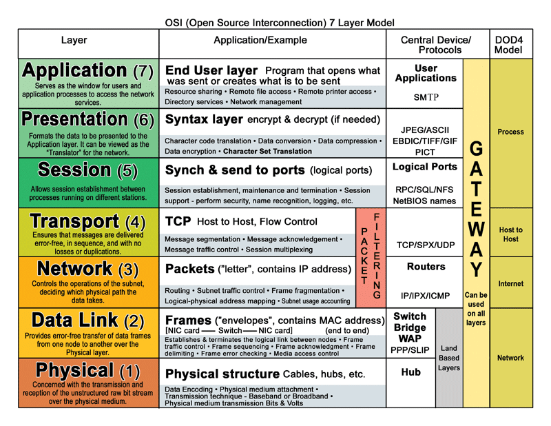

# Interchange IP Addresses on Cisco Router

To resolve the overlapping IP address issue and interchange the IP addresses between `FastEthernet0/0` and `FastEthernet0/1`, follow these steps:

## Current Configuration:
- **FastEthernet0/0** has IP `192.168.1.100`.
- **FastEthernet0/1** has IP `16.0.0.100`.

## Steps to Interchange IP Addresses:

1. **Enter Global Configuration Mode:**
   Access global configuration mode on your router.

```bash
Router# configure terminal
Router(config)# interface FastEthernet0/0
Router(config-if)# no ip address
Router(config-if)# exit

Router(config)# interface FastEthernet0/1
Router(config-if)# no ip address
Router(config-if)# exit


Router(config)# interface FastEthernet0/0
Router(config-if)# ip address 16.0.0.100 255.255.255.0
Router(config-if)# no shutdown
Router(config-if)# exit

Router(config)# interface FastEthernet0/1
Router(config-if)# ip address 192.168.1.100 255.255.255.0
Router(config-if)# no shutdown
Router(config-if)# exit


Router# show ip interface brief

Router# show ip interface brief

Router# show ip interface brief
```


# Routing Configuration 
- Four_Routers_Four_Switches_8_Nodes_7_Networks


Note: Configure Nodes first and plug-in the serial port WIC-2T in all routers.

## Network Setup Overview

### Router-A
- **Network**: 192.168.1.0
- **Nodes**: 192.168.1.2, 192.168.1.3
- **Gateway**: 192.168.1.1
- **Interfaces**:
  - Fast Ethernet 0/0: 192.168.1.1
  - Serial 0/0/0: 11.0.0.2

### Router-B
- **Network**: 192.168.2.0
- **Nodes**: 192.168.2.2, 192.168.2.3
- **Gateway**: 192.168.2.1
- **Interfaces**:
  - Fast Ethernet 0/0: 192.168.2.1
  - Serial 0/0/0: 11.0.0.3
  - Serial 0/0/1: 12.0.0.2

### Router-C
- **Network**: 192.168.3.0
- **Nodes**: 192.168.3.2, 192.168.3.3
- **Gateway**: 192.168.3.1
- **Interfaces**:
  - Fast Ethernet 0/0: 192.168.3.1
  - Serial 0/0/0: 12.0.0.3
  - Serial 0/0/1: 13.0.0.2

### Router-D
- **Network**: 192.168.4.0
- **Nodes**: 192.168.4.2, 192.168.4.3
- **Gateway**: 192.168.4.1
- **Interfaces**:
  - Fast Ethernet 0/0: 192.168.4.1
  - Serial 0/0/0: 13.0.0.3

## Routing Configuration

### Router-A Configuration

1. **To reach Network 192.168.2.0**:
   - Network: 192.168.2.0
   - Subnet Mask: 255.255.255.0
   - Next Hop: 11.0.0.3 (Router-B’s Serial 0/0/0 interface)

2. **To reach Network 192.168.3.0**:
   - Network: 192.168.3.0
   - Subnet Mask: 255.255.255.0
   - Next Hop: 11.0.0.3 (Router-B’s Serial 0/0/0 interface)

3. **To reach Network 192.168.4.0**:
   - Network: 192.168.4.0
   - Subnet Mask: 255.255.255.0
   - Next Hop: 11.0.0.3 (Router-B’s Serial 0/0/0 interface)

4. **Additional Routes**:

   - **To reach Network 12.0.0.0**:
     - **Network**: 12.0.0.0
     - **Subnet Mask**: 255.0.0.0
     - **Next Hop**: 12.0.0.3 (Router-C’s Serial 0/0/0 interface)
     - **Description**: This route is used to reach Router-C through Router-B. It handles traffic destined for Network 12.0.0.0, which is needed to route through Router-C to reach Router-D.This route helps Router-A send traffic to Router-C through Router-B. It’s needed to reach Network 12.0.0.0 and then continue to Router-D.

   - **To reach Network 13.0.0.0**:
     - **Network**: 13.0.0.0
     - **Subnet Mask**: 255.0.0.0
     - **Next Hop**: 12.0.0.3 (Router-C’s Serial 0/0/0 interface)
     - **Description**: This route is used to reach Router-D via Router-C. Traffic for Network 13.0.0.0 must be routed through Router-C to get to Router-D, enabling communication with Network 192.168.4.0.This route helps Router-A send traffic to Router-D through Router-C. It’s used to reach Network 13.0.0.0, allowing communication with Network 192.168.4.0.

### Router-B Configuration

1. **To reach Network 192.168.1.0**:
   - Network: 192.168.1.0
   - Subnet Mask: 255.255.255.0
   - Next Hop: 11.0.0.2 (Router-A’s Serial 0/0/0 interface)

2. **To reach Network 192.168.3.0**:
   - Network: 192.168.3.0
   - Subnet Mask: 255.255.255.0
   - Next Hop: 12.0.0.3 (Router-C’s Serial 0/0/0 interface)

3. **To reach Network 192.168.4.0**:
   - Network: 192.168.4.0
   - Subnet Mask: 255.255.255.0
   - Next Hop: 12.0.0.3 (Router-C’s Serial 0/0/0 interface)

4. **Additional Route**:

   - **To reach Network 13.0.0.0**:
     - **Network**: 13.0.0.0
     - **Subnet Mask**: 255.0.0.0
     - **Next Hop**: 12.0.0.3 (Router-C’s Serial 0/0/0 interface)
     - **Description**: This route allows Router-B to direct traffic to Network 13.0.0.0 via Router-C. Router-B uses this route to pass on data to Router-C, which then handles further routing to Router-D.This route helps Router-B send traffic to Network 13.0.0.0 through Router-C. Router-B passes the data to Router-C, which then sends it to Router-D.

### Router-C Configuration

1. **To reach Network 192.168.1.0**:
   - Network: 192.168.1.0
   - Subnet Mask: 255.255.255.0
   - Next Hop: 12.0.0.2 (Router-B’s Serial 0/0/1 interface)

2. **To reach Network 192.168.2.0**:
   - Network: 192.168.2.0
   - Subnet Mask: 255.255.255.0
   - Next Hop: 12.0.0.2 (Router-B’s Serial 0/0/1 interface)

3. **To reach Network 192.168.4.0**:
   - Network: 192.168.4.0
   - Subnet Mask: 255.255.255.0
   - Next Hop: 13.0.0.3 (Router-D’s Serial 0/0/0 interface)

### Router-D Configuration

1. **To reach Network 192.168.1.0**:
   - Network: 192.168.1.0
   - Subnet Mask: 255.255.255.0
   - Next Hop: 13.0.0.2 (Router-C’s Serial 0/0/1 interface)

2. **To reach Network 192.168.2.0**:
   - Network: 192.168.2.0
   - Subnet Mask: 255.255.255.0
   - Next Hop: 13.0.0.2 (Router-C’s Serial 0/0/1 interface)

3. **To reach Network 192.168.3.0**:
   - Network: 192.168.3.0
   - Subnet Mask: 255.255.255.0
   - Next Hop: 13.0.0.2 (Router-C’s Serial 0/0/1 interface)

<hr>


Only 24 Hours For Networking (With Consistency)

1. https://www.youtube.com/playlist?list=PLVFyjfF2Drdt9hXs37KTPTIqtNVCXFfOG <br>
   https://github.com/alihaghshenas/cisco-packet-tracer-cource

2. https://www.youtube.com/playlist?list=PLB57s6OrG8LjS4rXfvYZd95H5oHPabDcF

3. https://www.youtube.com/playlist?list=PLXP9Twz5n6qrPsZ8eJCc2TiSWMEEUi1O8

4. https://www.youtube.com/playlist?list=PLZURQ_XyXLwDBCD6BtfRP-Bc9DM4_U1Om

5. https://www.youtube.com/playlist?list=PLhEyzxBNToCroL2HjrsoLAOtcS88fwc9M

6. https://www.youtube.com/playlist?list=PL71kSR7neg7KpyPqlq3jgw0RMKU3XHljL


---
Cisco Packet tracer Shortcut keys

https://mahi130.wordpress.com/2011/06/21/packet-tracer-shortcuts/

---
Cisco Packet Tracer Github repos


# Baap re Baap
