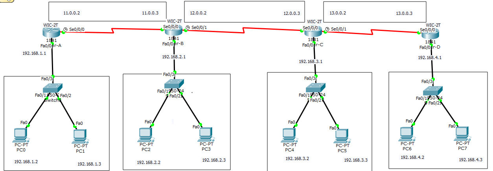
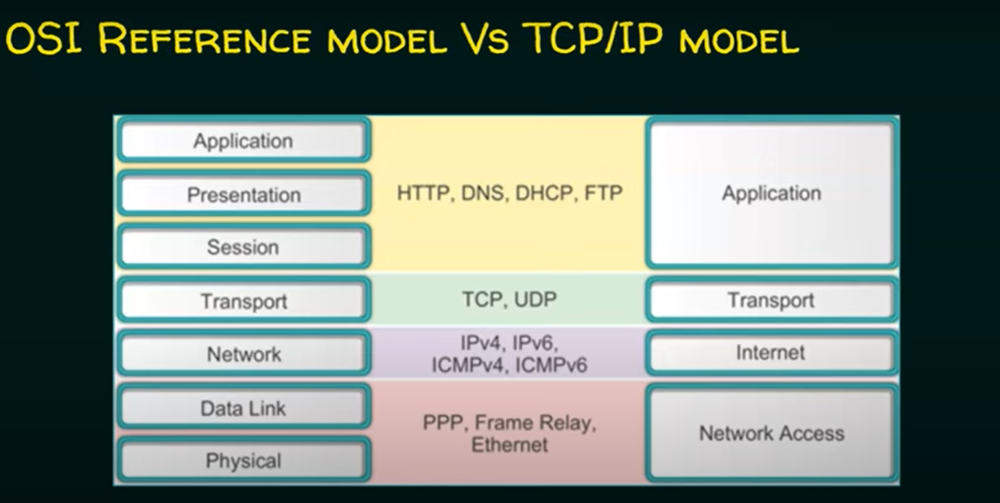
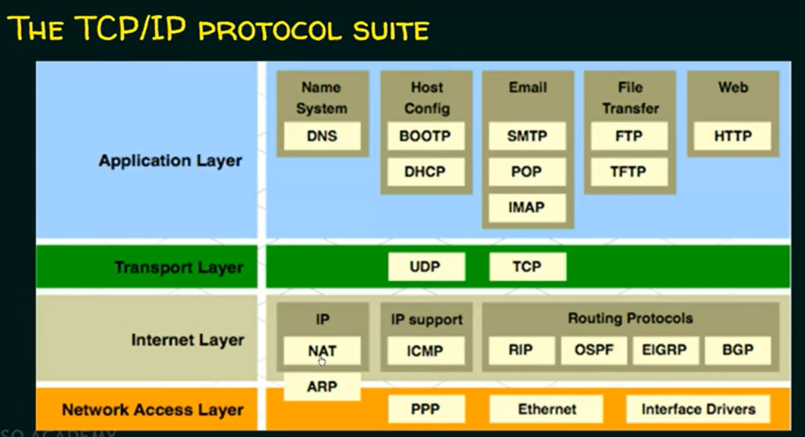
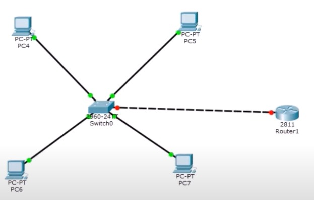

# Table of Contents

1. [Interchanging IP Addresses on Cisco Router](#interchanging-ip-addresses-on-cisco-router)
   - [Current Configuration](#current-configuration)
   - [Steps to Interchange IP Addresses](#steps-to-interchange-ip-addresses)
   - [Verification](#verification)

2. [Network Setup Overview](#network-setup-overview)
   - [Router-A Configuration](#router-a-configuration)
   - [Router-B Configuration](#router-b-configuration)
   - [Router-C Configuration](#router-c-configuration)
   - [Router-D Configuration](#router-d-configuration)

3. [Routing Configuration](#routing-configuration)
   - [Router-A Configuration Details](#router-a-configuration-details)
   - [Router-B Configuration Details](#router-b-configuration-details)
   - [Router-C Configuration Details](#router-c-configuration-details)
   - [Router-D Configuration Details](#router-d-configuration-details)

4. [Additional Resources](#additional-resources)
   - [Networking Courses and Tutorials](#networking-courses-and-tutorials)
   - [Cisco Packet Tracer Shortcuts](#cisco-packet-tracer-shortcuts)
   - [Cisco Packet Tracer GitHub Repositories](#cisco-packet-tracer-github-repositories)

5. [Networking Commands](#networking-commands)
   - [IPCONFIG](#ipconfig)
   - [IPCONFIG /all](#ipconfig-all)
   - [NSLOOKUP](#nslookup)
   - [PING](#ping)
   - [TRACERT](#tracert)

6. [Commands Examples](#commands-examples)
   - [IPCONFIG Example](#ipconfig-example)
   - [IPCONFIG /all Example](#ipconfig-all-example)
   - [NSLOOKUP Example](#nslookup-example)
   - [PING Example](#ping-example)
   - [TRACERT Example](#tracert-example)

   [InterVLAN](#intervlan)


# Interchange IP Addresses on Cisco Router

To resolve the overlapping IP address issue and interchange the IP addresses between `FastEthernet0/0` and `FastEthernet0/1`, follow these steps:

## Current Configuration:
- **FastEthernet0/0** has IP `192.168.1.100`.
- **FastEthernet0/1** has IP `16.0.0.100`.

## Steps to Interchange IP Addresses:

1. **Enter Global Configuration Mode:**
   Access global configuration mode on your router.

```bash
Router# configure terminal
Router(config)# interface FastEthernet0/0
Router(config-if)# no ip address
Router(config-if)# exit

Router(config)# interface FastEthernet0/1
Router(config-if)# no ip address
Router(config-if)# exit


Router(config)# interface FastEthernet0/0
Router(config-if)# ip address 16.0.0.100 255.255.255.0
Router(config-if)# no shutdown
Router(config-if)# exit

Router(config)# interface FastEthernet0/1
Router(config-if)# ip address 192.168.1.100 255.255.255.0
Router(config-if)# no shutdown
Router(config-if)# exit


Router# show ip interface brief

Router# show ip interface brief

Router# show ip interface brief
```


# Routing Configuration 
- Four_Routers_Four_Switches_8_Nodes_7_Networks



Note: Configure Nodes first and plug-in the serial port WIC-2T in all routers.

## Network Setup Overview

### Router-A
- **Network**: 192.168.1.0
- **Nodes**: 192.168.1.2, 192.168.1.3
- **Gateway**: 192.168.1.1
- **Interfaces**:
  - Fast Ethernet 0/0: 192.168.1.1
  - Serial 0/0/0: 11.0.0.2

### Router-B
- **Network**: 192.168.2.0
- **Nodes**: 192.168.2.2, 192.168.2.3
- **Gateway**: 192.168.2.1
- **Interfaces**:
  - Fast Ethernet 0/0: 192.168.2.1
  - Serial 0/0/0: 11.0.0.3
  - Serial 0/0/1: 12.0.0.2

### Router-C
- **Network**: 192.168.3.0
- **Nodes**: 192.168.3.2, 192.168.3.3
- **Gateway**: 192.168.3.1
- **Interfaces**:
  - Fast Ethernet 0/0: 192.168.3.1
  - Serial 0/0/0: 12.0.0.3
  - Serial 0/0/1: 13.0.0.2

### Router-D
- **Network**: 192.168.4.0
- **Nodes**: 192.168.4.2, 192.168.4.3
- **Gateway**: 192.168.4.1
- **Interfaces**:
  - Fast Ethernet 0/0: 192.168.4.1
  - Serial 0/0/0: 13.0.0.3

## Routing Configuration

### Router-A Configuration

1. **To reach Network 192.168.2.0**:
   - Network: 192.168.2.0
   - Subnet Mask: 255.255.255.0
   - Next Hop: 11.0.0.3 (Router-B’s Serial 0/0/0 interface)

2. **To reach Network 192.168.3.0**:
   - Network: 192.168.3.0
   - Subnet Mask: 255.255.255.0
   - Next Hop: 11.0.0.3 (Router-B’s Serial 0/0/0 interface)

3. **To reach Network 192.168.4.0**:
   - Network: 192.168.4.0
   - Subnet Mask: 255.255.255.0
   - Next Hop: 11.0.0.3 (Router-B’s Serial 0/0/0 interface)

4. **Additional Routes**:

   - **To reach Network 12.0.0.0**:
     - **Network**: 12.0.0.0
     - **Subnet Mask**: 255.0.0.0
     - **Next Hop**: 12.0.0.3 (Router-C’s Serial 0/0/0 interface)
     - **Description**: This route is used to reach Router-C through Router-B. It handles traffic destined for Network 12.0.0.0, which is needed to route through Router-C to reach Router-D.This route helps Router-A send traffic to Router-C through Router-B. It’s needed to reach Network 12.0.0.0 and then continue to Router-D.

   - **To reach Network 13.0.0.0**:
     - **Network**: 13.0.0.0
     - **Subnet Mask**: 255.0.0.0
     - **Next Hop**: 12.0.0.3 (Router-C’s Serial 0/0/0 interface)
     - **Description**: This route is used to reach Router-D via Router-C. Traffic for Network 13.0.0.0 must be routed through Router-C to get to Router-D, enabling communication with Network 192.168.4.0.This route helps Router-A send traffic to Router-D through Router-C. It’s used to reach Network 13.0.0.0, allowing communication with Network 192.168.4.0.

### Router-B Configuration

1. **To reach Network 192.168.1.0**:
   - Network: 192.168.1.0
   - Subnet Mask: 255.255.255.0
   - Next Hop: 11.0.0.2 (Router-A’s Serial 0/0/0 interface)

2. **To reach Network 192.168.3.0**:
   - Network: 192.168.3.0
   - Subnet Mask: 255.255.255.0
   - Next Hop: 12.0.0.3 (Router-C’s Serial 0/0/0 interface)

3. **To reach Network 192.168.4.0**:
   - Network: 192.168.4.0
   - Subnet Mask: 255.255.255.0
   - Next Hop: 12.0.0.3 (Router-C’s Serial 0/0/0 interface)

4. **Additional Route**:

   - **To reach Network 13.0.0.0**:
     - **Network**: 13.0.0.0
     - **Subnet Mask**: 255.0.0.0
     - **Next Hop**: 12.0.0.3 (Router-C’s Serial 0/0/0 interface)
     - **Description**: This route allows Router-B to direct traffic to Network 13.0.0.0 via Router-C. Router-B uses this route to pass on data to Router-C, which then handles further routing to Router-D.This route helps Router-B send traffic to Network 13.0.0.0 through Router-C. Router-B passes the data to Router-C, which then sends it to Router-D.

### Router-C Configuration

1. **To reach Network 192.168.1.0**:
   - Network: 192.168.1.0
   - Subnet Mask: 255.255.255.0
   - Next Hop: 12.0.0.2 (Router-B’s Serial 0/0/1 interface)

2. **To reach Network 192.168.2.0**:
   - Network: 192.168.2.0
   - Subnet Mask: 255.255.255.0
   - Next Hop: 12.0.0.2 (Router-B’s Serial 0/0/1 interface)

3. **To reach Network 192.168.4.0**:
   - Network: 192.168.4.0
   - Subnet Mask: 255.255.255.0
   - Next Hop: 13.0.0.3 (Router-D’s Serial 0/0/0 interface)

### Router-D Configuration

1. **To reach Network 192.168.1.0**:
   - Network: 192.168.1.0
   - Subnet Mask: 255.255.255.0
   - Next Hop: 13.0.0.2 (Router-C’s Serial 0/0/1 interface)

2. **To reach Network 192.168.2.0**:
   - Network: 192.168.2.0
   - Subnet Mask: 255.255.255.0
   - Next Hop: 13.0.0.2 (Router-C’s Serial 0/0/1 interface)

3. **To reach Network 192.168.3.0**:
   - Network: 192.168.3.0
   - Subnet Mask: 255.255.255.0
   - Next Hop: 13.0.0.2 (Router-C’s Serial 0/0/1 interface)

<hr>


Only 24 Hours For Networking (With Consistency)

1. https://www.youtube.com/playlist?list=PLVFyjfF2Drdt9hXs37KTPTIqtNVCXFfOG <br>
   https://github.com/alihaghshenas/cisco-packet-tracer-cource

2. https://www.youtube.com/playlist?list=PLB57s6OrG8LjS4rXfvYZd95H5oHPabDcF

3. https://www.youtube.com/playlist?list=PLXP9Twz5n6qrPsZ8eJCc2TiSWMEEUi1O8

4. https://www.youtube.com/playlist?list=PLZURQ_XyXLwDBCD6BtfRP-Bc9DM4_U1Om

5. https://www.youtube.com/playlist?list=PLhEyzxBNToCroL2HjrsoLAOtcS88fwc9M

6. https://www.youtube.com/playlist?list=PL71kSR7neg7KpyPqlq3jgw0RMKU3XHljL


---
Cisco Packet tracer Shortcut keys

https://mahi130.wordpress.com/2011/06/21/packet-tracer-shortcuts/

---
Cisco Packet Tracer Github repos





# Baap re Baap


# Networking Commands
1. IPCONFIG: Displays the current IP configuration of your network interfaces, including IP address, subnet mask, and default gateway.

2. IPCONFIG /all: Provides detailed information about all network interfaces, including MAC addresses, DHCP status, DNS servers, and more.

3. NSLOOKUP: A tool used to query the Domain Name System (DNS) to obtain the IP address associated with a domain name or vice versa.

4. PING: Tests the connectivity to a specific IP address or domain name by sending ICMP echo request packets and measuring the response time.

5. TRACERT: Traces the route packets take to a destination IP address or domain name, showing each hop along the way and measuring the time it takes to reach each one.


## Commands Examples  (Network Command Line Tools)

This document provides an overview of commonly used network command-line tools, including definitions and examples for each command.

## 1. IPCONFIG

**Definition:**  
Displays the current network configuration for all network interfaces on a Windows machine.

**Example:**
```bash
ipconfig
```

**output**<br>

```yaml
Ethernet adapter Local Area Connection:
   IPv4 Address: 192.168.1.10
   Subnet Mask: 255.255.255.0
   Default Gateway: 192.168.1.1

```


## 2. IPCONFIG /all

**Definition**<br>
Displays detailed information about all network interfaces, including physical address, DHCP status, and more.<br>

**Example**<br>
```bash
ipconfig /all
```

**output**<br>

```yaml
Host Name: mycomputer
Primary Dns Suffix: 
Node Type: Hybrid
IP Routing Enabled: No
WINS Proxy Enabled: No

Ethernet adapter Local Area Connection:
   Description: Intel(R) Ethernet Connection
   Physical Address: 00-1A-2B-3C-4D-5E
   DHCP Enabled: Yes
   Autoconfiguration Enabled: Yes
   IPv4 Address: 192.168.1.10
   Lease Obtained: Monday, September 20, 2024 10:00 AM
   Lease Expires: Tuesday, September 21, 2024 10:00 AM

```

## 3. NSLOOKUP

**Definition**<br>
Queries the DNS to obtain the domain name or IP address mapping for a specific hostname.<br>


**Example**<br>
```bash
nslookup example.com
```


```makefile
Server:  dns.server.com
Address:  192.168.1.1

Name:    example.com
Addresses:  93.184.216.34

```


## 4. PING
**Definition**<br>
Tests the connectivity to another host on a network by sending ICMP Echo Request messages.<br>

```bash
ping google.com
```

```python
Pinging google.com [172.217.14.206] with 32 bytes of data:
Reply from 172.217.14.206: bytes=32 time=14ms TTL=56
Reply from 172.217.14.206: bytes=32 time=13ms TTL=56

```

## 5. TRACERT
**Definition**<br>
Traces the route that packets take to a network host, showing each hop along the way.<br>

```bash
tracert google.com
```

```css
Tracing route to google.com [172.217.14.206] over a maximum of 30 hops:
  1     1 ms     <1 ms     <1 ms  router.local [192.168.1.1]
  2     10 ms      9 ms      9 ms  10.0.0.1
  3     15 ms     14 ms     15 ms  172.217.14.206
```


# InterVLAN Each VLAN having seperate port with access mode

# InterVLAN (Router on Stick Methodology: One Port with Trunk Mode)



## Switch Configuration
```js
Switch> enable                                  # Enter enable mode  
Switch# config terminal                         # Enter global configuration mode  
Switch(config)# vlan 10                         # Create VLAN 10  
Switch(config-vlan)# name HR                    # Name VLAN 10 as HR  
Switch(config-vlan)# vlan 20                    # Create VLAN 20  
Switch(config-vlan)# name IT                    # Name VLAN 20 as IT  

# Configure access ports for VLAN 10
Switch(config-vlan)# interface fa0/1            # Select interface Fa0/1 -PC4(198.168.1.2)
Switch(config-if)# switchport mode access       # Set port to access mode  
Switch(config-if)# switchport access vlan 10    # Assign port to VLAN 10  

Switch(config-vlan)# interface fa0/2            # Select interface Fa0/2  -PC5(192.168.1.3)
Switch(config-if)# switchport mode access       # Set port to access mode  
Switch(config-if)# switchport access vlan 10    # Assign port to VLAN 10  

# Configure access ports for VLAN 20
Switch(config-vlan)# interface fa0/3            # Select interface Fa0/3  -PC6(192.168.2.2)
Switch(config-if)# switchport mode access       # Set port to access mode  
Switch(config-if)# switchport access vlan 20    # Assign port to VLAN 20  

Switch(config-vlan)# interface fa0/4            # Select interface Fa0/4  -PC7(192.168.2.3)
Switch(config-if)# switchport mode access       # Set port to access mode  
Switch(config-if)# switchport access vlan 20    # Assign port to VLAN 20  

# Configure trunk port
Switch(config-vlan)# interface fa0/5            # Select interface Fa0/5  -Port Connected to Router
Switch(config-if)# switchport mode trunk        # Set port to trunk mode  

```


## Router Configuration

```js
Router> en                                                  # Enter enable mode  
Router# conf t                                              # Enter global configuration mode  

# Configure the physical interface
Router (config)# int fa0/0                                  # Select interface Fa0/0  
Router (config-if)# no shutdown                             # Bring the interface up  

# Subinterface for VLAN 10
Router (config-if)# int fa0/0.10                            # Create subinterface Fa0/0.10  
Router (config-subif)# encapsulation dot1Q 10               # Set encapsulation for VLAN 10  
Router (config-subif)# ip add 198.168.1.1 255.255.255.0     # Assign IP address to subinterface  

# Subinterface for VLAN 20
Router (config-subif)# int fa0/0.20                         # Create subinterface Fa0/0.20  
Router (config-subif)# encapsulation dot1Q 20               # Set encapsulation for VLAN 20  
Router (config-subif)# ip add 198.168.2.2 255.255.255.0     # Assign IP address to subinterface  

```


## Nov 04 2024


- VTP Protocol for InterVLAN
- vtp domain vtp server/client password: wtf

## Nov 07 2024
